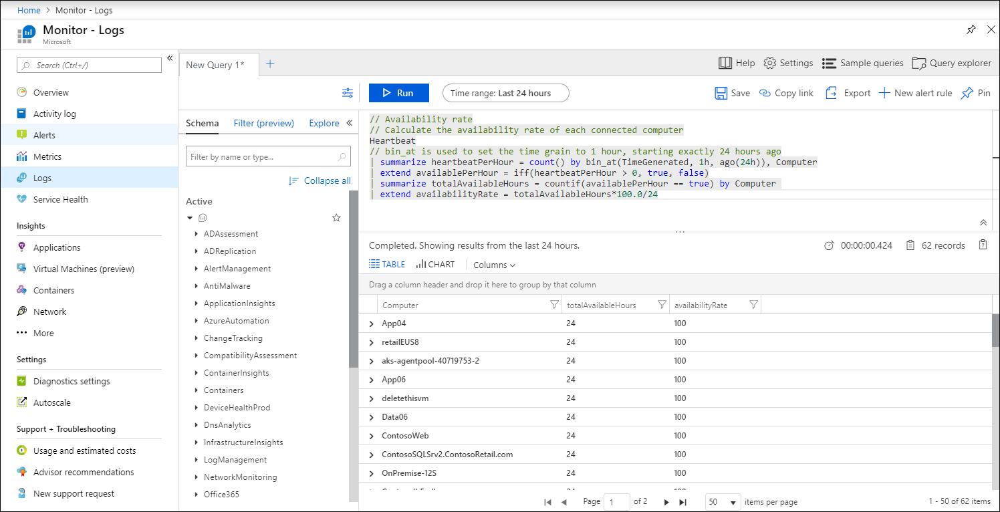

Log Analytics is part of Microsoft Azure's overall monitoring solution. Log Analytics helps you monitors cloud and on-premises environments to maintain availability and performance.

Log Analytics is the primary tool in the Azure portal for writing log queries and interactively analyzing their results. Even if a log query is used elsewhere in Azure Monitor, you'll typically write and test the query first using Log Analytics.

You can start Log Analytics from several places in the Azure portal. The scope of the data available to Log Analytics is determined by how you start it.
* Select Logs from the Azure Monitor menu or Log Analytics workspaces menu.
* Select Analytics from the Overview page of an Application Insights application.
* Select Logs from the menu of an Azure resource.

In addition to interactively working with log queries and their results in Log Analytics, areas in Azure Monitor where you will use queries include the following:
* **Alert rules**. Alert rules proactively identify issues from data in your workspace. Each alert rule is based on a log search that is automatically run at regular intervals. The results are inspected to determine if an alert should be created.
* **Dashboards**. You can pin the results of any query into an Azure dashboard which allow you to visualize log and metric data together and optionally share with other Azure users.
* **Views**. You can create visualizations of data to be included in user dashboards with View Designer. Log queries provide the data used by tiles and visualization parts in each view.
* **Export**. When you import log data from Azure Monitor into Excel or Power BI, you create a log query to define the data to export.
* **PowerShell**. You can run a PowerShell script from a command line or an Azure Automation runbook that uses Get-AzOperationalInsightsSearchResults to retrieve log data from Azure Monitor. This cmdlet requires a query to determine the data to retrieve.
* **Azure Monitor Logs API**. The Azure Monitor Logs API allows any REST API client to retrieve log data from the workspace. The API request includes a query that is run against Azure Monitor to determine the data to retrieve.

At the center of Log Analytics is the Log Analytics workspace, which is hosted in Azure. Log Analytics collects data in the workspace from connected sources by configuring data sources and adding solutions to your subscription. Data sources and solutions each create different record types, each with its own set of properties.
But you can still analyze sources and solutions together in queries to the workspace. This capability allows you to use the same tools and methods to work with a variety of data collected by a variety of sources.

Use the Log Analytics workspaces menu to create a Log Analytics workspace using the Azure portal. A Log Analytics workspace is a unique environment for Azure Monitor log data. Each workspace has its own data repository and configuration, and data sources and solutions are configured to store their data in a particular workspace. You require a Log Analytics workspace if you intend on collecting data from the following sources:
* Azure resources in your subscription
* On-premises computers monitored by System Center Operations Manager
* Device collections from Configuration Manager
* Diagnostics or log data from Azure storage
