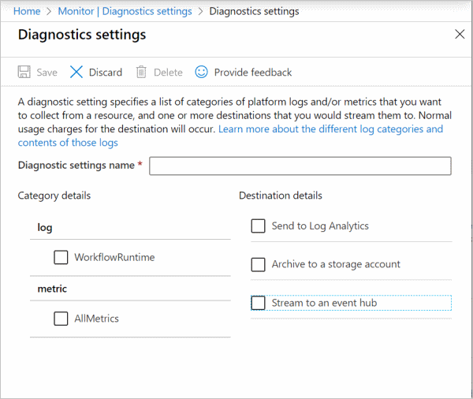

Azure Monitor diagnostic logs are logs produced by an Azure service that provide rich, frequently collected data about the operation of that service. Azure Monitor makes two types of diagnostic logs available:

* **Tenant logs**. These logs come from tenant-level services that exist outside an Azure subscription, such as Azure Active Directory (Azure AD).

* **Resource logs**. These logs come from Azure services that deploy resources within an Azure subscription, such as Network Security Groups (NSGs) or storage accounts.

> [!div class="mx-imgBorder"]
> 

The content of these logs varies by Azure service and resource type. For example, NSG rule counters and Azure Key Vault audits are two types of diagnostic logs.

These logs differ from the **activity log**. The activity log provides insight into the operations, such as creating a VM or deleting a logic app, that Azure Resource Manager performed on resources in your subscription using. The activity log is a subscription-level log. Resource-level diagnostic logs provide insight into operations that were performed within that resource itself, such as getting a secret from a key vault.

These logs also differ from **guest operating system (OS)–level diagnostic logs**. Guest OS diagnostic logs are those collected by an agent running inside a VM or other supported resource type. Resource-level diagnostic logs require no agent and capture resource-specific data from the Azure platform itself, whereas guest OS–level diagnostic logs capture data from the OS and applications running on a VM.

### Create diagnostic settings in Azure portal
You can configure diagnostic settings in the Azure portal either from the Azure Monitor menu or from the menu for the resource.

> [!div class="mx-imgBorder"]
> 

### Uses for diagnostic logs

Here are some of the things you can do with diagnostic logs:

> [!div class="mx-imgBorder"]
> 

* Save them to a storage account for auditing or manual inspection. You can specify the retention time (in days) by using resource diagnostic settings.

* Stream them to event hubs for ingestion by a third-party service or custom analytics solution, such as Power BI.

* Analyze them with Azure Monitor, such that the data is immediately written to Azure Monitor with no need to first write the data to storage.

Streaming of diagnostic logs can be enabled programmatically, via the portal, or using the Azure Monitor REST APIs. Either way, you create a diagnostic setting in which you specify an Event Hubs namespace and the log categories and metrics you want to send in to the namespace. An event hub is created in the namespace for each log category you enable. A diagnostic log category is a type of log that a resource may collect.
