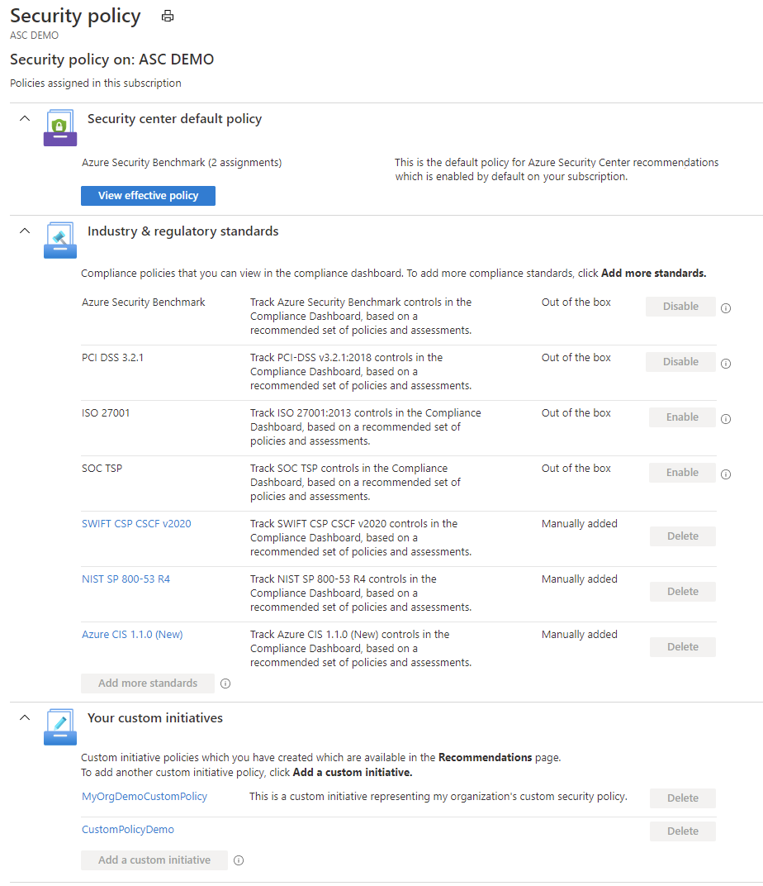

[Azure Security Benchmark](/security/benchmark/azure/introduction) is the Microsoft-authored, Azure-specific set of guidelines for security and compliance best practices based on common compliance frameworks. This widely respected benchmark builds on the controls from the Center for Internet Security (CIS) and the National Institute of Standards and Technology (NIST) with a focus on cloud-centric security. Customers use the ASB as a comprehensive control framework to help meet all their security requirements. The Benchmark is implemented as an Azure Policy initiative implementing monitoring for all of these guidelines.

Azure Security Benchmark is the foundation for Security Center’s recommendations and has been fully integrated as the default policy initiative. This means that ALL ASC customers automatically get the ASB as their default security policy, and the ASB is positioned as the singular set of security best practices in Azure, aligned with Secure Score.

## Working with Security Policy in Azure Security Center
By default, all prevention policies are turned on. Prevention policies and recommendations are tied to each other. In other words, if you enable a prevention policy, such as OS vulnerabilities, that enables recommendations for that policy. In most situations, you want to enable all policies even though some might be more important to you than others, depending on the Azure resource you’ve deployed.

Security Center automatically creates a default security policy for each of your Azure subscriptions. You can edit Azure policies:

- Create new policy definitions.
- Assign policies across management groups and subscriptions, which can represent an entire organization or a business unit within the organization.
- Monitor policy compliance.

An Azure policy consists of the following components:
- A **policy** is a rule.
- An **initiative** is a collection of policies.
- An **assignment** is the application of an initiative or a policy to a specific scope (management group, subscription, or resource group).

The following is a generated list of the types of recommendations. The recommendations help provide full visibility into the security health of your environment.

> [!div class="mx-imgBorder"]
> 

- **System updates**. Retrieves a daily list of available security updates and critical updates from Windows Update or Windows Server Update Services (WSUS).

- **OS vulnerabilities**. Analyzes OS configurations daily to determine issues that might make the VM vulnerable to attack.

- **Endpoint protection**. Recommends endpoint protection to be provisioned for all Windows VMs to help identify and remove viruses, spyware, and other malicious software.

- **Disk encryption**. Recommends enabling disk encryption in all VMs to enhance data protection at rest.

- **Network security groups**. Recommends that NSGs be configured to control inbound and outbound traffic to VMs that have public endpoints. In addition to checking that an NSG has been configured, this policy assesses inbound security rules.

- **Web application firewall**. Extends network protections beyond NSGs, which are built in to Azure. Security Center will discover deployments for which a next generation firewall is recommended and allow you to provision a virtual appliance.
- **Next Generation firewall**. Azure Security Center may recommend that you add a partner’s next generation firewall (NGFW) from a Microsoft partner to increase your security protections.

- **Vulnerability Assessment**. Recommends that you install a vulnerability assessment solution on your VM.

- **SQL auditing & Threat detection**. Recommends that you enable the auditing of access to Azure SQL Database for compliance and advanced threat detection—for investigation purposes.

- **SQL Encryption**. Recommends that you enable encryption at rest for your Azure SQL database, associated backups, and transaction log files. This helps prevent your data from being readable even if it’s breached.

### Who can edit security policies?

Security Center uses Role-Based Access Control (RBAC), which provides built-in roles that can be assigned to users, groups, and services in Azure. When users open Security Center, they can only view information that's related to resources they have access to. Which means that users are assigned the role of owner, contributor, or reader to the subscription or resource group that a resource belongs to. In addition to these roles, there are two specific Security Center roles:

- Security reader: Have view rights to Security Center, which includes recommendations, alerts, policy, and health, but they can't make changes.
- Security admin: Have the same view rights as security reader, and they can also update the security policy and dismiss recommendations and alerts.
