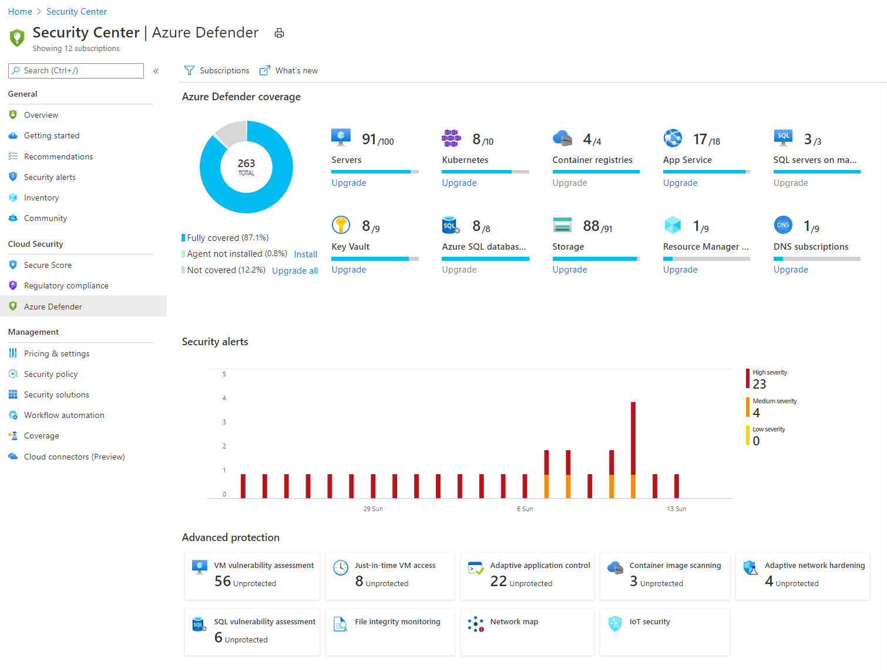

Azure Defender provides security alerts and advanced threat protection for virtual machines, SQL databases, containers, web applications, your network, and more.

## Azure Defender benefits

Azure Security Center is offered in two modes:

**Azure Defender Disabled** (Free) - Security Center without Azure Defender is enabled for free on all your Azure subscriptions when you visit the Azure Security Center dashboard in the Azure portal for the first time.

**Azure Defender Enabled** - Enabling Azure Defender extends the capabilities of Security Center to workloads running in private and other public clouds, providing unified security management and threat protection across your hybrid cloud workloads.

- Microsoft Defender for Endpoint - Azure Defender for servers includes Microsoft Defender for Endpoint for comprehensive endpoint detection and response (EDR). Learn more about the benefits of using Microsoft Defender for Endpoint together with Azure Defender in Use Security Center's integrated EDR solution.
- Vulnerability scanning for virtual machines and container registries - Easily deploy a scanner to all of your virtual machines that provides the industry's most advanced solution for vulnerability management. View, investigate, and remediate the findings directly within Security Center.
- Hybrid security – Get a unified view of security across all of your on-premises and cloud workloads. Apply security policies and continuously assess the security of your hybrid cloud workloads to ensure compliance with security standards. Collect, search, and analyze security data from multiple sources, including firewalls and other partner solutions.
- Threat protection alerts - Advanced behavioral analytics and the Microsoft Intelligent Security Graph provide an edge over evolving cyber-attacks. Built-in behavioral analytics and machine learning can identify attacks and zero-day exploits. Monitor networks, machines, and cloud services for incoming attacks and post-breach activity. Streamline investigation with interactive tools and contextual threat intelligence.
- Access and application controls (AAC) - Block malware and other unwanted applications by applying machine learning powered recommendations adapted to your specific workloads to create allow and blocklists. Reduce the network attack surface with just-in-time, controlled access to management ports on Azure VMs. AAC drastically reduces exposure to brute force and other network attacks.
- Container security features - Benefit from vulnerability management and real-time threat protection on your containerized environments. When enabling the Azure Defender for container registries, it may take up to 12 hrs until all the features are enabled. Charges are based on the number of unique container images pushed to your connected registry. After an image has been scanned once, you won't be charged for it again unless it's modified and pushed once more.
- Breadth threat protection for resources connected to the Azure environment - Azure Defender includes Azure-native breadth threat protection for the Azure services common to all of your resources: Azure Resource Manager, Azure DNS, Azure network layer, and Azure Key Vault. Azure Defender has unique visibility into the Azure management layer and the Azure DNS layer, and can therefore protect cloud resources that are connected to those layers.
