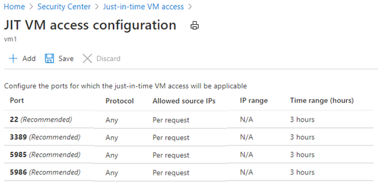
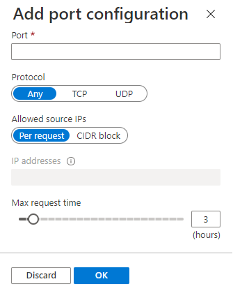

Just-in-time (JIT) virtual machine (VM) access is used to lock down inbound traffic to your Azure VMs, reducing exposure to attacks while providing easy access to connect to VMs when needed.

When you enable JIT VM Access for your VMs, you next create a policy that determines the ports to help protect, how long ports should remain open, and the approved IP addresses that can access these ports. The policy helps you stay in control of what users can do when they request access. Requests are logged in the Azure activity log, so you can easily monitor and audit access. The policy will also help you quickly identify the existing VMs that have JIT VM Access enabled and the VMs where JIT VM Access is recommended.

### How JIT VM Access works

To use Just-in-Time VM access, you must enable Microsoft Defender for Cloud.

> [!div class="mx-imgBorder"]
> 

After you enable Defender for Cloud, you can view which virtual machines have JIT configured. Enable JIT on any virtual machine that is not Healthy.  

> [!div class="mx-imgBorder"]
> 

For each virtual machine, you are recommended specific ports and access. 

> [!div class="mx-imgBorder"]
> 

You can accept the recommendations or **Add** other ports of your choosing. 

> [!div class="mx-imgBorder"]
> 

Once everything is in place, users must request access to the virtual machine. You can also monitor the usage of each virtual machine. 

> [!div class="mx-imgBorder"]
> 

For more information, [Secure your management ports with just-in-time access](/azure/security-center/security-center-just-in-time?tabs=jit-config-asc%2Cjit-request-asc).
