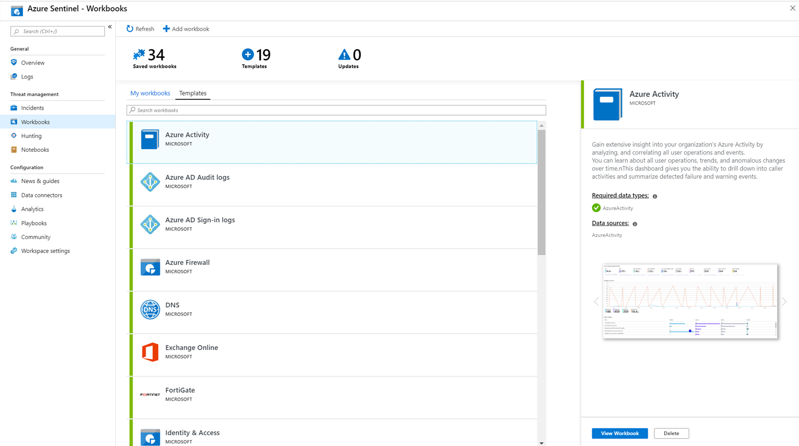

After you connected your data sources to Microsoft Sentinel, you can monitor the data using the Microsoft Sentinel integration with Azure Monitor Workbooks, which provides versatility in creating custom workbooks. While Workbooks are displayed differently in Microsoft Sentinel, it may be useful for you to determine how to Create interactive reports with Azure Monitor Workbooks. Microsoft Sentinel allows you to create custom workbooks across your data, and also comes with built-in workbook templates to allow you to quickly gain insights across your data as soon as you connect a data source.

> [!div class="mx-imgBorder"]
> 

Workbooks combine text, Analytics queries, Azure Metrics, and parameters into rich interactive reports. Workbooks are editable by any other team members who have access to the same Azure resources.

Workbooks are helpful for scenarios like:
* Exploring the usage of your app when you don't know the metrics of interest in advance: numbers of users, retention rates, conversion rates, etc. Unlike other usage analytics tools, workbooks let you combine multiple kinds of visualizations and analyses, making them great for this kind of free-form exploration.
* Explaining to your team how a newly released feature is performing, by showing user counts for key interactions and other metrics.
* Sharing the results of an A/B experiment in your app with other members of your team. You can explain the goals for the experiment with text, then show each usage metric and Analytics query used to evaluate the experiment, along with clear call-outs for whether each metric was above- or below-target.
* Reporting the impact of an outage on the usage of your app, combining data, text explanation, and a discussion of next steps to prevent outages in the future.

### Saving and sharing workbooks with your team

Workbooks are saved within an Application Insights resource, either in the My Reports section that's private to you or in the Shared Reports section that's accessible to everyone with access to the Application Insights resource. 
A workbook can be shared with a link or via email. Keep in mind that recipients of the link need access to this resource in the Azure portal to view the workbook. To make edits, recipients need at least Contributor permissions for the resource.

### Analytics
To help you reduce noise and minimize the number of alerts you have to review and investigate, Microsoft Sentinel uses analytics to correlate alerts into incidents. Incidents are groups of related alerts that together create an actionable possible-threat that you can investigate and resolve. Use the built-in correlation rules as-is, or use them as a starting point to build your own. Microsoft Sentinel also provides machine learning rules to map your network behavior and then look for anomalies across your resources. These analytics connect the dots, by combining low fidelity alerts about different entities into potential high-fidelity security incidents.
