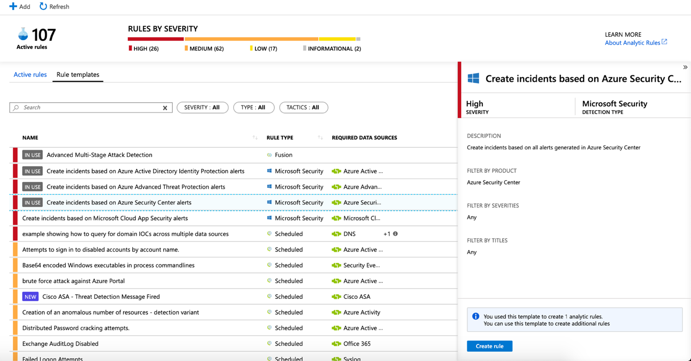

Alerts triggered in Microsoft security solutions that are connected to Microsoft Sentinel, such as Microsoft Defender for Cloud Apps and Azure Advanced Threat Protection, do not automatically create incidents in Microsoft Sentinel. By default, when you connect a Microsoft solution to Microsoft Sentinel, any alert generated in that service will be stored as raw data in Microsoft Sentinel, in the Security Alert table in your Microsoft Sentinel workspace. You can then use that data like any other raw data you connect into Sentinel

### Using Microsoft Security incident creation analytic rules
Use the built-in rules available in Microsoft Sentinel to choose which connected Microsoft security solutions should create Microsoft Sentinel incidents automatically in real time. You can also edit the rules to define more specific options for filtering which of the alerts generated by the Microsoft security solution should create incidents in Microsoft Sentinel. 
For example, you can choose to create Microsoft Sentinel incidents automatically only from high-severity Microsoft Defender for Cloud alerts.

> [!div class="mx-imgBorder"]
> 

You can create more than one Microsoft Security analytic rule per Microsoft security service type. This does not create duplicate incidents, since each rule is used as a filter. Even if an alert matches more than one Microsoft Security analytic rule, it creates just one Microsoft Sentinel incident.

When you connect a Microsoft security solution, you can select whether you want the alerts from the security solution to automatically generate incidents in Microsoft Sentinel automatically.
