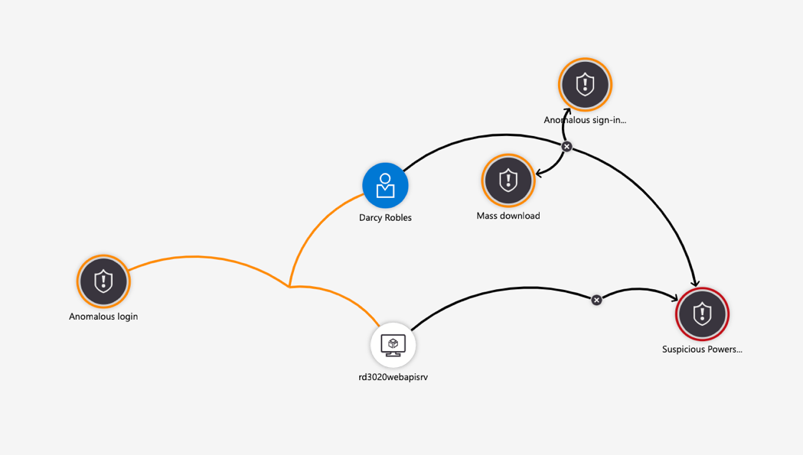

Currently in **preview**, Microsoft Sentinel deep investigation tools help you to understand the scope and find the root cause, of a potential security threat. You can choose an entity on the interactive graph to ask interesting questions for a specific entity, and drill down into that entity and its connections to get to the root cause of the threat.

An incident can include multiple alerts. It's an aggregation of all the relevant evidence for a specific investigation. An incident is created based on analytic rules that you created in the Analytics page. The properties related to the alerts, such as severity, and status, are set at the incident level. After you let Microsoft Sentinel know what kinds of threats you're looking for and how to find them, you can monitor detected threats by investigating incidents.

### Use the investigation graph to deep dive

The investigation graph enables analysts to ask the right questions for each investigation. The investigation graph helps you understand the scope, and identify the root cause, of a potential security threat by correlating relevant data with any involved entity. You can dive deeper and investigate any entity presented in the graph by selecting it and choosing between different expansion options.

The investigation graph provides you with:
* **Visual context from raw data**: The live, visual graph displays entity relationships extracted automatically from the raw data. This enables you to easily view connections across different data sources.
* **Full investigation scope discovery**: Expand your investigation scope using built-in exploration queries to surface the full scope of a breach.
* **Built-in investigation steps**: Use predefined exploration options to make sure you are asking the right questions in the face of a threat.

### To use the investigation graph:

Select an incident, then select **Investigate**. This takes you to the investigation graph. The graph provides an illustrative map of the entities directly connected to the alert and each resource connected further.

> [!div class="mx-imgBorder"]
> 

You'll only be able to investigate the incident if you used the entity mapping fields when you set up your analytic rule. The investigation graph requires that your original incident includes entities.

## Hunting
Use Microsoft Sentinel's powerful hunting search-and-query tools, based on the **MITRE framework**, which enable you to proactively hunt for security threats across your organization’s data sources, before an alert is triggered. After you discover which hunting query provides high-value insights into possible attacks, you can also create custom detection rules based on your query, and surface those insights as alerts to your security incident responders. While hunting, you can create bookmarks for interesting events, enabling you to return to them later, share them with others, and group them with other correlating events to create a compelling incident for investigation.

For example, one built-in query provides data about the most uncommon processes running on your infrastructure. You may not want an alert each time they are run.

With Microsoft Sentinel hunting, you can take advantage of the following capabilities:

* **Built-in queries**: To get you started, a starting page provides preloaded query examples designed to get you started and get you familiar with the tables and the query language. These built-in hunting queries are developed by Microsoft security researchers on a continuous basis, adding new queries, and fine-tuning existing queries to provide you with an entry point to look for new detections and figure out where to start hunting for the beginnings of new attacks.
* **Powerful query language with IntelliSense**: Built on top of a query language that gives you the flexibility you need to take hunting to the next level.
* **Create your own bookmarks**: During the hunting process, you may come across matches or findings, dashboards, or activities that look unusual or suspicious. In order to mark those items so you can come back to them in the future, use the bookmark functionality. Bookmarks let you save items for later, to be used to create an incident for investigation.
* **Use notebooks to automate investigation**: Notebooks are like step-by-step playbooks that you can build to walk through the steps of an investigation and hunt. Notebooks encapsulate all the hunting steps in a reusable playbook that can be shared with others in your organization.
* **Query the stored data**: The data is accessible in tables for you to query. For example, you can query process creation, DNS events, and many other event types.
* **Links to community**: Leverage the power of the greater community to find additional queries and data sources.

> [!div class="mx-imgBorder"]
> 

### Community

The Microsoft Sentinel community is a powerful resource for threat detection and automation. Our Microsoft security analysts constantly create and add new workbooks, playbooks, hunting queries, and more, posting them to the community for you to use in your environment. You can download sample content from the private community GitHub [repository](https://aka.ms/asicommunity) to create custom workbooks, hunting queries, notebooks, and playbooks for Microsoft Sentinel.
