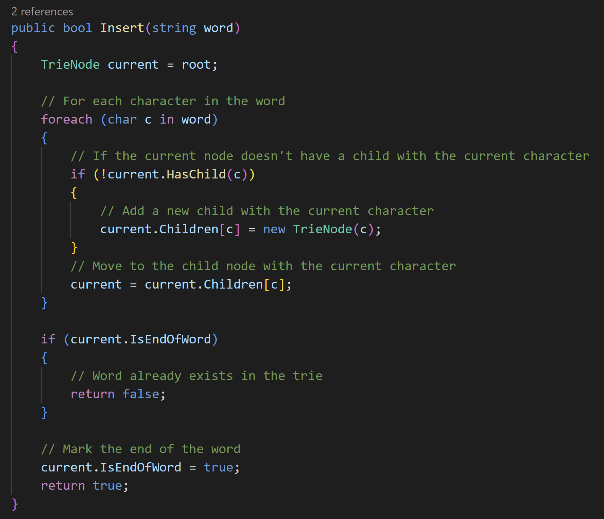

In this exercise, you'll familiarize yourself with the Trie project by using Copilot to interpret the code. Let's get started!

> [!IMPORTANT] This exercise uses features of Copilot Chat. To use Copilot Chat, you must have a GitHub account and be signed in to the GitHub Copilot extension. For more information, see [Use Copilot Chat](https://docs.github.com/en/copilot/github-copilot-chat/about-github-copilot-chat).

> [!IMPORTANT]
> You need to have completed the Setup instructions in the previous unit, Prepare, before you begin this Exercise.

## Use Copilot Chat to explain code

1. In the File Explorer, expand the **TrieDictionary** folder.

1. Open the **Trie.cs** file.

1. Select the `TrieNode` constructor code.

    ```c#
    public TrieNode(char value = ' ')
    {
        Children = new Dictionary<char, TrieNode>();
        IsEndOfWord = false;
        _value = value;
    }
    ```

1. Right-click the selected code. Under **Copilot**, click **Explain this**

    The "Explain this" feature of Copilot Chat can help developers quickly understand a new codebase. Copilot Chat provides explanations for selected code, including the purpose of the code, the data types, and the return values.

    In the explanation Copilot Chat provides, note the descriptions of the `Children` and `IsEndOfWord` properties.

1. Select the Trie `Insert` method code.

    Ensure that the entire method is selected.

1. Right-click the selected code. Under **Copilot**, click **Explain this**

1. In the chat, enter "Explain line by line"
    
    Copilot Chat provides an explanation for each line of code in the selection.

## Add code comments with Copilot

You can use Copilot to autocomplete code comments which can help you better understand the code, and can also help you quickly add helpful comments to your own code.

1. Navigate to the `Insert` method in **Trie.cs**

1. Enter a new line before the `foreach` loop.

1. Begin typing `// For` and wait for Copilot to autocomplete the code comment.

    Copilot should suggest something like: `For each character in the word`

1. Enter a new line above the `if` statement.

1. Begin typing `// If` and wait for Copilot to autocomplete the code comment.

    Copilot should suggest something like: `If the current node doesn't have a child with the current character`

1. Enter a new line above the line: `current.Children[c] = new TrieNode(c);`

1. Begin typing `// ` and wait for Copilot to autocomplete the code comment.

    Copilot should suggest something like: `Add a new child with the current character`

    Since you established a pattern of adding code comments, you might notice that Copilot Chat needs less prompting to suggest code comments.

1. Continue with this pattern to add comments to the rest of the code in the `Insert` method.

    

## Add code comments using Copilot Chat

Copilot Chat can add comments for multiple lines of code, which is helpful when you want to add comments to a large block of code.

1. Navigate to **Program.cs**

1. Select the `InitializeTrie` method code and right-click the selection

1. Under **Copilot**, click **Start Code Chat**

1. Enter the text "Insert comments to explain this code line by line"

    Copilot Chat should suggest comments for each line of code in the selection.

    

1. Click **Accept**

    Copilot Chat should add the comments to the code.

## Add code documentation with Copilot Chat

1. Navigate to **Trie.cs**

1. Select the `AutoSuggest` method and right-click the selection.

1. Under **Copilot**, click **Generate Docs**

    Copilot Chat should generate suggested documentation for the method. If no suggestion appears, click the **Regenerate** button.

1. Click **Accept** to add the documentation to the code.
