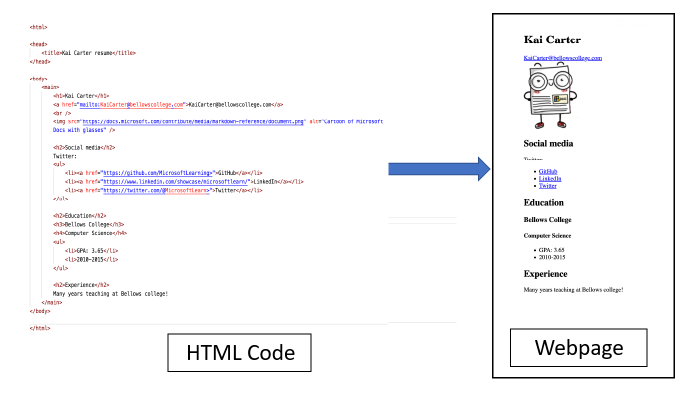

You will soon be writing code to create a web page.



When getting started with a new technology there are different terms you will need to be familiar with. While your vocabulary will expand as you continue to grow as a web developer, there are certain core concepts which will help you get started.

## Web Pages and Websites

Web pages, HTML pages, or simply pages are similar to a page in an e-book. They are a single screen that displays information. You might scroll up and down on the page, but it's made to be a collection of similar data. Software developers create pages in HTML *files*. A file is like a document you might create in a word processor. Instead of writing in a language like English or Spanish, you create files using the languages designed for websites.

In web development, a web page can be a single file or the result of bringing two or more files together. In the next section, you'll learn about the different files that can be used to create a web page.

A website is a set of pages. Returning to our e-book analogy, the e-book itself would be the website. It has all of the pages and is read by a user one page at a time. A website could be a single page, thousands of pages, and everything in between.

As you read this unit, you are reading a web page. You scroll up and down to examine the information you want. You eventually navigate to a different page to review the next unit. All of these pages make up the site that is Microsoft Learn.

## Creating a Web Page

Web pages are mostly created with a combination of three languages - hypertext markup language (HTML), cascading style sheets (CSS), and JavaScript. These languages might exist all in one file. But they can be separated across multiple files. Many "assistant programs" (called frameworks) exist to help. At their core, though, they all make HTML, CSS, and JavaScript.

Like all programs, HTML, CSS, and JavaScript alone can't do much (and they can be hard to read). They need a tool that can "read" them and know what to do with them. The web browser is an example of just such a tool.

### HTML

HTML tells the web browser what to do with the information on the page by using **markup**. Markup displays certain parts of text in a specific way. Some text needs to be **bold** or *italic*. Some text needs to be in a table. HTML tags tell the browser what to do. If you want the browser to bold something, you would write it like this in HTML:

```html
<strong>This is bold text</strong>
```

The "strong" tags tell the browser that the text in between should be bold. It would appear as bolded text when you view it in a browser:

**This is bold text**

### CSS

CSS adds more style to the page, like what color to make something or what font to use. CSS has become very powerful. It can even tell the browser where the information should be displayed on the page.

### JavaScript

Finally, JavaScript lets you do things to items on a page. JavaScript can tell the browser to create things like buttons or to display the date. But a script also tells the browser what to do when the button is clicked, like submitting data in a form.

> [!IMPORTANT]
> This module will focus solely on HTML and a single file for a web page. As you continue to grow as a developer, you will learn how to divide a page up into multiple files and why you might decide to do this.
