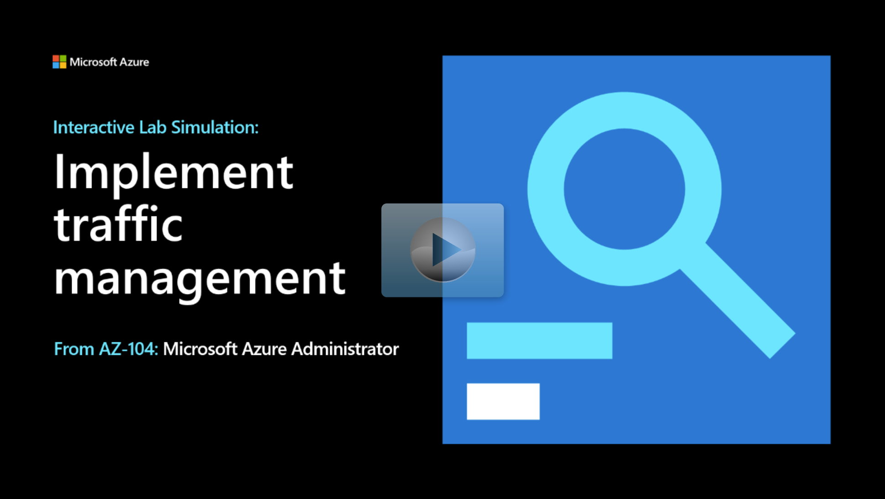

## Lab scenario

Your organization is migrating hub and spoke network topologies to Azure. As the Azure Administrator you need to:
+ Replicate the on-premises functionality in Azure.
+ Configure virtual network peering and traffic routing.
+ Implement load balancer and application gateway functionality.
+ Test to ensure traffic management is flowing as intended.

## Architecture diagram

:::image type="content" source="../media/lab-06.png" alt-text="Architecture diagram as explained in the text." border="false":::

## Objectives

+ **Task 1: Provision the lab environment.** In this task, you deploy four virtual machines into the same Azure region. The first two reside in a hub virtual network, while the remaining two reside in a separate spoke virtual network.
    + Review an [Azure Resource Manager template](https://github.com/MicrosoftLearning/AZ-104-MicrosoftAzureAdministrator/blob/master/Allfiles/Labs/06/az104-06-vms-loop-template.json).
    + This template includes the virtual machines and virtual networks in the underlying architecture. 
    + Use Azure PowerShell to install the Network Watcher extension on the Azure virtual machines. 
+ **Task 2: Configure the hub and spoke network topology.** In this task, you configure local peering between the virtual networks you deployed in the previous tasks in order to create a hub and spoke network topology.
    + Configure virtual network peering between the virtual networks. 
    + Ensure forwarded traffic is allowed to facilitate routing between spoke virtual networks.
+ **Task 3: Test transitivity of virtual network peering.** In this task, you test transitivity of virtual network peering by using Network Watcher.
    + Use Network Watcher to verify peered networks are reachable. 
    + Use Network Watcher to verify unpeered networks are unreachable. 
+ **Task 4: Configure routing in the hub and spoke topology**. In this task, you configure and test routing between the two spoke virtual networks.
    + Enable IP forwarding on a virtual machine.
    + Install the remote access Windows feature with associated tools.
    + Create routing tables and associate them with the appropriate subnets.
    + Use Network Watcher to verify traffic routed through the virtual machine.
+ **Task 5: Implement Azure Load Balancer**. In this task, you implement an Azure load balancer in front of the two Azure virtual machines in the hub virtual network.
    + Create a load balancer with a public IP address.
    + Create a back-end pool that includes the virtual machines.
    + Add a load balancing rule to alternate between virtual machines in the back-end pool.
    + Test to confirm that the load balancer is working correctly. 
+ **Task 6: Implement Azure Application Gateway**. In this task, you implement an Azure application gateway in front of the two Azure virtual machines in the spoke virtual networks.
    + Create a dedicated subnet for the application gateway.
    + Create an application gateway with a public IP address.
    + Configure the application gateway back-end pool to include the virtual machines.
    + Test to ensure traffic is balanced across the back-end virtual machines. 

> [!NOTE]
> Select the thumbnail image to start the lab simulation. When you're done, be sure to return to this page so you can continue learning. 

