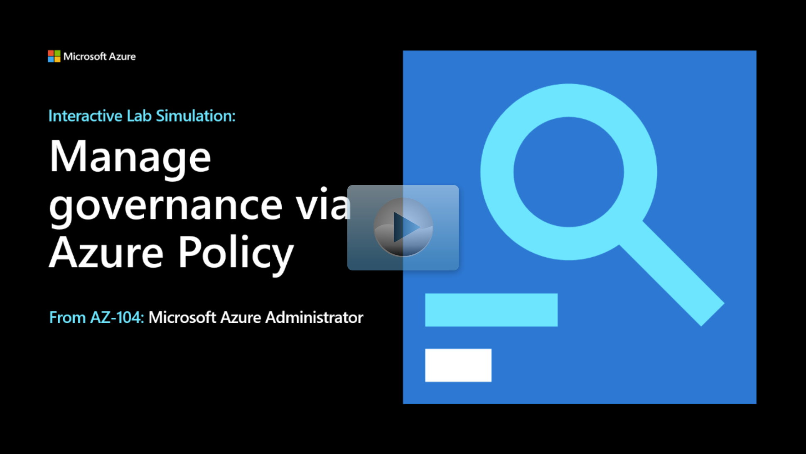

## Lab scenario

Your organization is piloting a new infrastructure project. The CTO wants to know which Azure resources are being used on the new project. Your specific tasks are:

+ Create a way to tag the project resources.
+ Don't allow resources to be created without the resource tag.
+ If a resource is created without the tag, automatically add the tag. 

## Architecture diagram

:::image type="content" source="../media/lab-02b.png" alt-text="Architecture diagram as explained in the text.":::

## Objectives

+ **Task 1**: Create and assign tags via the Azure portal.
    + For testing purposes, identify the Cloud Shell resource group. 
    + Add a tag to the resource group. Assign the value of the tag. 
    + Verify the storage account in the resource group doesn't have the tag. 
+ **Task 2**: Enforce tagging by using an Azure policy.
    + Locate the **Require a tag and its value on resources** built-in policy and review the definition. 
    + Assign the policy to the resource group. 
    + Configure the required tag: **Role** with a value of **Infra**.
    + Create a new storage account in the resource group and verify without the tag you can't create the resource.
+ **Task 3**: Automatically apply tagging by using an Azure policy.
    + Assign the **Inherit a tag from the resource group if missing** built-in policy to the resource group.
    + Configure remediation to automatically add the **Role** tag if it is missing from a new resource.
    + Create a new storage account and verify the tag and value are added.

> [!NOTE]
> Click on the thumbnail image to start the lab simulation. When you're done, be sure to return to this page so you can continue learning. 

