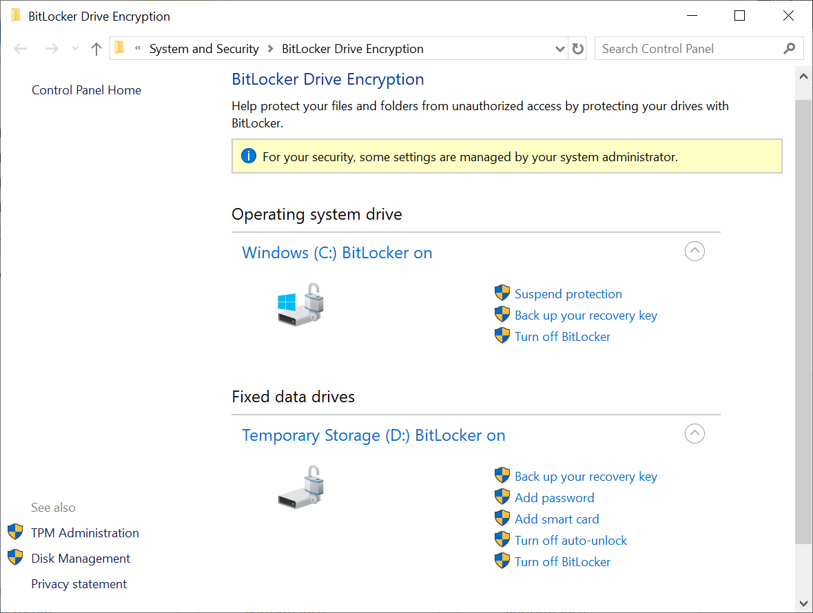

In the context of Azure VMs, storage-level security is provided through encryption of the VMs' virtual disk files. When considering options to enable storage-level security, in general, there are two primary mechanisms that the Contoso IT security team needs to research:

- Azure Disk Encryption
- Server-side encryption of Azure Managed Disks

## What is Azure Disk Encryption?

*Azure Disk Encryption* is a capability built into the Azure platform that enables you to encrypt file system volumes residing on Windows and Linux Azure VM disks. Azure Disk Encryption uses existing file system–based encryption technologies:

- For Windows, Azure Disk Encryption uses BitLocker Drive Encryption.
- For Linux, Azure Disk Encryption uses DM-Crypt.

Azure Disk Encryption uses these technologies to provide encryption of volumes hosting the operating system and data.

> [!CAUTION]
> Although you can review BitLocker settings in Windows, notice the warning message in the screenshot: *For your security, some settings are managed by your system administrator.* Therefore, you shouldn't reconfigure BitLocker settings directly within a VM.

> [!NOTE]
> Key Vault stores the cryptographic keys that BitLocker uses.

Key Vault maintains its content in an encrypted form. To provide additional layers of security, you have the option to encrypt the volume encryption keys as well, by utilizing Key Vault's key encryption key functionality.

Azure Disk Encryption can automatically encrypt:

- The operating system disk
- Data disks
- The temporary disk

It also supports both managed and unmanaged disks.

You can use Azure Disk Encryption in three scenarios:

- Enabling encryption on new Azure VMs that were created from Azure Marketplace images
- Enabling encryption on existing Azure VMs that are already running in Azure
- Enabling encryption on new Azure VMs created from a customer-encrypted .vhd file by using existing encryption keys

Azure Disk Encryption requires additional steps to provide the Azure platform with access to the key vault where secrets and encryption keys will reside. In particular, you must enable the access policy setting **Enable Access to Azure Disk Encryption for volume encryption** for the vault.

When applying encryption to a new VM, you must:

1. Configure the vault access policy to enable the Microsoft.Compute resource provider and Azure Resource Manager to retrieve its secrets during VM deployments.

   > [!NOTE]
   > This step only applies when you plan to deploy VMs using Resource Manager templates.  

1. Enable encryption on new or existing Resource Manager VMs. Details of this step depend on which of the three scenarios you're implementing and which deployment methodology you're using.

### Requirements

To implement Azure Disk Encryption, your environment must meet certain requirements. These include operating system, VM generation, networking, and Group Policy requirements, in addition to certain SKU requirements.

The requirements for Azure Disk Encryption are described in the following table.

|Requirement|Details|
|----------------------|------------------------------------------------------------|
|VM size|Azure Disk Encryption isn't available on Basic, A-series VMs. It's also not available on Lsv2-series VMs.|
|VM generation|Azure Disk Encryption isn't available on Generation 2 VMs.|
|Memory|Azure Disk Encryption isn't available on VMs with less than 2 gigabytes (GB) of memory.|
|Networking|To get a token to connect to your key vault, the Windows VM must be able to connect to an Azure AD endpoint, `login.microsoftonline.com`. To write the encryption keys to your key vault, the Windows VM must be able to connect to the key vault endpoint.|
|Group Policy|Azure Disk Encryption uses the BitLocker external key protector for Windows VMs. For domain-joined VMs, don't push any Group Policy Object (GPO) settings that enforce Trusted Platform Module (TPM) protectors. BitLocker policy on domain-joined VMs with custom GPO must include the following setting: `Configure user storage of BitLocker recovery information -> Allow 256-bit recovery key`. Azure Disk Encryption fails when custom GPO settings for BitLocker are incompatible. Azure Disk Encryption also fails if domain-level GPOs block the AES-CBC algorithm, which is used by BitLocker.|
|Encryption key storage |Azure Disk Encryption requires a key vault to control and manage disk encryption keys and secrets. your key vault and VMs must reside in the same Azure region and subscription.|

## What is server-side encryption of Azure-managed disks?

By using platform-managed encryption keys, server-side encryption of Azure-managed disks automatically applies encryption to:

- All managed disks
- Managed disk snapshots
- Managed images

> [!NOTE]
> Unlike Azure Disk Encryption, server-side encryption doesn't apply to a temporary disk and doesn't provide support for unmanaged disks.

However, server-side encryption supports Generation 2 Azure VMs and all existing Azure VM sizes. Effectively, all Azure VM–managed disks are automatically protected, even if Azure Disk Encryption isn't being used.

> [!NOTE]
> If you decide to implement Azure-managed disks with your own keys rather than using the platform-provided keys, server-side encryption of Azure managed disks will be incompatible with Azure Disk Encryption.

As previously mentioned, server-side encryption of Azure-managed disks is automatic. If you want to implement it with your own keys, you have to add the keys to a key vault that's in the same region and the same Azure subscription where the Azure VM disks reside. You also have to create a Disk Encryption Set resource that references the keys in the key vault, and then point to the Disk Encryption Set when deploying the Azure VM with managed disks or when configuring encryption of a managed disk.

## Additional reading

You can learn more by reviewing the following documents:

- [Azure Disk Encryption scenarios on Windows VMs](https://aka.ms/disk-encryption-windows?azure-portal=true)
- [Server-side encryption of Azure Disk Storage](https://aka.ms/disk-encryption?azure-portal=true)
