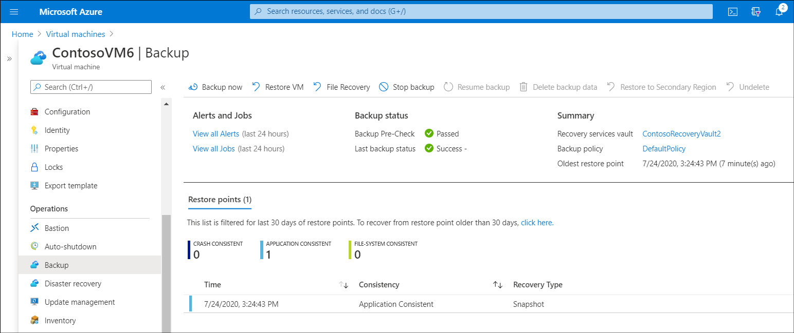
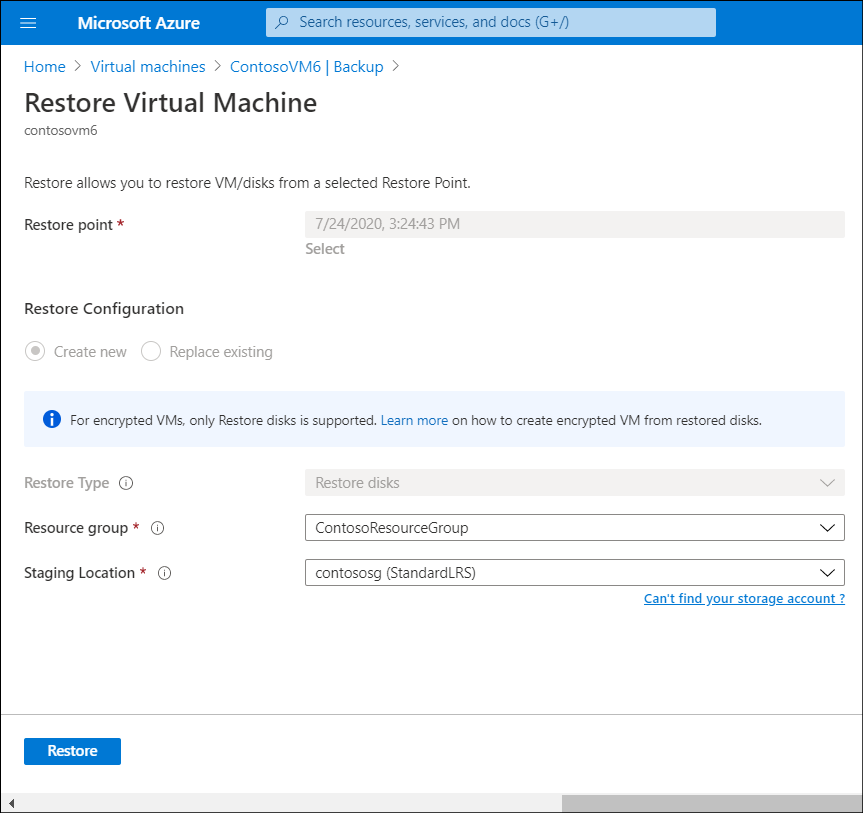

It's important for the Contoso IT security team to be able to recover data from any disk. This is true for encrypted disks as well. The Azure Backup service enables the team to perform backup and restore operations for disks encrypted with Azure Disk Encryption.

## Back up your Azure Disk Encryption–protected VMs

To back up your Azure Disk Encryption–protected VMs, create a Recovery Services vault if you don't already have one. Then perform the following steps:

1. In the Azure portal, navigate to and select your Recovery Services vault.
2. On the **Recovery Services Vault** blade, select **Backup**.
3. On the **Backup Goal** blade, specify the location of your workload. For example, select **Azure**, select **Virtual machine**, and then select **Backup**.
4. On the **Backup** blade, in the **Policy** section, select a backup policy (or create a new one).
5. In the **Virtual Machines** section, select **Add**.
6. In the **Select virtual machine** blade, select the encrypted VMs, and then select **OK**.
7. On the **Backup** blade, select **Enable Backup**.
8. On the **Backup Goal** blade, select **Backup**.
9. You can force a manual backup of a protected VM by selecting that VM on the **Virtual machines** blade in the Azure portal. On the **Backup** blade, in the **Operations** section, select **Backup**, and then from the menu, select **Backup now**.



## Restore your Azure Disk Encryption–protected VMs

After you've backed up your Azure Disk Encryption–protected VM, you can restore any encrypted disks using Azure Backup. Use the following procedure to restore the VM:

1. In the Azure portal, on the **Virtual machines** blade, select the VM you want to recover.
2. On the **Backup** blade, in the **Operations** section, select **Backup**, and then review the available **Restore points**.
3. In the **Restore points** section, select the appropriate restore point, and then select the ellipsis button.
4. Select **Restore VM**.

    > [!NOTE]
    > You can only restore encrypted VMs by restoring the VM disk. **Replace existing** and **Restore VM** aren't supported.

5. Select a **Staging location**, and then select **Restore**.



## Decrypting disks

If you need to, you can decrypt a disk by using either the Azure CLI, PowerShell, or the Azure portal.

### Use Azure CLI to decrypt a disk

For the Azure CLI, use the `vm encryption disable` command:

```AzureCLI
Disable-AzVMDiskEncryption -ResourceGroupName ContosoResourceGroup -VMName ContosoVM6
```

### Use PowerShell to decrypt a disk

You can decrypt a disk through PowerShell using `Disable-AzVMDiskEncryption` as in the following command:

```PowerShell
Disable-AzVMDiskEncryption -ResourceGroupName ContosoResourceGroup -VMName ContosoVM6
```

## Use the Azure portal to decrypt a disk

Use the following procedure to decrypt disks using the Azure portal:

1. In the Azure portal, navigate to your VMs, and then select the appropriate VM.
2. On the **Virtual machine** blade, in the navigation pane, in the **Settings** section, select **Disks**.
3. On the **Disks** blade, select **Encryption**.
4. On the **Encryption** blade, from the **Disks to encrypt** list, select **None**, and then select **Save**.


