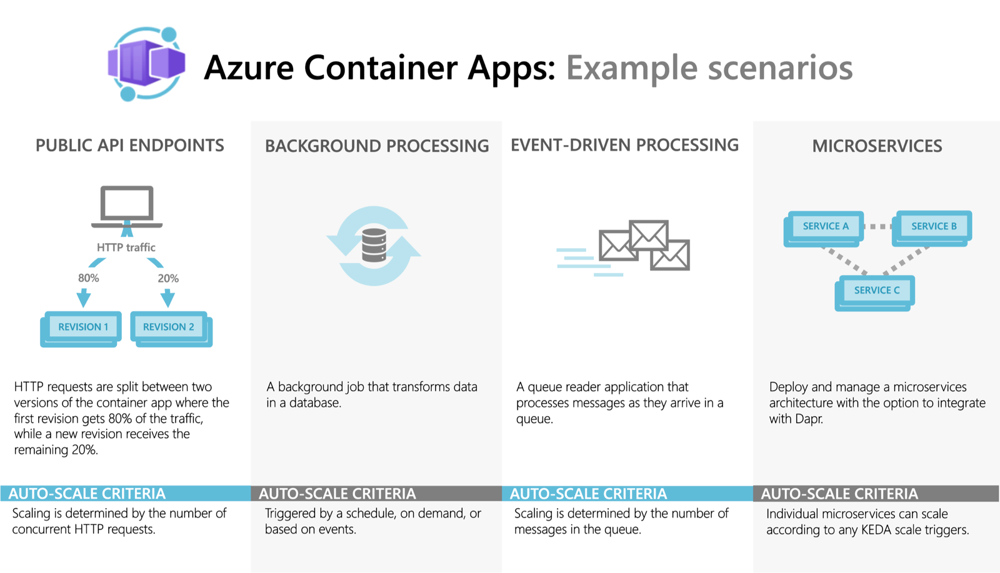

Azure Container Apps is a fully managed environment that enables you to run microservices and containerized applications on a serverless platform. Common uses of Azure Container Apps include:

- Deploying API endpoints
- Hosting background processing jobs
- Handling event-driven processing
- Running microservices

Applications built on Azure Container Apps can dynamically scale based on the following characteristics:

- HTTP traffic
- Event-driven processing
- CPU or memory load
- Any KEDA-supported scaler

Azure Container Apps enables executing application code packaged in any container and is unopinionated about runtime or programming model. With Container Apps, you enjoy the benefits of running containers while leaving behind the concerns of managing cloud infrastructure and complex container orchestrators.

## Key features

With Azure Container Apps, you can:

- Use the Azure CLI extension, Azure portal or ARM templates to manage your applications.

- Enable HTTPS or TCP ingress without having to manage other Azure infrastructure.

- Build microservices with Dapr and access its rich set of APIs.

- Run jobs on-demand, on a schedule, or based on events.

- Add Azure Functions and Azure Spring Apps to your Azure Container Apps environment.

- Use specialized hardware for access to increased compute resources.

- Run multiple container revisions and manage the container app's application lifecycle.

- Autoscale your apps based on any KEDA-supported scale trigger. Most applications can scale to zero.

    > [!NOTE]
    > Applications that scale on CPU or memory load can't scale to zero.

- Split traffic across multiple versions of an application for Blue/Green deployments and A/B testing scenarios.

- Use internal ingress and service discovery for secure internal-only endpoints with built-in DNS-based service discovery.

- Run containers from any registry, public or private, including Docker Hub and Azure Container Registry (ACR).

- Provide an existing virtual network when creating an environment for your container apps.

- Securely manage secrets directly in your application.

- Monitor logs using Azure Log Analytics.

- Override (already generous) quotas to increase limits on a per-account basis.
