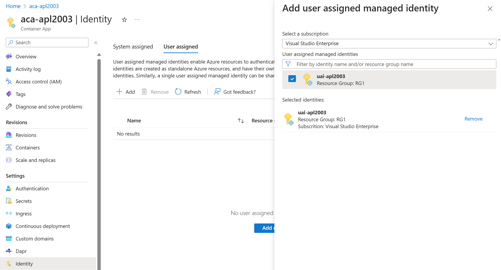

A managed identity from Microsoft Entra allows your container app to access other Azure AD-protected resources.

Your container app can be granted two types of identities:

- A system-assigned identity is tied to your container app and is deleted when your container app is deleted. An app can only have one system-assigned identity.
- A user-assigned identity is a standalone Azure resource that can be assigned to your container app and other resources. A container app can have multiple user-assigned identities. The identity exists until you delete them.

## Why use a managed identity?

You can use a managed identity in a running container app to authenticate to any service that supports Microsoft Entra authentication.

With managed identities:

- Your app connects to resources with the managed identity. You don't need to manage credentials in your container app.
- You can use role-based access control to grant specific permissions to a managed identity.
- System-assigned identities are automatically created and managed. They're deleted when your container app is deleted.
- You can add and delete user-assigned identities and assign them to multiple resources. They're independent of your container app's life cycle.
- You can use managed identity to authenticate with a private Azure Container Registry without a username and password to pull containers for your Container App.
- You can use managed identity to create connections for Dapr-enabled applications via Dapr components

### Common use cases

System-assigned identities are best for workloads that:

- are contained within a single resource
- need independent identities

User-assigned identities are ideal for workloads that:

- run on multiple resources and can share a single identity
- need pre-authorization to a secure resource

## Limitations

Using managed identities in scale rules isn't supported. You'll still need to include the connection string or key in the secretRef of the scaling rule.

Init containers can't access managed identities.

## Configure managed identities

You can configure your managed identities through:

- the Azure portal
- the Azure CLI
- your Azure Resource Manager (ARM) template

When a managed identity is added, deleted, or modified on a running container app, the app doesn't automatically restart and a new revision isn't created.

### Add a user-assigned identity in the Azure portal

Configuring a container app with a user-assigned identity requires that you first create the identity then add its resource identifier to your container app's configuration. You can create user-assigned identities via the Azure portal or the Azure CLI.

