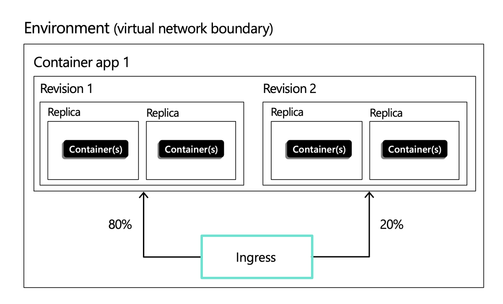

Azure Container Apps allows you to expose your container app to the public web, your virtual network (VNET), and other container apps within your environment by enabling ingress. Ingress settings are enforced through a set of rules that control the routing of external and internal traffic to your container app. When you enable ingress, you don't need to create an Azure Load Balancer, public IP address, or any other Azure resources to enable incoming HTTP requests or TCP traffic.

Ingress supports:

- External and internal ingress
- HTTP and TCP ingress types
- Domain names
- IP restrictions
- Authentication
- Traffic splitting between revisions
- Session affinity

Example ingress configuration showing ingress split between two revisions:

## External and internal ingress

When you enable ingress, you can choose between two types of ingress:

- External: Accepts traffic from both the public internet and your container app's internal environment.
- Internal: Allows only internal access from within your container app's environment.

Each container app within an environment can be configured with different ingress settings. For example, in a scenario with multiple microservice apps, to increase security you may have a single container app that receives public requests and passes the requests to a background service. In this scenario, you would configure the public-facing container app with external ingress and the internal-facing container app with internal ingress.

## Protocol types

Container Apps supports two protocols for ingress: HTTP and TCP.

### HTTP

With HTTP ingress enabled, your container app has:

- Support for TLS termination

- Support for HTTP/1.1 and HTTP/2

- Support for WebSocket and gRPC

- HTTPS endpoints that always use TLS 1.2, terminated at the ingress point

- Endpoints that expose ports 80 (for HTTP) and 443 (for HTTPS)

    - By default, HTTP requests to port 80 are automatically redirected to HTTPS on 443

- A fully qualified domain name (FQDN)

- Request timeout is 240 seconds

### TCP

Container Apps supports TCP-based protocols other than HTTP or HTTPS. For example, you can use TCP ingress to expose a container app that uses the Redis protocol.

> [!NOTE]
> External TCP ingress is only supported for Container Apps environments that use a custom VNET.

With TCP ingress enabled, your container app:

- Is accessible to other container apps in the same environment via its name (defined by the name property in the Container Apps resource) and exposed port number.

- Is accessible externally via its fully qualified domain name (FQDN) and exposed port number if the ingress is set to "external".
