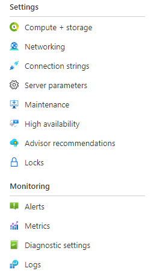
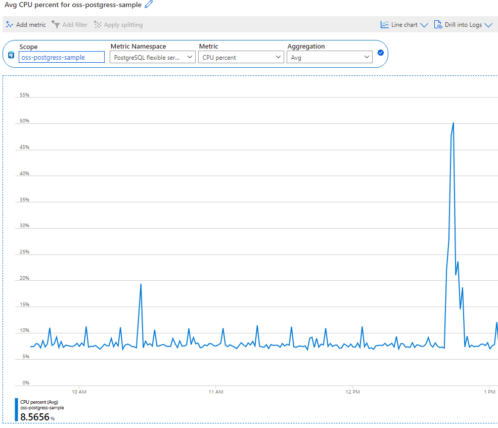
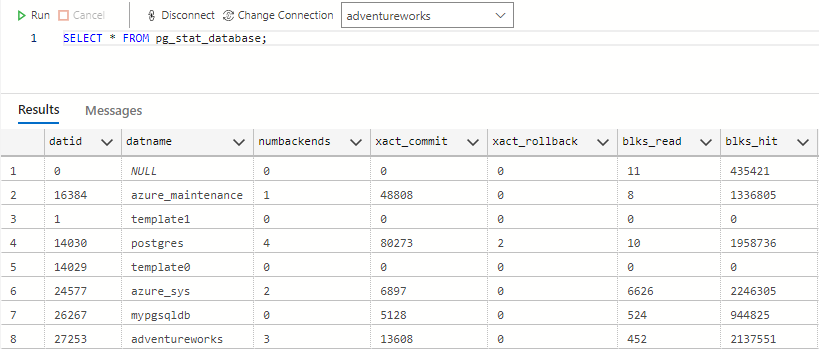

To investigate metadata in an Azure Database for PostgreSQL database, you can query a view or table that accesses the data, or use an interface that displays data from the system catalog.

## Investigate metadata in the Azure portal

The Azure portal has many pages for settings and monitoring allowing you to assess, and in some cases modify metadata.

[](../media/3-settings-monitor.png#lightbox)

These pages are typically the most straightforward and informative method to view metadata for the most commonly required metrics. Many metrics can also be displayed in a graph to give a visual representation of changes over time.

[](../media/3-metrics.png#lightbox)

## Investigate metadata using system tables and system views

To query metadata in an Azure Database for PostgreSQL database or server, you can run a SQL query on the tables in the pg_catalog schema. Some of the most useful pg_catalog tables are:

* pg_database
    pg_database has basic information such as the database owner (in **datdba**), the collation, and the connection limit (in **datconnlimit**). A **datconnlimit** of **-1** signifies that there's no connection limit.

    [](../media/3-query-code.png#lightbox)

* pg_stat_database
    pg_stat_database contains lock information for each database, updated in real time. Querying this table enables you to see the number of rollbacks and deadlocks on each database.

    [](../media/3-query-code-1.png#lightbox)

To view the metadata that, you require it's often necessary to write complex sql queries against system tables. The most common queries are referenced in system views. These views are in the **pg_catalog** schema and can be listed with the following query:

```sql
SELECT viewname
,definition
FROM pg_catalog.pg_views
WHERE schemaname = 'pg_catalog';
```

### Database and server metadata

A large proportion of the metadata in the system catalog is server settings and data. This data is available in any database and it isn't necessary to switch database.

There are two system tables that are database specific and you need to connect to the correct database to view its data.

- **pg_catalog.pg_stat_user_tables** lists statistical metadata about user table in the database.
- **pg_statio_user_tables** lists I/O metadata about user tables in the database.
    [](../media/3-query-code-2.png#lightbox)
