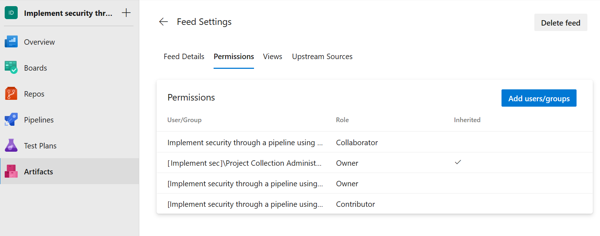
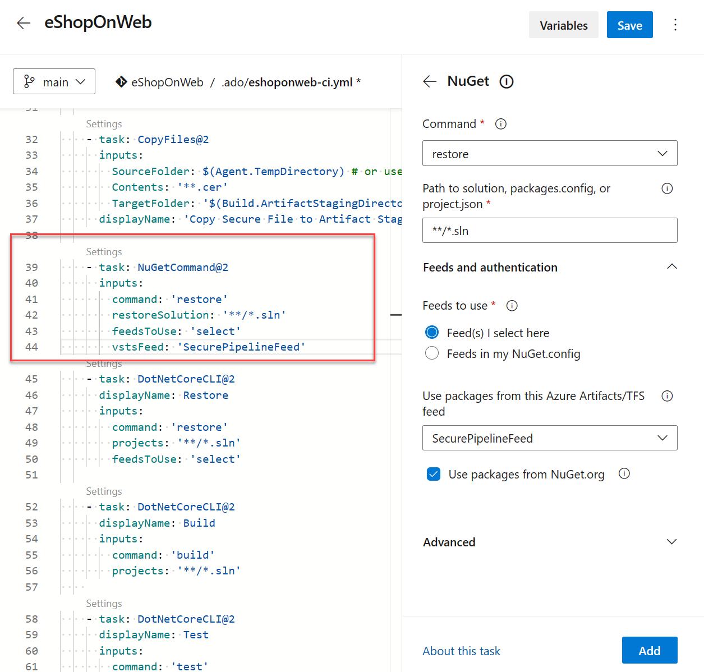

In this unit, you'll learn how to configure pipeline access to packages stored in Azure Artifacts. It involves creating and managing feed permissions, which allow you to control who can access and manage your packages. By controlling access to these packages, you can ensure that only authorized users can access and use the packages in your projects.

## Configuring pipeline access to packages in YAML

1. Navigate to your Azure DevOps organization and select the project that contains the Azure Artifacts repository you want to configure.
2. In the left-side menu, select Artifacts.
3. If you don't have any feed, [Create a feed](https://learn.microsoft.com/azure/devops/artifacts/get-started-nuget).
4. In the Artifacts menu, select Feed Settings.
5. Click on the Permissions tab.
6. Add users or groups to the repository.
7. Select the permissions you want to assign to each user or group (for example, Owner, Reader, Contributor, or Collaborator).

    

8. Select Add users/groups, and then add your build identity as a Contributor. The project-level build identity is named as follows: [Project name] Build Service ([Organization name]).
Example: Implement security through a pipeline using DevOps Build Service (contoso).

    > [!NOTE]
    > To access packages from your pipelines, the appropriate build identity must have access to your feed. By default, feeds have the Project Collection Build Service role set to Collaborator.

9. Save your changes.

## Consume packages from Azure Artifacts in a pipeline

In Azure Pipelines, you can use the classic editor or the YAML tasks to publish your NuGet, or other packages within your pipeline to your Azure Artifacts feed or public registries such as nuget.org.

To configure pipeline access to packages stored in Azure Artifacts repositories using YAML:

```YAML
steps:
    - task: NuGetCommand@2
      inputs:
        command: 'restore'
        restoreSolution: '**/*.sln'
        feedsToUse: 'select'
        vstsFeed: 'SecurePipelineFeed'

```

Replace to your Azure Artifacts feed name with the name of your Azure Artifacts feed and your solution file.sln with the name of your solution file.



## Challenge yourself

If you want to take your learning to the next level, try setting up a pipeline that restores packages from multiple Azure Artifacts repositories. You can also try setting up a pipeline that restores packages based on the branch being built.

For more information about Artifacts, see:

- [Create and target an environment.](https://learn.microsoft.com/azure/devops/artifacts/start-using-azure-artifacts)
- [Configure permissions](https://learn.microsoft.com/azure/devops/artifacts/feeds/feed-permissions)
- [Set pipeline permissions](https://learn.microsoft.com/azure/devops/pipelines/policies/permissions)
