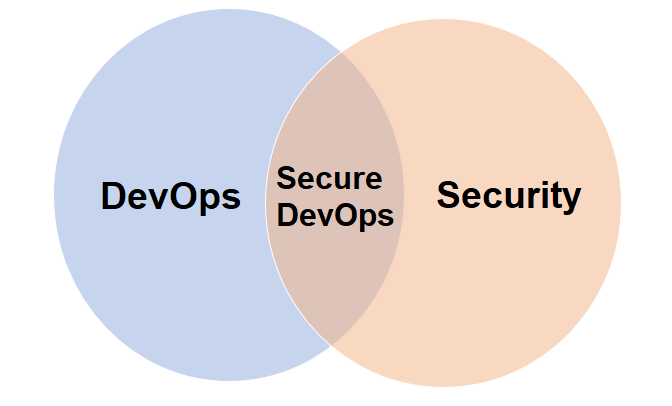

While a DevOps culture enables development and operations teams to deploy applications faster, going faster over a cliff doesn't help.

Cloud environments brought unprecedented infrastructure and scale to DevOps teams. They can be approached by some of the most nefarious actors on the internet, as they risk the security of their business with every application deployment.

How do you ensure your applications are secure and stay secure with continuous integration and delivery? How can you find and fix security issues early in the process?

  

DevOps is about working faster. Security is about-emphasizing thoroughness. Security concerns are typically addressed at the end of the cycle. It can potentially create unplanned work right at the end of the pipeline. Secure DevOps integrates DevOps with security into a set of practices designed to meet the goals of both DevOps and safety effectively.

A Secure DevOps pipeline allows development teams to work fast without breaking their project by introducing unwanted security vulnerabilities.

## What will you learn?

You'll learn best practices for securing pipelines in Azure DevOps, how to configure secure access to pipeline resources, secure access to Azure Repos from pipelines, manage permissions, structure projects and repositories for security, extend pipelines with multiple templates, secure variables, and parameters, and manage identity for projects, pipelines, and agents.

This module series is designed for the Implement security through a pipeline using DevOps credential made for developers, administrators, and IT professionals responsible for managing and securing pipelines in Azure DevOps. By the end of this journey, you'll have the skills to secure your pipelines.

The course is divided into several modules, each covering a specific topic related to securing pipelines in Azure DevOps. Each module includes lectures, hands-on activities, quizzes, and challenges to help you apply your knowledge and practice what you have learned. At the end of each module, you take a final assessment to evaluate your understanding of the subject.

## Why should I take the implement security through a pipeline using DevOps learning path?

Completing this module helps prepare you for the **Implement security through a pipeline using DevOps** assessment.

### Learning objectives

After completing this module, students and professionals can:

- Configure pipeline access to specific agent pools.
- Configure agents for projects and agent identities.
- Configure pipeline access to packages.
- Manage secret variables and variable groups.
- Configure service connections.
- Manage environments.
- Secure repositories.
- Ensure that the secrets are in the Azure Key Vault.
- Configure and validate user and pipeline permissions.
- Configure and validate approval and branch checks.
- Manage and audit permissions in Azure DevOps.
- Separate secure files between projects.
- Create nested templates.
- Limit variables that can be set at queue time.
- Convert to a managed identity in Azure DevOps.

### Prerequisites

You must create an Azure DevOps Organization and a Team Project for some exercises. If you don't have it yet, see:

- [Create an organization - Azure DevOps](https://docs.microsoft.com/azure/devops/organizations/accounts/create-organization).
- [Create a project in Azure DevOps](https://learn.microsoft.com/azure/devops/organizations/projects/create-project).

To get the most out of this course, we recommend that you understand Azure DevOps and pipeline management. If you don't have this experience, we recommend that you first complete a module or course on Azure DevOps and pipeline management:

- Free online:
  - [Choose the DevOps tools](https://learn.microsoft.com/training/modules/migrate-to-devops/).
  - [Explore Azure Pipelines](https://learn.microsoft.com/training/modules/explore-azure-pipelines/).
  - [Integrate with Azure Pipelines](https://learn.microsoft.com/training/modules/integrate-azure-pipelines/).

- Instructor-led course: [AZ-400: Designing and Implementing Microsoft DevOps solutions](https://learn.microsoft.com/training/courses/az-400t00).

If you're new to Azure and cloud computing, consider one of the following resources:

- Free online: [Azure Fundamentals](https://docs.microsoft.com/learn/paths/az-900-describe-cloud-concepts/).
- Instructor-led course: [AZ-900: Azure Fundamentals](https://learn.microsoft.com/training/courses/az-900t00).

If you're new to Azure Administration, consider taking the:

- Free online: [Prerequisites for Azure Administrators](https://docs.microsoft.com/learn/paths/az-104-administrator-prerequisites/).
- Instructor-led courses: [AZ-104: Microsoft Azure Administrator](https://docs.microsoft.com/learn/certifications/courses/az-104t00).

If you're new to Azure Developer, consider taking the:

- Free online: [Create serverless applications](https://docs.microsoft.com/learn/paths/create-serverless-applications/).
- Instructor-led courses: [AZ-204: Developing Solutions for Microsoft Azure](https://docs.microsoft.com/learn/certifications/courses/az-204t00).

Ensure you have all the necessary resources and access to Azure DevOps before starting the course.

Let's begin!
