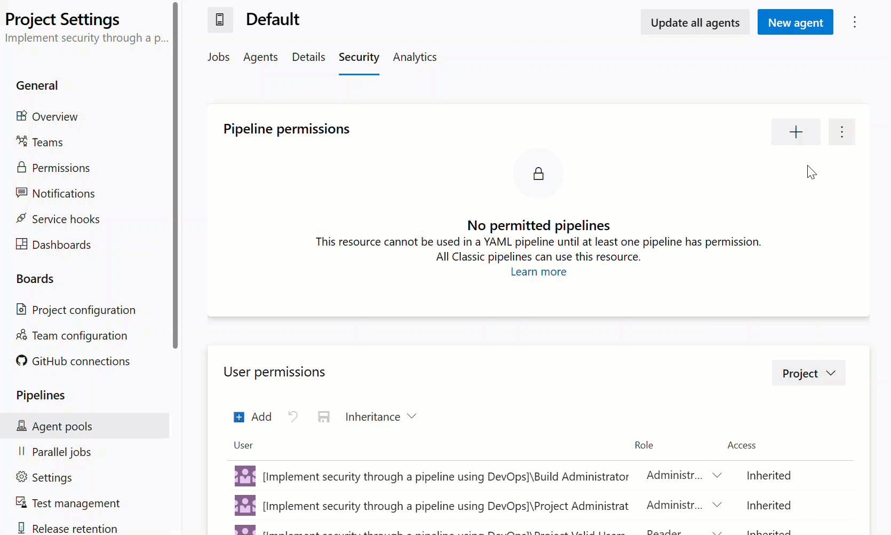

It is crucial to control and manage access to your pipelines and the resources they use, such as agent pools.

This unit will teach you how to configure pipeline access to specific agent pools in Azure DevOps. By controlling access to agent pools, you can ensure the execution of your pipeline on the right set of agents and grant the right level of permissions to the pipelines.

## Prerequisites

* A project in Azure DevOps
* Access to the project settings
* Agent pools created and configured in Azure DevOps.

> [!NOTE]
> For more details about Agent Pools, see: [Create and manage agent pools](https://learn.microsoft.com/azure/devops/pipelines/agents/pools-queues)

## Pipeline permissions

Pipeline permissions control which YAML pipelines are authorized to use an agent pool. Pipeline permissions do not restrict access from Classic pipelines.

You can choose from the following options:

* Open access for all pipelines to use the agent pool from the more options at the top-right corner of the Pipeline permissions section in the security tab of an agent pool.

* Lock down the agent pool and only allow selected YAML pipelines to use it. If any other YAML pipeline refers to the agent pool, an authorization request gets raised, which must be approved by an agent pool Administrator. This does not limit access from Classic pipelines.

Pipeline permissions for the Azure Pipelines agent pool cannot be configured, as the pool is accessible, by default, to all pipelines.

The **Security** action in the Agent pools tab is used to control the security of all project agent pools in a project. Role memberships for individual project agent pools are automatically inherited from what you define here. By default, the following groups are added to the Administrator role of 'All agent pools': Build Administrators, Release Administrators, Project Administrators.

### Steps to configure pipeline access to agent pools

By configuring pipeline access to agent pools, you can ensure that your pipelines are executed on the right set of agents and that the right level of permissions is granted to the pipelines. You can restrict access to specific pipelines or allow all pipelines to use a specific agent pool.

1. Log in to your Azure DevOps account
2. Navigate to the project for which you want to configure pipeline access to agent pools
3. Go to Project Settings, then click on Agent Pools under Pipelines
4. Choose the agent pool that you want to grant access to your pipeline
5. Go to the Security tab
6. Click on the + button (Add pipeline) to add a new pipeline
7. (Optional) Search for the pipeline name
8. Select the name of your pipeline that you want to grant access to the current agent

    

Your pipeline is ready to run from the agent you select.

For more information about Agents and Pools, see: [Manage Azure Pipeline agents and pools](https://learn.microsoft.com/en-us/training/modules/manage-azure-pipeline-agents-pools/)