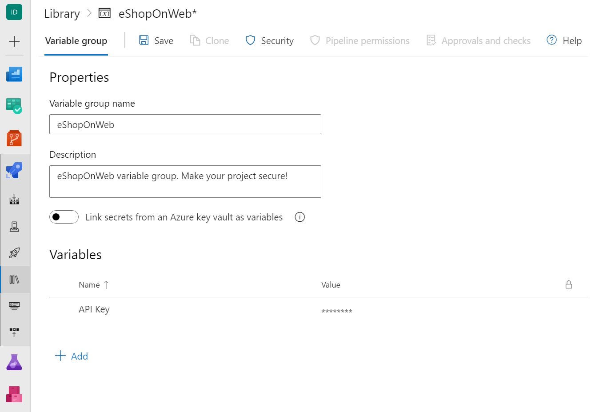
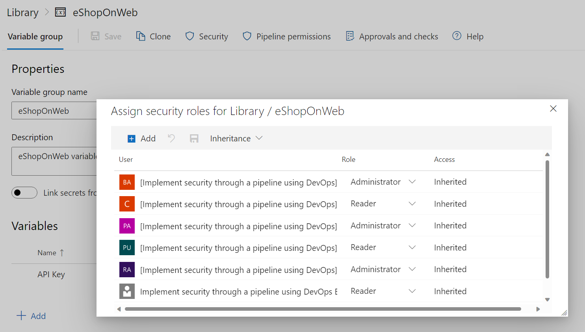

Security and protection of sensitive information are of utmost importance in your projects. Using Secret Variables and Variable Groups, you can ensure that sensitive information such as passwords, API keys, or other secrets are stored securely and protected from unauthorized access.

In Azure DevOps, secret variables are stored encrypted and can only be accessed by authorized users. It protects sensitive information from being exposed or leaked in your build and release pipelines. Additionally, variable groups allow you to organize variables and manage access permissions for multiple users or teams in a centralized location.

You can protect sensitive information throughout the DevOps phases by using secret variables and variable groups. It helps to ensure that your projects are secure, trustworthy, and meet industry standards for safety and privacy. The integrity of your projects is crucial, and you need to reduce the risk of security breaches.

In this unit, you will learn how to create and manage secret variables and variable groups in Azure DevOps and configure permissions and access to protect your secrets.

## Step 1: Creating a Variable Group and Secret Variables

1. Navigate to the Azure DevOps project where you want to store your secrets.
2. Go to the Pipelines section and select Library.
3. Click on Variable Groups.
4. Click on the New Variable Group button (+ Variable group).
5. Enter a name for your Variable Group.
6. Add your secret variables to the Variable Group by clicking on the Add button.
7. (Optional) If you want to encrypt and securely store the value, choose the "lock" icon at the end of the row.
8. Click on the Save button to store your Variable Group.

    

## Step 2: Configuring Permissions and Access

1. Navigate to the Azure DevOps project where you want to store your secrets.
2. Go to the Pipelines section and select Library.
3. Click on Variable Groups.
4. Click on the Variable Group that you want to configure.
5. Click on the Security button.
6. Add the users or groups that you want to have access to the Variable Group.
7. Assign the appropriate permissions to each user or group.
8. Click on the Save button to store your changes.

    

> [!NOTE]
> For more details about Library security, see: [Library security](https://learn.microsoft.com/azure/devops/pipelines/library/)

## Step 3: Configuring Pipeline permissions

You can add pipeline permissions to limit access to secret variables in a variable group and restrict access to pipelines not in the allowed list. Pipeline permissions do not limit access to non-secret variables.

1. Navigate to the Azure DevOps project where you want to store your secrets.
2. Go to the Pipelines section and select Library.
3. Click on Variable Groups.
4. Click on the Variable Group that you want to configure.
5. Click on the Pipeline permissions button.
6. Add the pipeline you want to allow to use and have access to the Variable Group.
7. (Optional) You can Open Access to all pipelines access the resource.

    

## Challenge yourself

Try creating a Secret Variable and Variable Group in your Azure DevOps project. Once you have created the Variable Group, try configuring permissions and access to see how it affects who can access the secrets stored in the Variable Group.

For more information about secret variables and variable groups, see:

* [Manage and modularize tasks and templates](https://learn.microsoft.com/training/modules/manage-modularize-tasks-templates/)
* [Add & use variable groups](https://learn.microsoft.com/azure/devops/pipelines/library/variable-groups/)
* [Set secret variables](https://learn.microsoft.com/azure/devops/pipelines/process/set-secret-variables/)
