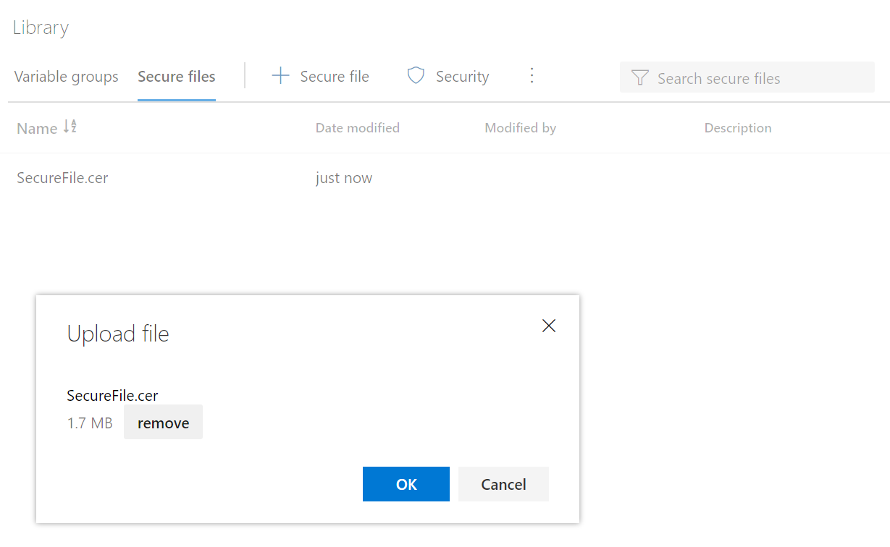
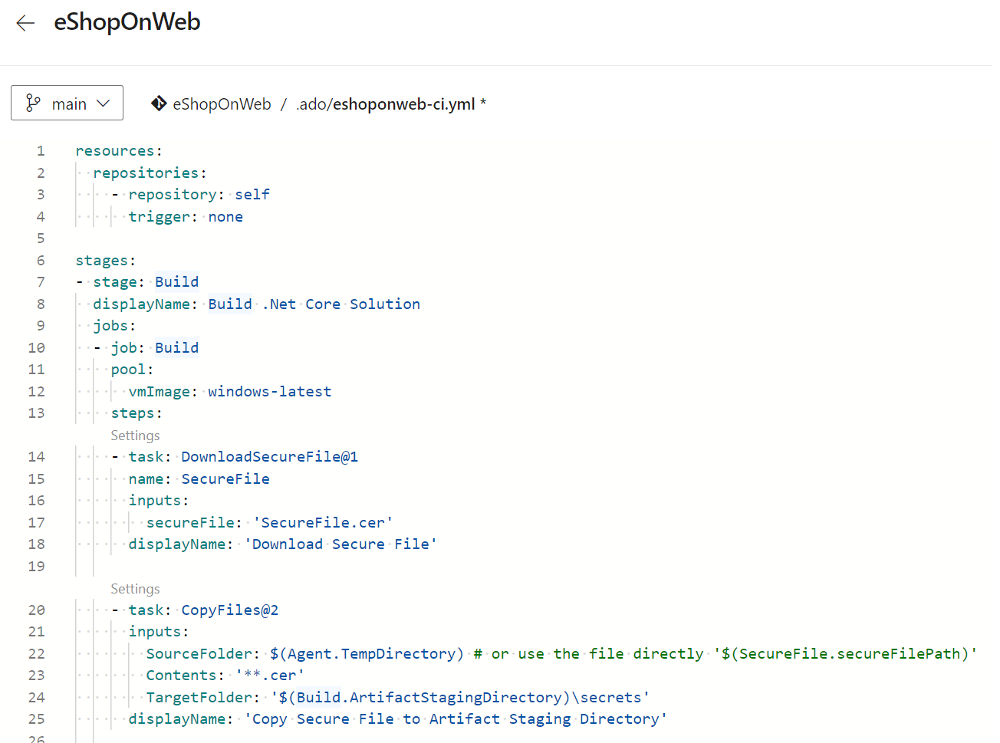
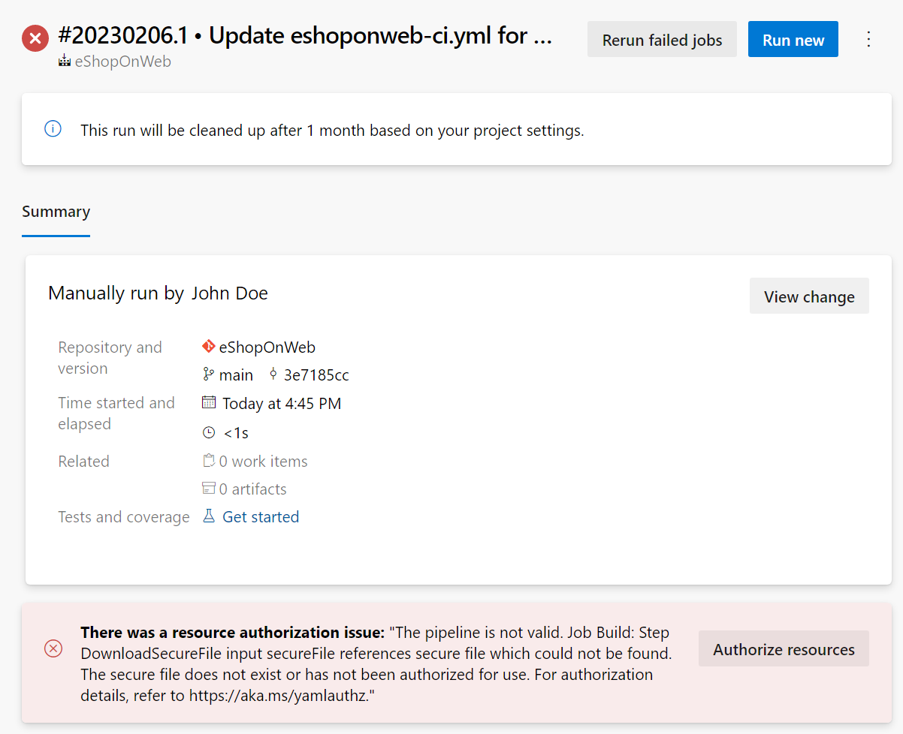
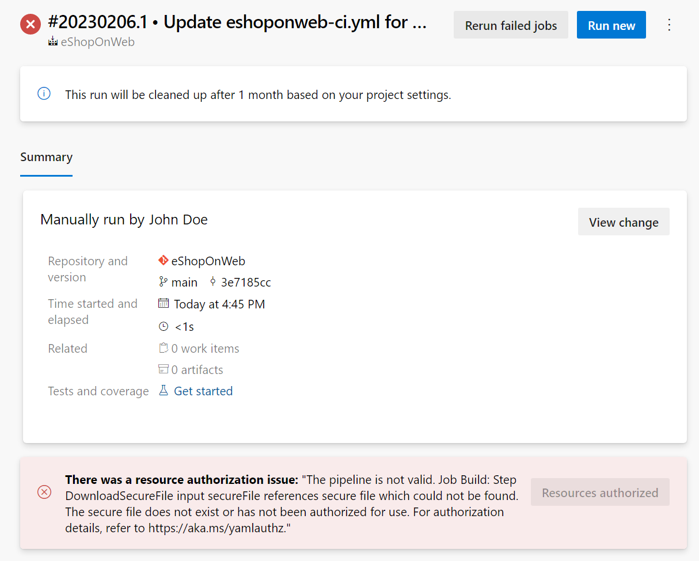

It's important to keep sensitive files such as certificates, private keys, or SSH Keys securely stored and protected from unauthorized access. Azure DevOps provides a secure file storage solution called Secure Files, which allows you to store and manage sensitive files within your projects securely.

## Why use Secure Files

Using Secure Files in Azure DevOps provides several benefits for protecting sensitive files in your projects.

Access to secure files is controlled through Azure DevOps permissions and can only be restricted to authorized users. All files are encrypted and stored securely.

Secure Files can be easily accessed and used in the build and release pipelines, eliminating the need to store sensitive files in a separate location.
Secure Files help to maintain the security and privacy of sensitive files, reducing the risk of security breaches.

> [!IMPORTANT]
> These files can be stored on the server without committing them to your repository.

In this unit, you go through the steps to configure Secure Files in Azure DevOps and demonstrate how to access these files in your pipelines.

## Create a Secure File

1. Go to the Azure DevOps project where you want to store the secure file.
2. Navigate to the Library tab in the Pipelines section.
3. Click on Secure Files and then click on the + Secure file button.
4. Upload the file you want to store securely.
5. Click on OK.

    

## Add the secure file to the pipeline

1. Go to your pipeline where you want to use the Secure File.
2. Click to edit your existing pipeline, or create a new pipeline.
3. Use the Download Secure File task to consume secure files.

    ```YAML
    steps:
    - task: DownloadSecureFile@1
      name: SecureFile
      inputs:
        secureFile: 'SecureFile.cer'
      displayName: 'Download Secure File'

    - task: CopyFiles@2
      inputs:
        SourceFolder: $(Agent.TempDirectory) # or use the file directly '$(SecureFile.secureFilePath)'
        Contents: '**.cer'
        TargetFolder: '$(Build.ArtifactStagingDirectory)\secrets'
      displayName: 'Copy Secure File to Artifact Staging Directory'
    ```

    In this example, the first task **DownloadSecureFile@1** is used to download the secure file specified in the **secureFile** input. The second task **CopyFiles@2** is used to copy the secure file to the artifact staging directory. The secure file will now be available for use in your build pipeline and can be passed to other tasks or stages as needed.

    > [!NOTE]
    > If the task is given the name mySecureFile, its path can be referenced in the pipeline as $(mySecureFile.secureFilePath). Alternatively, downloaded secure files can be found in the directory given by $(Agent.TempDirectory).

4. Save and commit your YAML pipeline.

    

5. (Optional) Run the pipeline. If you see the message:

    >_There was a resource authorization issue: "The pipeline is not valid. Job Build: Step DownloadSecureFile input secureFile references secure file which could not be found. The secure file does not exist or has not been authorized for use. For authorization details, refer to <https://aka.ms/yamlauthz>."_

    

6. (Optional) Click on the Authorize Resources button to allow the Secure File usage by the pipeline.

7. (Optional) Click to rerun failed jobs, or run new.

    

8. The pipeline downloads the secure file to the agent folder.

    

    > [!IMPORTANT]
    > When the pipeline job completes, whether it succeeds, fails, or is canceled, the secure file is deleted from its download location.

Secure Files in Azure DevOps is an essential tool for storing and protecting sensitive files in your projects. Ensure your sensitive files are securely accessible to authorized users in your pipelines.

For more information about Secure Files (YAML or classic UI), see: [Use secure files](https://learn.microsoft.com/azure/devops/pipelines/library/secure-files/).
