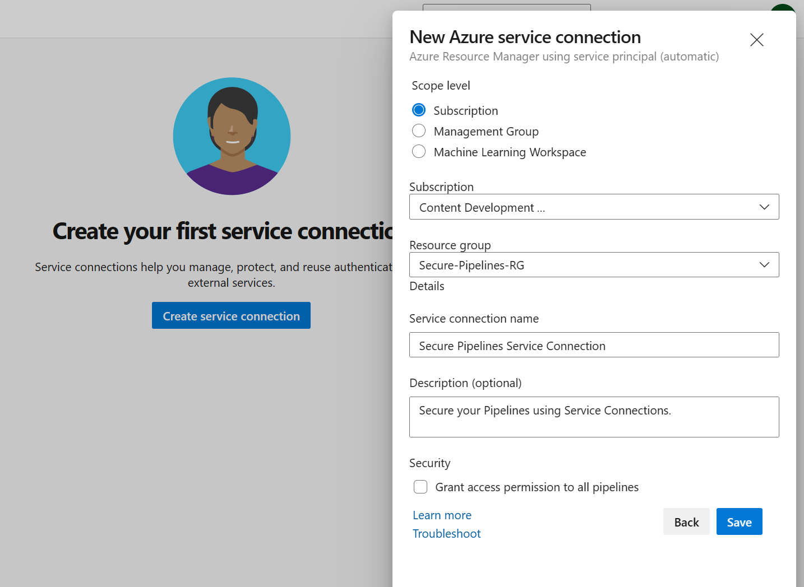
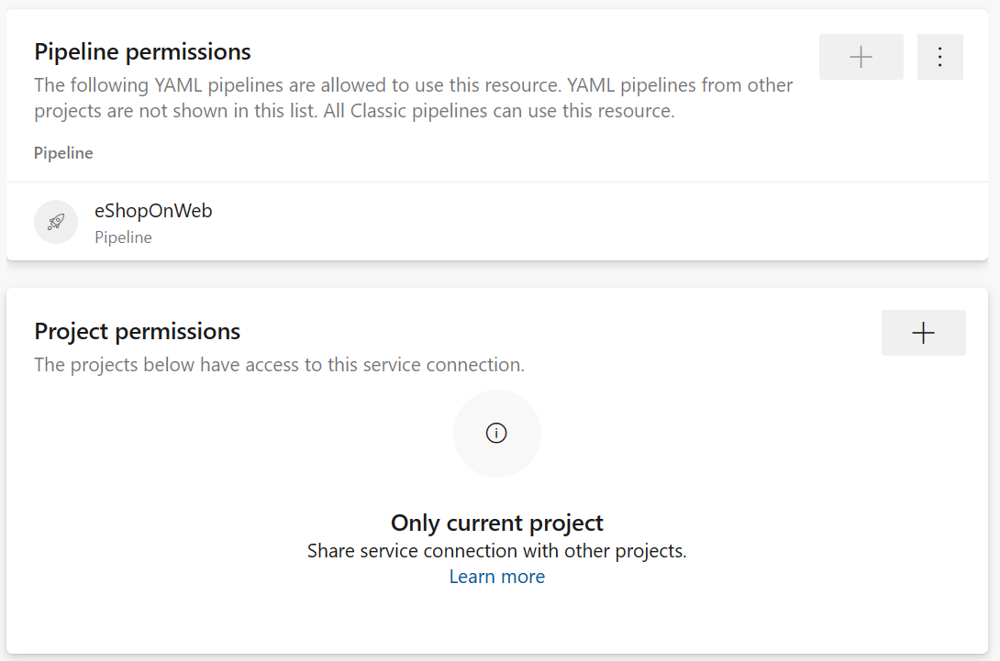

Service connections in Azure DevOps allow you to connect to external services and resources securely. These connections can access databases, third-party APIs, and cloud services. You can automate deployment, testing, and other processes using service connections without storing sensitive information in your codebase.

## Step 1: Creating a Service Connection

To create a service connection, you need to be a Project Administrator or a Project Collection Administrator in Azure DevOps.

1. Navigate to the Project Settings in Azure DevOps.
2. Click on the Service Connections tab under Pipelines.
3. Click on the "Create service connection" button.
4. Select the type of service connection you want to create (for example, Azure Resource Manager, GitHub, etc.).
5. Enter the necessary information to connect to the service (for example, subscription ID, access key, etc.).
6. (Optional) Click on the "Verify connection" button to validate your connection.
7. Give your service connection a meaningful name and description.
8. Click on the "Save" button to create the service connection.

    

## Step 2: Configure pipeline permissions to the Service Connection

1. Go to the Azure DevOps project where the service connection was created.
2. Click on the Project settings located in the bottom left corner.
3. Under the Pipelines section, select Service connections.
4. Click on the service connection you want to grant access to the pipeline.
5. Click on the three dots (...) on the right side of the service connection, and select Security.
6. In the Pipeline permissions section, add the pipeline that should have access to the service connection.
7. Click on the Save button to save the pipeline permissions.

    

## Step 3: Using the Service Connection in a pipeline

Once you've created a service connection, you can use it in your pipelines. Here's an example of how you can use a service connection in a YAML pipeline:

```YAML
steps:
- task: AzureResourceManagerTemplateDeployment@3
  displayName: 'Create Azure Resource Group'
  inputs:
    deploymentScope: 'Resource Group'
    azureResourceManagerConnection: 'Secure Pipelines Service Connection'
    subscriptionId: '<your-subscription-id>'
    action: 'Create Or Update Resource Group'
    resourceGroupName: 'Secure-Pipelines-RG'
    location: 'Central US'
    templateLocation: 'Linked artifact'
    deploymentMode: 'Incremental'
```

The example uses a YAML pipeline to deploy an Azure Resource Manager (ARM) template. The pipeline contains a task, AzureResourceManagerTemplateDeployment@3, used to deploy the ARM template. The task requires several inputs, such as the deploymentScope, azureResourceManagerConnection, action, resourceGroupName, location, templateLocation, etc.

By using service connections, you can automate deployment, testing, and other processes that help maintain your projects' security and integrity and make it easier to manage and update the information as needed.

For more information about Service Connections, see:

- [Manage service connections](https://learn.microsoft.com/azure/devops/pipelines/library/service-endpoints/).
- [Provision and test environments](https://learn.microsoft.com/training/modules/configure-provision-environments/).
- [Integrate with identity management systems](https://learn.microsoft.com/training/modules/integrate-identity-management-systems/).
- [Create Azure resources using Azure Resource Manager templates](https://learn.microsoft.com/training/modules/create-azure-resources-using-azure-resource-manager-templates/).
