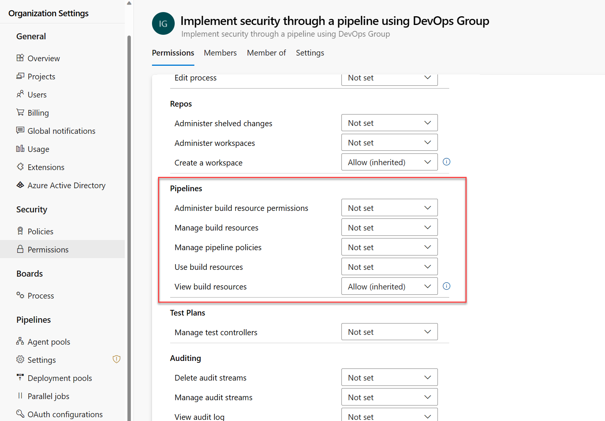
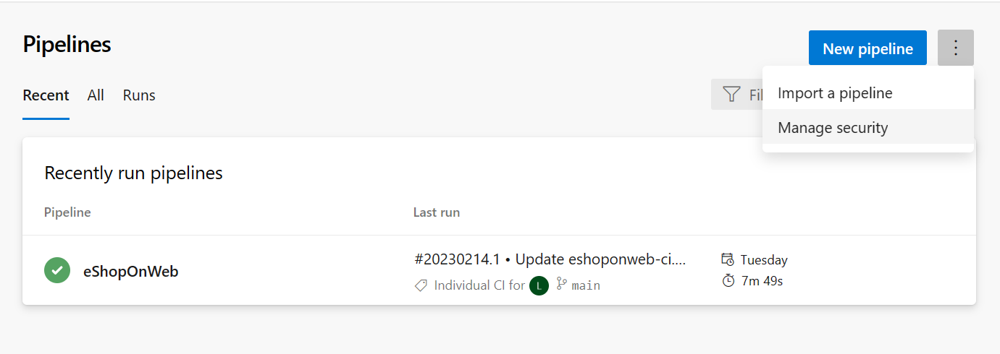
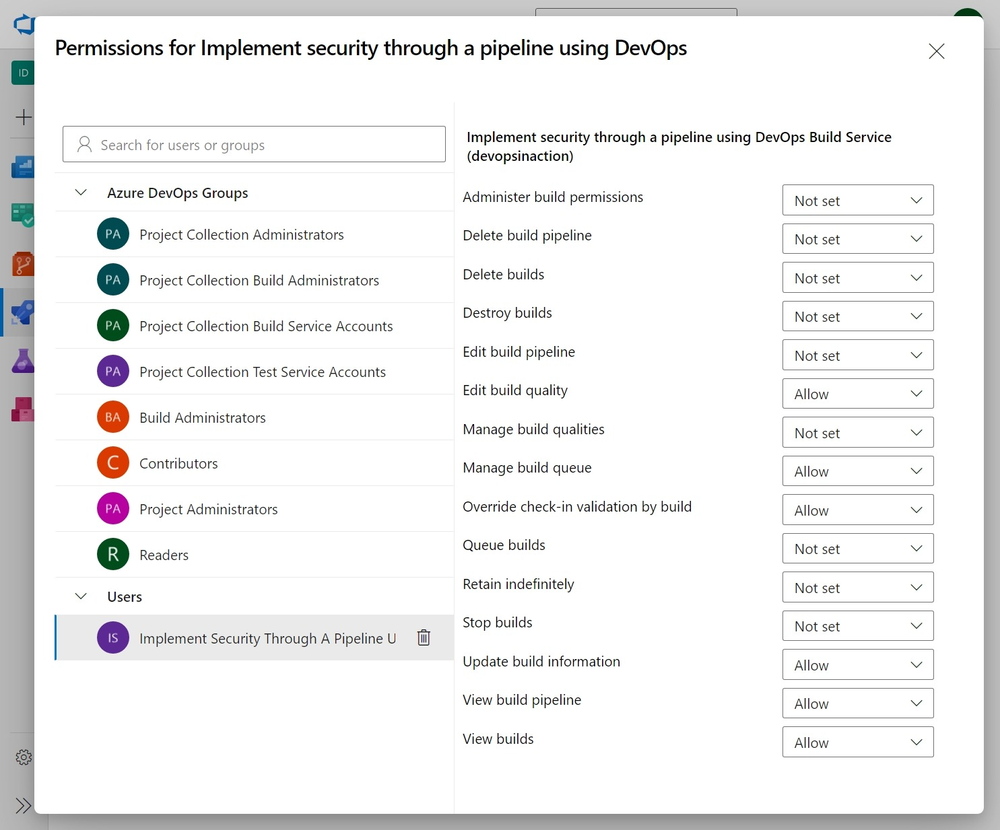
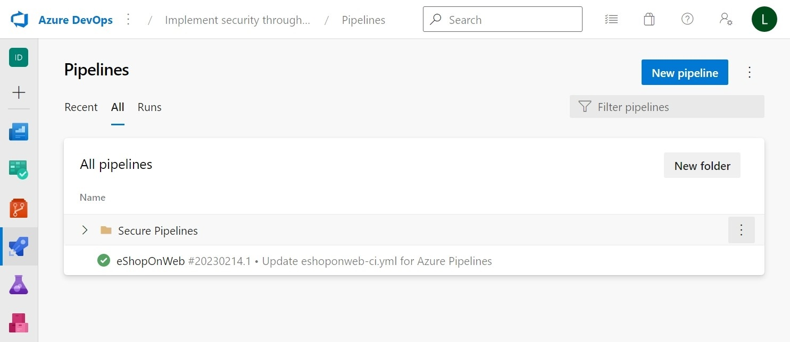

Configuring and validating permissions in Azure Pipelines is crucial to ensure that only authorized users can access the pipelines, environments, and other resources. Failure to properly manage and validate user permissions can result in serious security issues and potentially put your organization at risk.

If unauthorized users have access to your pipelines, they can make changes to your code, steal your secrets, and even access your production environment.

In this unit, you'll learn how to set up and manage pipeline permissions using Azure Pipelines with YAML. Pipeline permissions control who can create, edit, view, queue, or delete pipelines in your project.

## Set organization-level pipeline permissions

Organization-level pipeline permissions control who can create, edit, delete, or view pipelines across all projects in your organization. You can set these permissions for Azure DevOps groups or individual users.

1. Sign in to your organization.
2. Click on Organization Settings at the bottom left and in Permissions under Security section.
3. Select a group or a user from the list, or use the search box to find one.
4. Select Permissions and then find Pipelines.
5. Modify the permissions as needed, such as allowing or denying manage pipeline policies, view build resources, etc.

    

## Set project-level pipeline permissions

Project-level pipeline permissions apply to all pipelines in your project. You can grant or deny access to specific Azure DevOps groups or individual users.

To set project-level pipeline permissions:

1. Sign in to your Azure DevOps organization.
2. From your project, select Pipelines under Pipelines.
3. Select the three dots in the top right corner (...), and click Manage security.

    

4. Modify the groups or user permissions as you need.
5. Select Allow or Deny for the permission for a security group or an individual user, and then exit the screen.

    

Some common permissions are:

- **Edit build pipeline:** Allows editing existing pipelines.
- **View build pipeline:** Allows viewing existing pipelines and their runs.
- **Queue builds:** Allows queuing new runs for existing pipelines.

## Set folder-level pipeline permissions

1. Open your Azure DevOps project and select Pipelines under Pipelines.
2. Select a folder from the list of folders, or create a new one by selecting New folder.
3. Select the three dots in the top right corner (...), and click Manage security for the folder you want to modify.
4. Modify the permissions associated with an Azure DevOps group or an individual user.

    

## Set branch-level pipeline triggers

1. Open your YAML file that contains your pipeline definition.
2. In the trigger section of your YAML file, add a branches subsection and specify which branches you want to include or exclude using include and exclude keywords.
3. (Optional) You can also add a paths subsection and specify which files or folders you want to include or exclude using include and exclude keywords.
4. For example, this YAML snippet triggers a run of the pipeline only when there are changes in main branch under src directory:

    ```YAML
    trigger:
      branches:
        include:
        - main
      paths:
        include:
        - src/*
    ```

## Challenge yourself

1. Set organization-level pipeline permissions to allow only Project Administrators to create new pipelines across all projects in your organization.
2. Set folder-level pipeline permissions to deny Project Contributors from deleting or moving pipelines within a folder named “Production” in your project.
3. Set branch-level pipeline triggers to include only main and develop branches for a YAML pipeline.

For more information about pipeline permissions, see:

- [Set pipeline permissions](https://learn.microsoft.com/azure/devops/pipelines/policies/permissions)
- [About pipeline security roles](https://learn.microsoft.com/azure/devops/organizations/security/about-security-roles)
- [Use Azure Resource Manager service connections](https://learn.microsoft.com/azure/devops/pipelines/library/service-endpoints)
