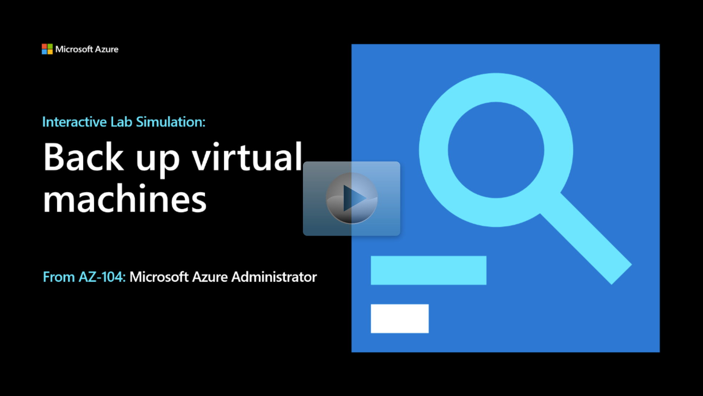

## Lab scenario

Your organization has decided to use Azure backup and recovery services. As the Azure Administrator you need to:
+ Determine how to back up and restore files hosted on Azure virtual machines and on-premises computers. 
+ Identify methods for protecting data stored in the Recovery Services vault.

## Architecture diagram

:::image type="content" source="../media/lab10.png" alt-text="Architecture diagram as explained in the text.":::

## Objectives

+ **Task 1**: Provision the lab environment. 
    + Review an [Azure Resource Manager template]( https://github.com/MicrosoftLearning/AZ-104-MicrosoftAzureAdministrator/blob/master/Allfiles/Labs/10/az104-10-vms-edge-template.json).
    + Use the template to deploy two virtual machines. These virtual machines will be used to test different backup scenarios.
+ **Task 2**: Create a Recovery Services vault.
    + Create a recovery services vault in the same region you deployed the virtual machines.
    + Configure the recovery services vault for geo-redundant storage and soft delete. 
+ **Task 3**: Implement Azure virtual machine-level backup.
    + Configure the recovery services vault to back up Azure virtual machines.
    + Create a backup policy that will run daily at 12:00 AM.
    + Enable backup for one of the virtual machines. 
+ **Task 4**: Implement file and folder backup.
    + Connect through remote desktop to a virtual machine and access the Azure portal.
    + Configure the recovery services vault to back up on-premises files and folders. 
    + Install the download agent for Windows Server or Windows Client.
    + Register the agent with the recovery services vault.
    + Create a backup schedule and back up local files.
    + Confirm the backed up files are in the recovery services vault. 
+ **Task 5**: Perform file recovery by using Azure Recovery Services agent.
    + Remove files that were backed up in the previous task.
    + Use the Recover Data Wizard to retrieve the deleted files.
+ **Task 6**: Perform file recovery by using Azure virtual machine snapshots (optional).
+ **Task 7**: Review the Azure Recovery Services soft delete functionality (optional).

> [!NOTE]
> Click on the thumbnail image to start the lab simulation. When you're done, be sure to return to this page so you can continue learning. 

