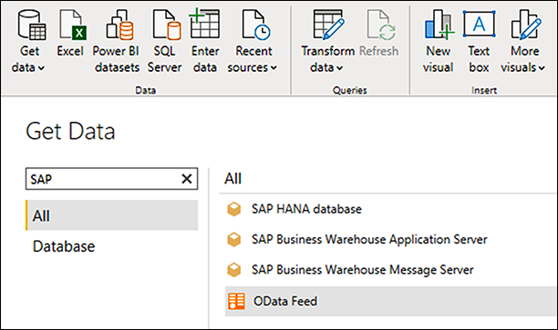

As we mentioned, you can choose from four major built-in connectors to access SAP environments and visualize data:

- SAP HANA Database

- SAP Business Warehouse Application Server

- SAP Business Warehouse Message Server

- Custom OData connector

    

## Connect to SAP HANA with Power BI

You can connect to SAP HANA with the Power BI Desktop on a Windows computer. You can then build reports for local use only, or connect to your Power BI Service and share the SAP HANA data with users you select.

### 1. Install Power BI Desktop

[Download the version of Power BI Desktop](https://www.microsoft.com/en-us/download/details.aspx?id=58494) that matches the architecture (x86 or x64) of the Windows computer you will use to connect to the SAP HANA database. Run the MSI installer and follow the setup steps.

### 2. Install the SAP HANA driver

The SAP HANA ODBC driver enables the Power BI connector for SAP HANA to support DirectQuery and Import options. DirectQuery mode allows access to SAP HANA data in Power BI Desktop and the Power BI service.

Before you can enable a Power BI connector to access SAP HANA databases, you must install the driver on the local client computer. Download the SAP HANA Client driver (or SAP HANA Studio, which contains the driver) from the SAP Development Tools website, or from the SAP Software Download Center if you have an SAP ID.

### 3. Invoke the connector

When you have the driver, invoke the Power BI connectors by clicking **Get data** in the Power BI Desktop application. You can connect in *relational mode* or the default *multidimensional mode*.

With the connector, business users and others can use Power BI to easily interact with SAP HANA information models, such as **Analytic** and **Calculation Views**, and use SAP HANA **Variables** and **Input Parameters** and HDI-container-based **Calculation Views**.

### 4. Use the connector

After making the connection, you can query or import SAP data into your data visualization dashboards and reports, conduct analysis, and even perform AI and predictive analytics functions on your SAP data. If you have a direct connection to a large data set that changes frequently because in SAP HANA, it is recommended that you use queries. They often run quickly and the data update can be smaller when imported into the Power BI service.

