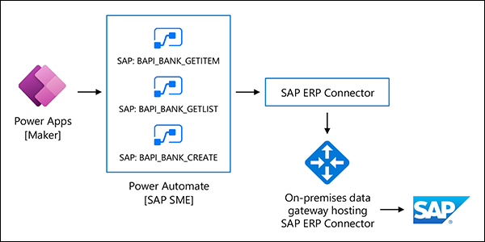

Using the On-premises data gateway with connectors, you can help users build apps that read and update data to and from SAP, and automate repetitive processes. To enable this effort among users, use Power Platform services such as **Power Apps**, **Power Automate**, and **Robotic Process Automation** (RPA).

## SAP access types for Power Automate and Power Apps

SAP applications, whether running on-premises or in Azure, depend on SAP-compliant access methods to maintain a secure environment. Any connector or gateway must conform to those norms using the following SAP-native interface types and drivers:

- **RFC/BAPI.** Business Application Programming Interfaces and custom RFCs can provide a stable, secure, and reliable interface across a range of SAP functions into Microsoft cloud offerings. Remote Function Call is the standard SAP interface for communication, and is supported in Microsoft connectors as well.

- **OData.** SAP provides OData APIs in SAP HANA XS and OData services in the SAP Gateway. These are RESTful APIs that Microsoft applications can use.

- **iDoc**. EDI SAP IDoc (intermediate documents) is an SAP document format for business transaction data transfers. It is used to integrate business processes with SAP and non-SAP systems, and is supported by Microsoft for SAP integration.

## Connect to Power Automate and Power Apps

Microsoft offers an SAP ERP connector for Power Apps and Power Automate. The connector (now in preview) allows you to integrate your Power Automate flows and Power App applications to an SAP ERP system (either SAP ECC or SAP S/4HANA). It provides the following functionality:

- Creates a connection to an SAP ECC or S/4HANA Server using either SAP authentication or Windows authentication

- Allows you to invoke any BAPI and custom RFCs

- Provides dynamic schemas for the input and output parameters for an RFC or BAPI

Choose the SAP ERP connector from within Power Automate. To use it in Power Apps, invoke the Power Automate flow you created when you selected the SAP ERP connector.

Before you can use the SAP ERP Connector, install these components on the same machine:

- [Latest release of the data gateway in an Azure Virtual Machine.](https://powerapps.microsoft.com/downloads/) You will need the December 2019 release or higher of the Data Gateway (version: 3000.21.18 or higher).

- [SAP .NET Connector 3.0 SDK from SAP.](https://support.sap.com/en/product/connectors/msnet.html)

    > [!NOTE]
    > Access to the download requires a valid S-user. You may need to reach out to your SAP team. The connector comes in 32-bit and 64-bit versions, and you must choose the 64-bit version. Install on the data gateway. In the Optional setup steps window, make sure you select the Install assemblies to GAC option.

If you have a unique connectivity requirement, you can [build a custom connector](https://docs.microsoft.com/connectors/custom-connectors/) and connect to it.

Power Apps and Power Automate Robotic Process Automation (RPA) allow you to automate rules-based tasks from SAP data and applications. For example, you can automate legacy applications such as terminal emulators, and interact with modern web and desktop applications, Excel files, folders and more.

