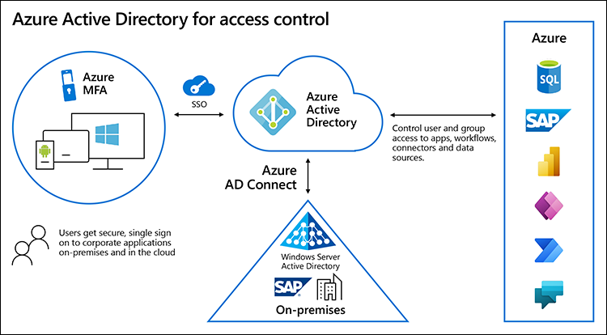

Any access to critical SAP systems must accommodate security and governance, risk management, privacy, and compliance. Microsoft and SAP provide security, compliance, and business continuity capabilities that allow you to govern, control, and monitor the integrations.

## Govern with automated policies

Policies enable you to govern connectors and the data that's transmitted through them. If your organization wants to create applications with Power Platform and SAP data, it's critical to ensure that no business-related data is propagated to apps or sites where it does not belong.

Data Loss Prevention policies enforce rules governing which connectors can be used together by classifying connectors as either **Business** or **Non-Business**. If you classify a connector as **Business**, it can be used only with other connectors from that group in any given app or flow. To block the usage of certain connectors, classify them as **Blocked**.

Create DLP policies in the [Power Platform admin center](/power-platform/admin/admin-documentation) to govern Power Platform canvas apps and Power Automate flows. To create a DLP policy, you need to be a [tenant admin](/power-platform/admin/use-service-admin-role-manage-tenant) or have the [Environment Admin role](/power-platform/admin/environments-overview).

## Control access to apps, flows, and connectors

Power Platform relies on Azure Active Directory (AAD) for authentication. AAD is Microsoft’s cloud-based identity and management service that helps authorized users sign in and access resources.

Developers can also register applications with AAD and use the oAuth2 authorization framework to allow their code to access platform APIs. This allows them to create applications that access SAP applications and data with high security.

In addition, you can configure Azure Active Directory to provide single sign-on and multi-factor authentication for SAP applications, Office 365, and any apps running on-premises and in Azure.

## Monitor users and developers

The Power Platform admin center provides a unified portal for administrators to [monitor and manage environments and settings](/power-platform/admin/admin-documentation) for Power Apps, Power Automate, and the Data Gateway. The admin center allows you to:

- View, share, disable, or delete Power Automate flows, including flows using the SAP ERP connector

- Add or change user access and sharing of Power Apps, and delete apps no longer in use (as determined by the usage reporting and analytics)

- Manage Power Platform licenses to control who can create, run, and share apps

- View analytics and create reports on usage of Power Apps, Power Automate, and Dataverse across the entire Microsoft 365 tenant

- Manage Data Gateways, including users and gateway settings

