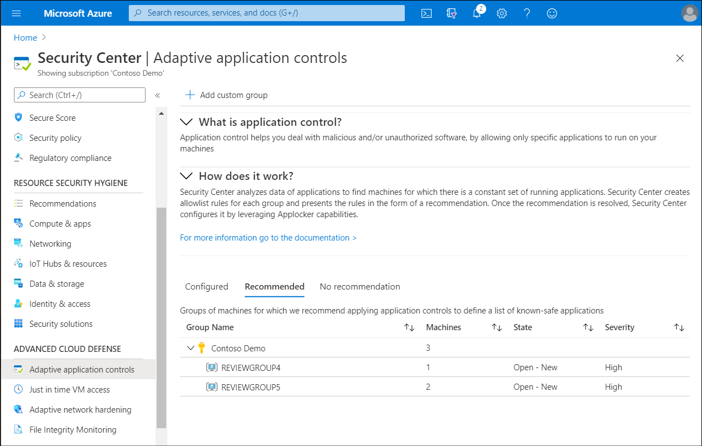
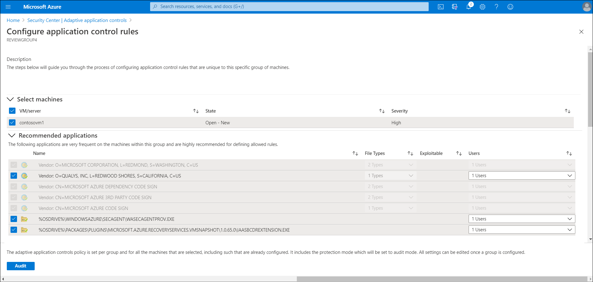
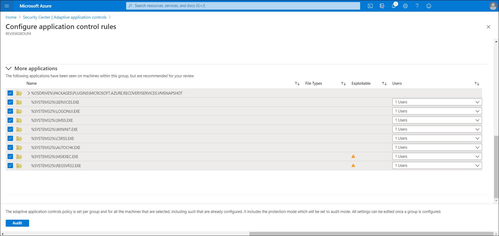
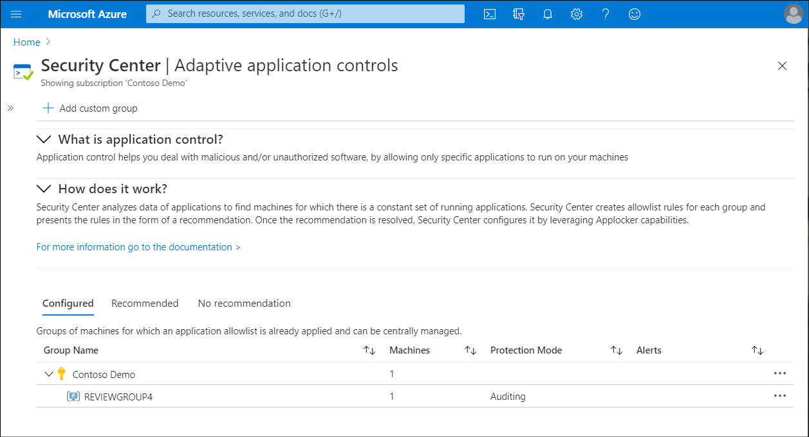
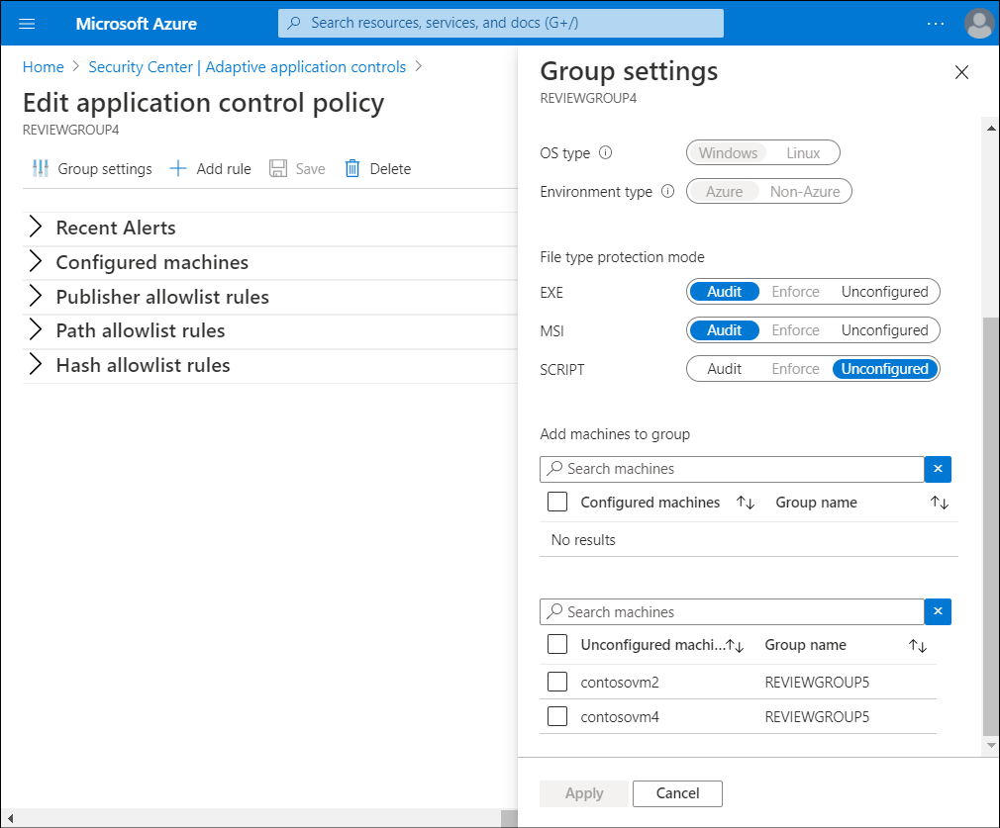
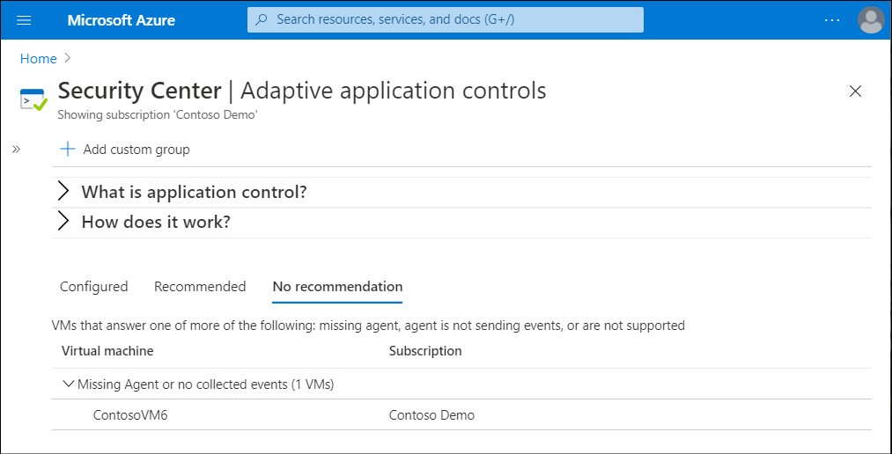

After the Contoso IT operations staff have enabled Adaptive application controls, they must configure an application control policy to address the recommendations.

## Configure a new application control policy

To configure a new application control policy, in **Security Center**, use the following procedure:

1. Select the **Recommended** tab for a list of groups with application control recommendations:

   

   The list, sorted by Azure subscription, includes the following information.

      |Column name|Description|
      |-----------|-----------|
      |Group name|The name of the group listed with the appropriate subscription.|
      |Machines|The number of VMs in the group.|
      |State|The state of the recommendations.|
      |Severity|The severity level of the recommendations.|

2. After selecting a group, review the **Configure application control rules** blade.

    

3. In the **Select Machines** section, review the list of recommended VMs, and deselect those to which you don't want to apply an application allow policy.

4. Within the Recommended applications section are two sections as described in the following table.

   |Section name|Description|
   |---|---|
   |Recommended applications|A list of applications that are frequent on the VMs within this group, and  that Security Center recommends that you allow to run.|
   |More applications|A list of applications that are either less frequent on the VMs within this group, or that are known as *Exploitable* and that you should review.|

    

5. Review the applications in each list, and clear the check boxes of those that you don't want to apply. The following table describes the information that the lists contain.

   |Column name|Description|
   |-----------|------------------------------------------------------------|
   |Name|This is the certificate information for the file or the full path of an application.|
   |File types|This is the application file type. This can be an executable (.exe), a script, a Microsoft Windows Installer (.msi), or any permutation of these file types.|
   |Exploitable|A warning icon indicates if a malicious hacker could use a specific application to bypass an application allow list. You should review these applications before approving them.|
   |Users|these are users that are recommended that you allow to run an application.|

6. After you complete your selections, select **Audit**.

   > [!NOTE]
   > After you select Audit, Security Center leverages the Windows AppLocker feature and automatically creates the appropriate rules on top of the built-in application allow list solution available on servers running the Windows Server operating system.

Keep in mind the information in the following table when configuring your policy.

|Consideration|Description|
|-----------------------------------------|------------------------------------------------------------|
|Two weeks of data required| Security Center relies on a minimum of two weeks of data to create a baseline and populate the unique recommendations per group of VMs. New customers of the Security Center standard tier should expect that, at first, their groups of VMs will appear under the *no recommendation* tab.|
|No support for existing AppLocker policies|Adaptive application controls from Security Center doesn’t support VMs for which an AppLocker policy is already enabled by using either a Group Policy Object (GPO) or a local security policy.|
|Publisher rules preferred|As a security best practice, Security Center will always try to create a publisher rule for applications that are selected to be allowed. If an application has no publisher information (that is, it's not signed), a path rule will be created for the full path of the specific application.|

> [!IMPORTANT]
> At the time of writing (July 2020), only Audit mode is available.

### Edit and monitor a group configured with application control

After you have configured the necessary groups, you can edit and monitor the group. To do this, complete the following procedure in Security Center.

1. To edit and monitor a group configured with an application allow list policy, return to the **Adaptive application controls** blade and select **Configured**.

   

   The list, sorted by Azure subscription, includes the following information.

   |Column name|Description|
   |-----------|-----------|
   |Group name|The name of the group, listed beneath the appropriate subscription.|
   |Machines|The number of VMs in the group.|
   |Protection mode|Auditing mode logs attempt to run applications that aren't on the allow list. but Enforce mode doesn't allow those applications to run at all.|
   |Alerts|Any current violations.|

2. Select a group that you want to make changes to. The **Edit application control policy** blade opens.

3. Select **Group settings** to make any changes to the group's settings.

    

4. On the **Group settings** blade, in the **File type protection mode** section, you have the option to select between the following file type protection modes:

   - **Audit**: in this mode, the application control solution doesn't enforce the rules, and only audits the activity on the protected VMs. This is recommended for scenarios in which you want to first observe the overall behavior before blocking an app on the target VM.
   - **Enforce**: in this mode, the application control solution enforces the rules by ensuring that applications that aren't allowed to run are blocked.

    > [!IMPORTANT]
    > At the time of writing (July 2020), only Audit mode is available.

5. In the **Add machines to group** section, you can also add VMs to the group. When you have made all your changes, select **Apply**.
6. Back on the **Edit application control policy** blade, review the current violations listed in the **Recent alerts** section. Select each line to be redirected to the **Alerts** page within Security Center, and review all the alerts that were detected by Security Center on the associated VMs.
7. In the **Publisher allowlist rules**, **Path allowlist rules**, and **Hash allowlist  rules** sections, you can review which application allow rules are currently configured on the VMs within a group, according to the rule collection type. For each rule, you can review the **Rule**, **File types**, **Exceptions**, and **Users**.
8. If you have made any changes, select **Save**.

### No recommendation list

Security Center only recommends application allow policies for VMs running a stable set of applications. Recommendations aren't created if:

- The VM doesn't have the Azure Log Analytics agent installed.
- The agent isn't sending events.
- The VM isn't supported.

Security Center lists the VMs and subscription information.

> [!TIP]
> You can install the Azure Log Analytics agent on your VMs. The agent then collects the data that Security Center needs for application controls.

> [!TIP]
> Security Center enables you to define an application allow policy on the **No recommendation** groups of VMs. Follow the same principles as were previously described to configure an application allow policy on those groups as well.

## Move a VM from one group to another

You can move VMs from one group to another. When you move a VM to another group, the application control policy applied to it changes to the settings of the group to which you moved it.

> [!TIP]
> You can also move a VM from a configured group to a non-configured group, which results in removing any application control policy that was previously applied to the VM.

To move a VM from one group to another, perform the following procedure:

1. From **Adaptive application controls** blade, on the **Configured** tab, select the group which the VM currently belongs to.
2. Select **Configured machines**.
3. Select the ellipsis, and then select **Move**.
4. In the **Move computer to different group** window, select the group to move the VM to, select **Move Computer**, and then select **Save**.

> [!CAUTION]
> Be sure to select  **Save** after selecting **Move Computer**. If you don't, then the VM isn't moved to its new group.
