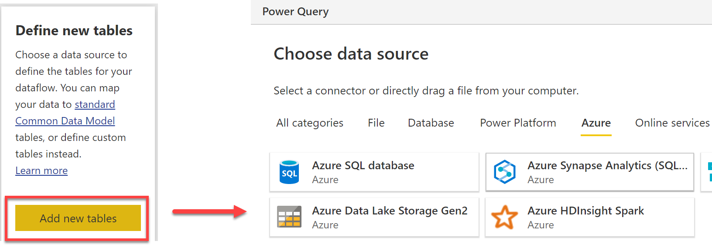
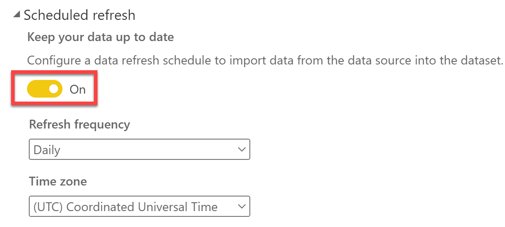
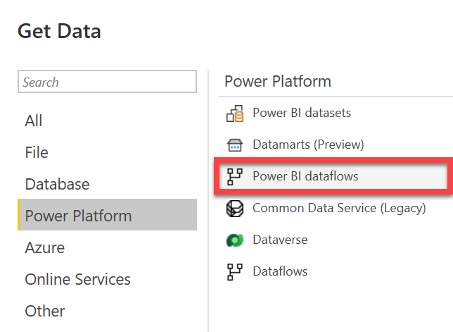

Dataflows are created and refreshed in the Power BI service, and can be consumed in either Power BI desktop or the Power BI service.

## Create a dataflow

There are multiple methods of creating dataflows in the Power BI service. We're going to cover creating a dataflow using the option to define new tables.

You can also create dataflows using linked tables, a computed table, or using import/export. Refer to the [Power BI documentation](/power-bi/transform-model/dataflows/dataflows-create) for step-by-step instructions of each creation option.

From within a shared workspace, select **New Dataflow**.

> [!div class="mx-imgBorder"]
> 

Here you'll have the option to define new tables, link tables from other dataflows, import model, or attach a Common Data Model folder. Select **Add new tables**. 

Selecting Add new tables will direct you to Power Query online, where you'll **choose a data source**. 

> [!div class="mx-imgBorder"]
> 

Depending on the data source you select, you'll need to enter connection settings and specify connection credentials. Specifying connection credentials will look similar to data connections using Power Query in Power BI desktop.

Enter the appropriate connection settings and credentials and select **Sign In**.

> [!div class="mx-imgBorder"]
> 

After signing in, you'll get a preview of the assets in the source data system. Here you can select which tables to use. Dataflows contain tables, but don't contain relationships.

> [!div class="mx-imgBorder"]
> 

Once you select the data you'd like to use, you can use the dataflow editor to shape and transform that data. The dataflow editor looks and behaves similar to Power Query in Power BI desktop.

> [!div class="mx-imgBorder"]
> 

> [!IMPORTANT]
> Dataflows can only be created in shared workspaces.

## Refresh a dataflow

When you create a dataflow, you're prompted to refresh the data for the dataflow. Refreshing a dataflow is required before it can be consumed in a dataset inside Power BI Desktop, or referenced as a linked or computed table.

To configure a dataflow refresh from the shared workspace, navigate to **Settings** via the **More options** menu.

> [!div class="mx-imgBorder"]
> 

Here you can take ownership of a dataflow, edit the data source credentials, schedule a refresh, configure enhanced compute engine settings, and endorse content.

> [!div class="mx-imgBorder"]
> 

### Linked entities in dataflow refreshes

Dataflows that are used in subsequent dataflows are called linked entities, and 

## Connect to a dataflow

Dataflows can be consumed in three ways. Report builders can:
- Create a linked table from the dataflow.
- Create a dataset from the dataflow.
- Create a connection from external tools that can read from the common data model format.

You can connect to a dataflow in Power BI desktop using the **Power BI dataflows** connector in the Get Data window.

> [!div class="mx-imgBorder"]
> 

> [!NOTE]
> Learn more about [configuring and consuming dataflows](/power-bi/transform-model/dataflows/dataflows-configure-consume).

## Refining dataflow settings

For dataflows in workspaces using Power BI Premium capacity, you can use the Admin portal to change, or refine, how dataflows are created and how they use resources in your Power BI Premium subscription. See [refining dataflow settings](/power-bi/transform-model/dataflows/dataflows-premium-workload-configuration#refining-dataflow-settings) to learn more.