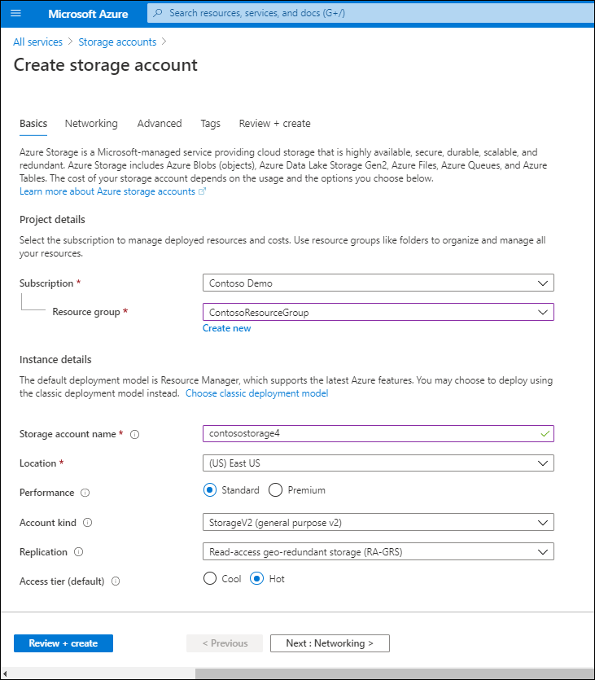
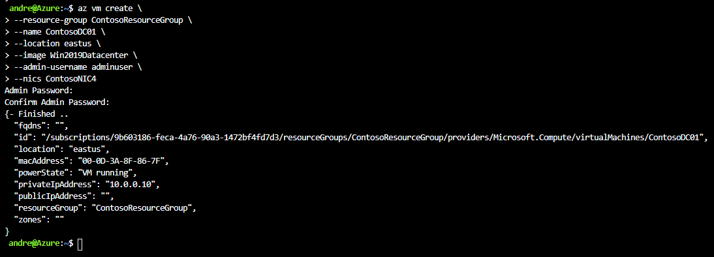

Having completed the planning process, IT staff at Contoso must be ready to perform one of the following procedures:

- Deploy an additional AD DS domain controller to an Azure VM.
- Deploy a separate AD forest or domain to Azure that is trusted by domains in your on-premises AD forest.

In this unit, you'll learn how to implement a replica domain controller on an Azure VM. You'll need to be able to perform the following tasks to complete this procedure:

- Create an Azure VNet with cross-premises connectivity.
- Create a storage account.
- Create a VM and assign an IP address.
- Install the AD DS and DNS roles on an Azure VM.

## Create an Azure virtual network with a site-to-site VPN

When you create an Azure VNet for a site-to-site VPN, you must specify:

- The name of the virtual network.
- The DNS server addresses that point to your on-premises DNS servers.
- Site-to-site VPN connectivity with the on-premises infrastructure. This involves creating a dynamic gateway with a public IP address for establishing a site-to-site VPN tunnel with the on-premises VPN device.
- The local network that defines the IP address assignment for the on-premises network.
- Virtual network address spaces that define the IP address range for VMs that run in Azure. 

> [!NOTE]
> The address range cannot overlap the address space for your on-premises network.

Additionally, you must configure an on-premises VPN device with a public IP address and the configuration rules that will connect to the previously created dynamic gateway. You can use ExpressRoute instead of site-to-site VPN for cross-premises connectivity. With ExpressRoute, you can extend your on-premises networks into Azure over a dedicated private connection that is provided by a connectivity provider. ExpressRoute connections use dedicated lines instead of a public internet connection and provide faster speeds, more reliability, and lower latency.

To create and provision an ExpressRoute circuit, perform the following high-level steps:

1. In Windows PowerShell, import the ExpressRoute module by running the following command:

   ```powershell
   Import-Module 'C:\Program Files (x86)\Microsoft SDKs\Azure\PowerShell\ServiceManagement\Azure\ExpressRoute\ExpressRoute.psd1'
   ```

2. Obtain the supported list of providers, locations, and bandwidths by running the following command:

   ```powershell
   Get-AzureDedicatedCircuitServiceProvider
   ```

3. Create an ExpressRoute circuit by running the following command:

   ```powershell
   New-AzureDedicatedCircuit -CircuitName $CircuitName -ServiceProviderName $ServiceProvider -Bandwidth $Bandwidth -Location $Location -sku Premium - BillingType MeteredData
   ```

4. Send the service key to your connectivity provider for provisioning.
5. Create your routing configuration.
6. Link a virtual network to the ExpressRoute circuit.

## Create a storage account

You need a storage account in which to place the Azure virtual hard disk for the VM operating system and data disks, with drive caching switched off. This data disk is for the Active Directory database, log files, and SYSVOL.

Use the following procedure to create a storage account:

1. Sign in to the Azure portal.
2. Search for and select **Storage accounts**, and then select **Add**.
3. Select the Azure subscription and resource group that you want to use for the new storage account.
4. Enter a name for your storage account, and select a location.
5. Select a performance category.
6. Select the account type.
7. Specify the type of storage replication.
8. Choose whether to enable secure transfer.
9. Select **Review + Create**.



The following table describes the configurable options when creating a storage account.

|Option|Explanation|
|-----|-----|
|Performance|Standard storage accounts use magnetic drives and are the least expensive. Use for applications that require bulk storage or where data is accessed infrequently. Premium storage accounts use solid state drives (SSD) and offer consistent, low-latency performance. For this scenario, choose Premium.|
|Account kind|General purpose storage accounts provide storage for blobs, files, tables, and queues in a unified account. Choose StorageV2 (general purpose v2) for this scenario.|
|Replication|The data in your Azure storage account is always replicated to ensure durability and high availability. Microsoft recommends using zone-redundant storage (ZRS), geo-redundant storage (GRS), or geo-zone-redundant storage (GZRS) for this scenario.|
|Access tier|The Hot Access Tier is ideal for frequently accessed data, and should be selected for this scenario.|

### Create a VM and assign an IP address

You must create a VM with a static IP address from the range in the VNet scope. You can use the Azure portal or the Azure module for Windows PowerShell to create a VM with the Windows Server operating system, and then attach one or more data disks for storing the database, logs, and SYSVOL.

To create a VM with a static IP configuration, you can use the following procedure in Azure CLI:

1. Sign in to the Azure CLI.
2. Run the following command to create a NIC, replacing the resource group, name, location, subnet, IP address, and VNet name with values appropriate to your organization and scenario:

   ```
   az network nic create \
   --resource-group ContosoResourceGroup \
   --name ContosoNIC4 \
   --location eastus \
   --subnet ContosoVM1Subnet \
   --private-ip-address 10.0.0.10 \
   --vnet-name ContosoVM1VNET
   ```

3. Create a VM using the following command, replacing the resource group, name, location, and nics values with values appropriate to your organization and scenario:

   ```
   az vm create \
   --resource-group ContosoResourceGroup \
   --name ContosoDC01 \
   --location eastus \
   --image Win2019Datacenter \
   --admin-username adminuser \
   --nics ContosoNIC4
   ```

4. Start the VM.

   

### Install and configure DNS and AD DS server roles

To promote the server to a domain controller, you must add and then configure AD DS. You can add the AD DS role by using **Add Roles and Features** in Server Manager or by using the following Windows PowerShell cmdlet:

```powershell
Add-WindowsFeature ADDS-Domain-Controller
```

AD DS setup allows you to automatically add the DNS role to the server. You can also install it later by using Add Roles and Features in Server Manager or by running the following Windows PowerShell cmdlet:

```powershell
Add-WindowsFeature DNS
```

> [!TIP]
> Place the Active Directory database on a data drive with caching turned off.
