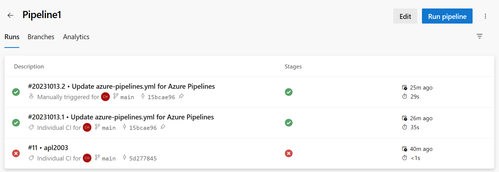
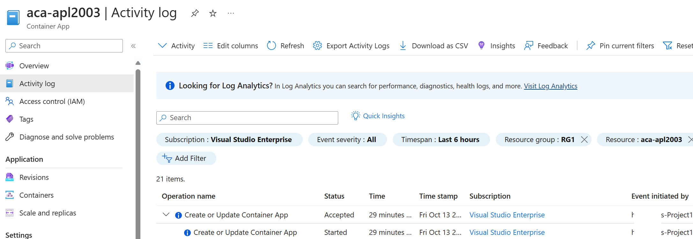

In this exercise, you deploy a container app from an image in the Azure Container Registry to the Azure Container Apps platform.

The following Azure resources must be available in your Resource group named RG1:

- A Container registry instance that contains one image.
- A Virtual network with subnets.
- A Service Bus Namespace
- A Managed Identity
- A Private endpoint
- A Container App
- A Container Apps Environment

You've been asked to configure a continuous integration environment for Container Apps that meets the following requirements:

- You need an Azure Container Apps deployment task in Project1/Pipeline1 of your ADO environment.
- Pipeline1 must deploy a container image from your container registry to your container app using a self-hosted agent pool.
- You must ensure that the pipeline successfully deploys the image at least once.

You complete the following tasks during this exercise:

1. Configure Pipeline1 to use the self-hosted agent pool

1. Configure Pipeline1 with an Azure Container Apps deployment task

1. Run the Pipeline1 deployment task

1. Verify the configuration

## Configure Pipeline1 to use the self-hosted agent pool

1. Open a browser windows, navigate to https://dev.azure.com, and then open your Azure DevOps organization.

1. On your Azure DevOps page, to your the DevOps project, select **Project1**.

1. In the left-side menu, select **Pipelines**.

1. Select **Pipeline1**, and then select **Edit**.

1. To use the self-hosted agent pool, update the azure-pipelines.yml file as shown below:

    ```yml
    trigger:
    - main
    
    pool:
      name: default
    
    steps:
    ```

1. Select **Save**.

1. Enter a commit message, and then select **Save**.

## Configure Pipeline1 with an Azure Container Apps deployment task

1. Ensure that you have Pipeline1 open for editing.

1. On the right side under Tasks, in the Search tasks field, enter **azure container**

1. In the filtered list of tasks, select **Azure Container Apps Deploy**

1. Under Azure Resource Manager connection, select the Subscription you are using, and then select **Authorize**.

1. In the Azure portal tab, open your Container App resource, and then open the Containers page.

1. Use the information on the Containers page to configure the following Pipeline1 Task information:

    - Docker Image to Deploy: `<Registry>/<Image>:<Image tag>`
    - Azure Container App name: `<Name>`

1. Configure the following Pipeline1 Task information:

    - Azure Resource group name: **RG1**

    > [!NOTE]
    > If you need to verify the resource group name, you can find it on the Overview page of your Container App resource.

1. On the Azure Container Apps Deploy page, select **Add**.

    The Yaml file for your pipeline should now include the AzureContainerApps tasks as follows:

    ```yml
    trigger:
    - main
    pool:
      name: default
    steps:
    - task: AzureContainerApps@1
      inputs:
        azureSubscription: '<Subscription>(<Subscription ID>)'
        imageToDeploy: '<Registry>/<Image>:<Image tag>' from Container App resource
        containerAppName: '<Name>' from Container App resource 
        resourceGroup: '<resource group name>'
    
    For example: 
    
    trigger:
    - main
    pool:
      name: default
    steps:
    - task: AzureContainerApps@1
      inputs:
        azureSubscription: 'Visual Studio Enterprise(1111aaaa-22bb-33cc-44dd-555555eeeeee)'
        imageToDeploy: 'acrapl2003cah12oct.azurecr.io/aspnetcorecontainer:latest'
        containerAppName: 'aca-apl2003'
        resourceGroup: 'RG1'
    ```

1. Select **Save**, and then select **Save** again to commit.

## Run the Pipeline1 deployment task

1. Ensure that you have Pipeline1 open in Azure DevOps.

1. To run the AzureContainerApps task, select **Run**.

1. On the Run pipeline page, select **Run**.

    A pipeline page will open to display the associated job. The job section displays job status, which progresses from Queued to Waiting.

    

    It can take a couple minutes for the status to transition from Queued to Waiting.

1. If 'Permission needed' is displayed under Job,  requires permission to proceed (), view the requirement and provide the required permissions.

1. Monitor the status of the run operation and verify that the run is successful.

    

## Check your work

In this task, you examine your pipeline and container app to verify successful pipeline runs.

1. Ensure that you have Pipeline1 open in Azure DevOps.

1. On the left side menu, select **Pipelines**, and then select **Pipeline1**.

1. The Runs tab displays individual runs that can be selected to review details.

    

1. Open your Azure portal, and then open your Container App.

1. On the left side menu, select **Activity Log**.

1. Verify that a **Create or Update Container App** operation succeeded as a result of running your pipeline.

    
