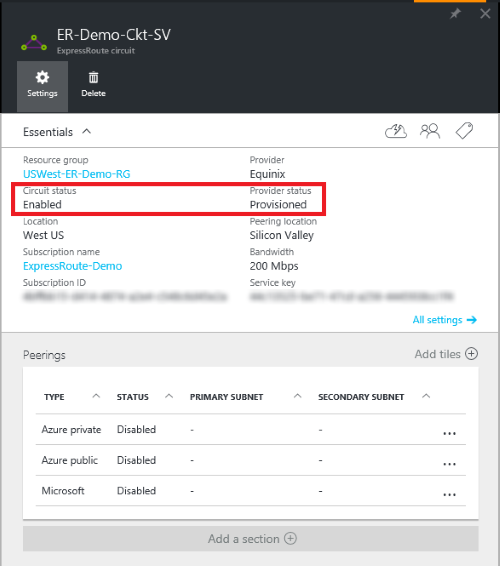
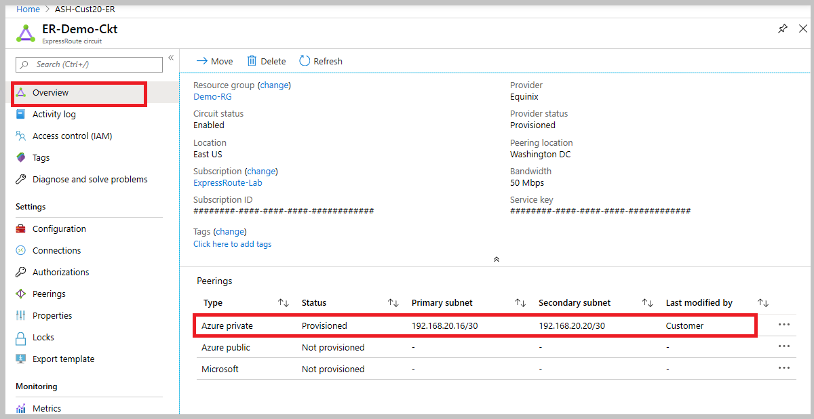

As an Azure network engineer supporting an ExpressRoute deployment, you will have to diagnose and resolve any ExpressRoute connection issues that arise. 

ExpressRoute connectivity traditionally involves three distinct network zones, as follows:

- Customer Network

- Provider Network

- Microsoft Datacenter

> [!NOTE] 
> In the ExpressRoute direct connectivity model (offered at 10/100 Gbps bandwidth), customers can directly connect to Microsoft Enterprise Edge (MSEE) routers' port. Therefore, in the direct connectivity model, there are only customer and Microsoft network zones.

## **Verify circuit provisioning and state through the Azure portal**

Provisioning an ExpressRoute circuit establishes a redundant Layer 2 connections between CEs/PE-MSEEs (2)/(4) and MSEEs (5). 

> [!TIP] 
> A service key uniquely identifies an ExpressRoute circuit. Should you need assistance from Microsoft or from an ExpressRoute partner to troubleshoot an ExpressRoute issue, provide the service key to readily identify the circuit.

In the Azure portal, open the ExpressRoute circuit blade. In the section of the blade, the ExpressRoute essentials are listed as shown in the following screenshot:

​	

In the ExpressRoute Essentials, Circuit status indicates the status of the circuit on the Microsoft side. Provider status indicates if the circuit has been Provisioned/Not provisioned on the service-provider side.

For an ExpressRoute circuit to be operational, the Circuit status must be Enabled, and the Provider status must be Provisioned.

> [!NOTE] 
> After configuring an ExpressRoute circuit, if the Circuit status is stuck in not enabled status, contact [Microsoft Support](https://portal.azure.com/?). On the other hand, if the Provider status is stuck in not provisioned status, contact your service provider.

## **Validate peering configuration**

After the service provider has completed the provisioning the ExpressRoute circuit, multiple eBGP based routing configurations can be created over the ExpressRoute circuit between CEs/MSEE-PEs (2)/ (4) and MSEEs (5). Each ExpressRoute circuit can have: Azure private peering (traffic to private virtual networks in Azure), and/or Microsoft peering (traffic to public endpoints of PaaS and SaaS). 

> [!NOTE]
> In IPVPN connectivity model, service providers handle the responsibility of configuring the peering (layer 3 services). In such a model, after the service provider has configured a peering and if the peering is blank in the portal, try refreshing the circuit configuration using the refresh button on the portal. This operation will pull the current routing configuration from your circuit.

In the Azure portal, status of an ExpressRoute circuit peering can be checked under the ExpressRoute circuit blade. In the overview section of the blade, the ExpressRoute peering would be listed as shown in the following screenshot:

​	

In the preceding example, as noted Azure private peering is provisioned, whereas Azure public and Microsoft peering are not provisioned. A successfully provisioned peering context would also have the primary and secondary point-to-point subnets listed. The /30 subnets are used for the interface IP address of the MSEEs and CEs/PE-MSEEs. For the peering that are provisioned, the listing also indicates who last modified the configuration.

> [!NOTE] 
> If enabling a peering fails, check if the primary and secondary subnets assigned match the configuration on the linked CE/PE-MSEE. Also check if the correct VlanId, AzureASN, and PeerASN are used on MSEEs and if these values map to the ones used on the linked CE/PE-MSEE. If MD5 hashing is chosen, the shared key should be same on MSEE and PE-MSEE/CE pair. Previously configured shared key would not be displayed for security reasons. Should you need to change any of these configuration on an MSEE router, refer to [Create and modify routing for an ExpressRoute circuit](/azure/expressroute/expressroute-howto-routing-portal-resource-manager).

> [!NOTE] 
> On a /30 subnet assigned for interface, Microsoft will pick the second usable IP address of the subnet for the MSEE interface. Therefore, ensure that the first usable IP address of the subnet has been assigned on the peered CE/PE-MSEE.

 ## **Validate Address Resolution Protocol (ARP)**

Address Resolution Protocol (ARP) is a layer 2 protocol defined in RFC 826. ARP is used to map the Ethernet address (MAC address) with an ip address. ARP tables can help validate layer 2 configuration and troubleshooting basic layer 2 connectivity issues.

The ARP table provides a mapping of the IP address and MAC address for a particular peering. The ARP table for an ExpressRoute circuit peering provides the following information for each interface (primary and secondary):
- Mapping of on-premises router interface ip address to the MAC address
- Mapping of ExpressRoute router interface ip address to the MAC address
- Age of the mapping ARP tables can help validate layer 2 configuration and troubleshooting basic layer 2 connectivity issues.

**ARP table when Microsoft side has problems**
- You won't see an ARP table shown for a peering if there are issues on the Microsoft side.
- Open a support ticket with Microsoft support. Specify that you have an issue with layer 2 connectivity.

**Next Steps**
- Validate Layer 3 configurations for your ExpressRoute circuit.
  - Get route summary to determine the state of BGP sessions.
  - Get route table to determine which prefixes are advertised across ExpressRoute.
- Validate data transfer by reviewing bytes in / out.
- Open a support ticket with Microsoft support if you're still experiencing issues.

## **ExpressRoute monitoring tools**

ExpressRoute uses Network insights to provide a detailed topology mapping of all ExpressRoute components (peerings, connections, gateways) in relation with one another. Network insights for ExpressRoute also have preloaded metrics dashboard for availability, throughput, packet drops, and gateway metrics.

You can analyze metrics for Azure ExpressRoute with metrics from other Azure services using metrics explorer by opening Metrics from the Azure Monitor menu.

- To view ExpressRoute metrics, filter by Resource Type ExpressRoute circuits.
- To view Global Reach metrics, filter by Resource Type ExpressRoute circuits and select an ExpressRoute circuit resource that has Global Reach enabled.
- To view ExpressRoute Direct metrics, filter Resource Type by ExpressRoute Ports.