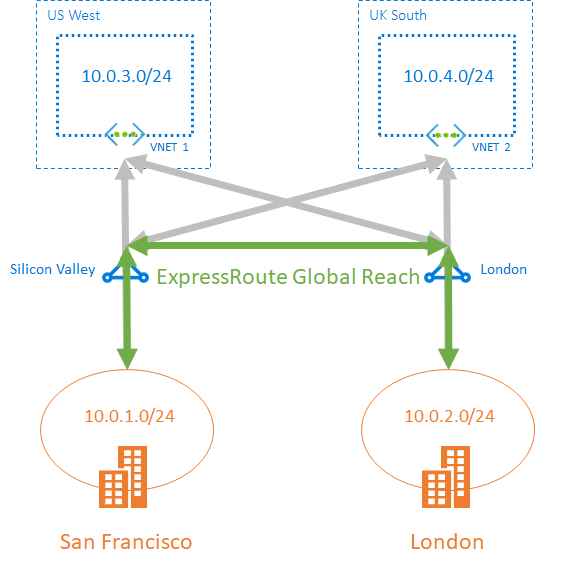
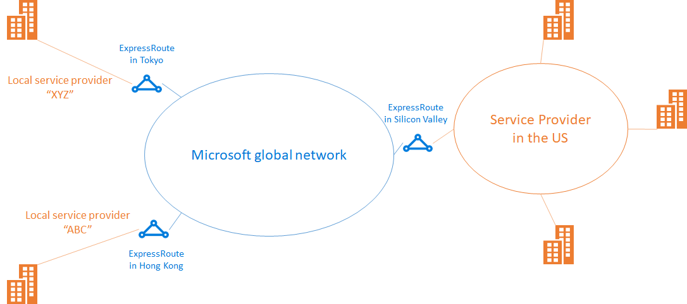
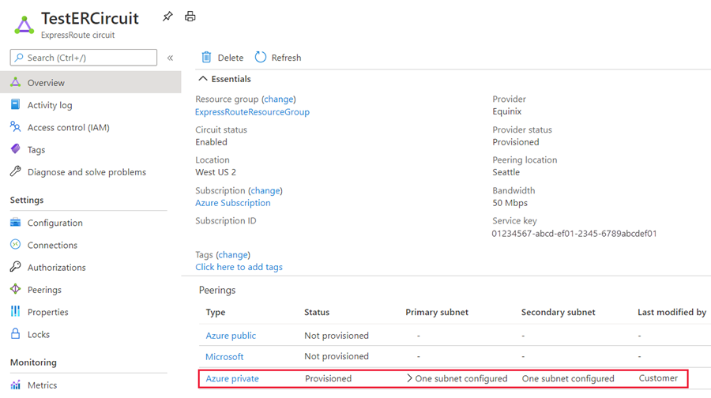
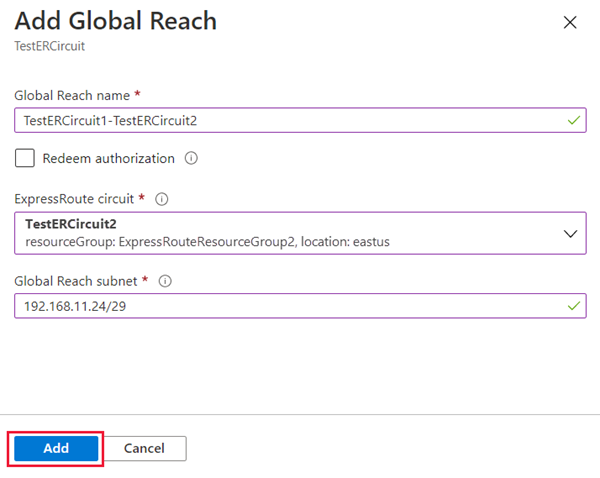
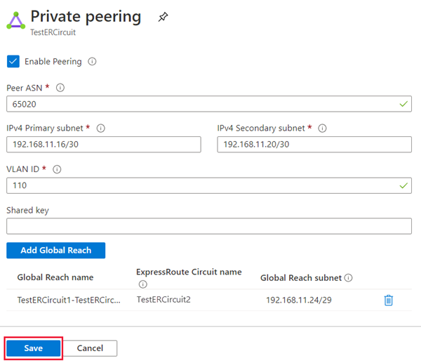
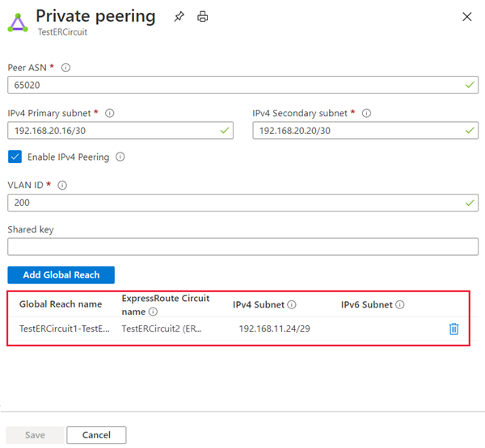
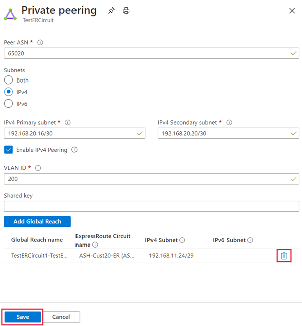

ExpressRoute is a private and resilient way to connect your on-premises networks to the Microsoft Cloud. You can access many Microsoft cloud services such as Azure and Microsoft 365 from your private data center or your corporate network. For example, you may have a branch office in San Francisco with an ExpressRoute circuit in Silicon Valley and another branch office in London with an ExpressRoute circuit in the same city. Both branch offices have high-speed connectivity to Azure resources in US West and UK South. However, the branch offices cannot connect and send data directly with one another. In other words, 10.0.1.0/24 can send data to 10.0.3.0/24 and 10.0.4.0/24 network, but NOT to 10.0.2.0/24 network.

> [!div class="mx-imgBorder"]
> 

## Choose when to use ExpressRoute global reach

ExpressRoute Global Reach is designed to complement your service provider’s WAN implementation and connect your branch offices across the world. For example, if your service provider primarily operates in the United States and has linked all your branches in the U.S., but the service provider does not operate in Japan and Hong Kong SAR, with ExpressRoute Global Reach you can work with a local service provider and Microsoft will connect your branches there to the ones in the U.S. using ExpressRoute and the Microsoft global network.

> [!div class="mx-imgBorder"]
> 

## Configure ExpressRoute global reach

These steps show you how to configure ExpressRoute Global Reach using Azure portal. 

**Before you begin**

Before you start configuration, confirm the following criteria:

- You understand ExpressRoute circuit provisioning workflows.

- Your ExpressRoute circuits are in a provisioned state.

- Azure private peering is configured on your ExpressRoute circuits.

- If you want to run PowerShell locally, verify that the latest version of Azure PowerShell is installed on your computer.

**Identify circuits**

Identify the ExpressRoute circuits that you want use. You can enable ExpressRoute Global Reach between the private peering of any two ExpressRoute circuits, if they are in the supported countries/regions. The circuits are required to be created at different peering locations.

- If your subscription owns both circuits, you can choose either circuit to run the configuration in the following sections.

- If the two circuits are in different Azure subscriptions, you need authorization from one Azure subscription. Then you pass in the authorization key when you run the configuration command in the other Azure subscription.

> [!div class="mx-imgBorder"]
> 

**Enable connectivity**

Enable connectivity between your on-premises networks. There are separate sets of instructions for circuits that are in the same Azure subscription, and circuits that are different subscriptions.

**ExpressRoute circuits in the same Azure subscription**

1. Select the **Azure private** peering configuration.

    > [!div class="mx-imgBorder"]
    > 

2. Select **Add Global Reach** to open the Add Global Reach configuration page.

    > [!div class="mx-imgBorder"]
    > 

3. On the Add Global Reach configuration page, give a name to this configuration. Select the ExpressRoute circuit you want to connect this circuit to and enter in a **/29 IPv4** for the Global Reach subnet. Azure uses IP addresses in this subnet to establish connectivity between the two ExpressRoute circuits. Do not use the addresses in this subnet in your Azure virtual networks, or in your on-premises network. Select **Add** to add the circuit to the private peering configuration.

    > [!div class="mx-imgBorder"]
    > 

4. Select **Save** to complete the Global Reach configuration. When the operation completes, you will have connectivity between your two on-premises networks through both ExpressRoute circuits.

    > [!div class="mx-imgBorder"]
    > 

**Verify the configuration**

Verify the Global Reach configuration by selecting Private peering under the ExpressRoute circuit configuration. When configured correctly your configuration should look as followed:

> [!div class="mx-imgBorder"]
> 

**Disable connectivity**

To disable connectivity between an individual circuit, select the delete button next to the Global Reach name to remove connectivity between them. Then select **Save** to complete the operation.

> [!div class="mx-imgBorder"]
> 