## What is Azure Monitor?

Azure Monitor helps you maximize the availability and performance of your applications and services. It delivers a comprehensive solution for collecting, analyzing, and acting on telemetry from your cloud and on-premises environments. This information helps you understand how your applications are performing and proactively identify issues affecting them and the resources they depend on.

Just a few examples of what you can do with Azure Monitor include:

- Detect and diagnose issues across applications and dependencies with Application Insights.

- Correlate infrastructure issues with VM insights and Container insights.

- Drill into your monitoring data with Log Analytics for troubleshooting and deep diagnostics.

- Support operations at scale with smart alerts and automated actions.

- Create visualizations with Azure dashboards and workbooks.

- Collect data from monitored resources using Azure Monitor Metrics.

The diagram below offers a high-level view of Azure Monitor. At the center of the diagram are the data stores for metrics and logs, which are the two fundamental types of data used by Azure Monitor. On the left are the sources of monitoring data that populate these data stores. On the right are the different functions that Azure Monitor performs with this collected data. This includes such actions as analysis, alerting, and streaming to external systems.

> [!div class="mx-imgBorder"]
> 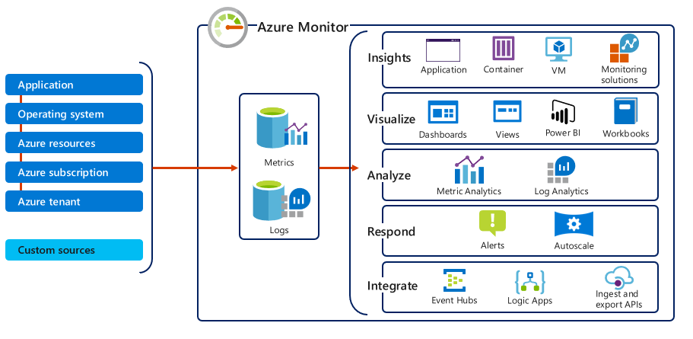

 

### Monitor data types in Azure Monitor

The data collected by Azure Monitor fits into one of two fundamental types:

- **Metrics** - Metrics are numerical values that describe some aspect of a system at a particular point in time. They are lightweight and capable of supporting near real-time scenarios.

- **Logs** - Logs contain different kinds of data organized into records with different sets of properties for each type. Telemetry such as events and traces are stored as logs in addition to performance data so that it can all be combined for analysis.

### Azure Monitor metrics

Azure Monitor Metrics is a feature of Azure Monitor that collects numeric data from monitored resources into a time series database. Metrics are numerical values that are collected at regular intervals and describe some aspect of a system at a particular time. Metrics in Azure Monitor are lightweight and capable of supporting near real-time scenarios making them particularly useful for alerting and fast detection of issues. You can analyze them interactively with metrics explorer, be proactively notified with an alert when a value crosses a threshold or visualize them in a workbook or dashboard.

The table below provides a summary of the various types of tasks you can perform by utilizing metrics in Azure Monitor:

|  Task     | Description                                                                                                                                                                                                                                             |
|:-:|:-:|
| Analyze   | Use metrics explorer to analyze collected metrics on a chart and compare metrics from different resources.                                                                                                                                              |
| Alert     | Configure a metric alert rule that sends a notification or takes automated action when the metric value crosses a threshold.                                                                                                                            |
| Visualize | Pin a chart from metrics explorer to an Azure dashboard. Create a workbook to combine with multiple sets of data in an interactive report.Export the results of a query to Grafana to leverage its dashboarding and combine with other data sources. |
| Automate  | Use Autoscale to increase or decrease resources based on a metric value crossing a threshold.                                                                                                                                                           |
| Retrieve  | Access metric values from a command line using PowerShell cmdlets. Access metric values from custom application using REST API. Access metric values from a command line using CLI.                                                               |
| Export    | Route Metrics to Logs to analyze data in Azure Monitor Metrics together with data in Azure Monitor Logs and to store metric values for longer than 93 days Stream Metrics to an Event Hub to route them to external systems.                         |
| Archive   | Archive the performance or health history of your resource for compliance, auditing, or offline reporting purposes.                                                                                                                                     |

> [!div class="mx-imgBorder"]
> 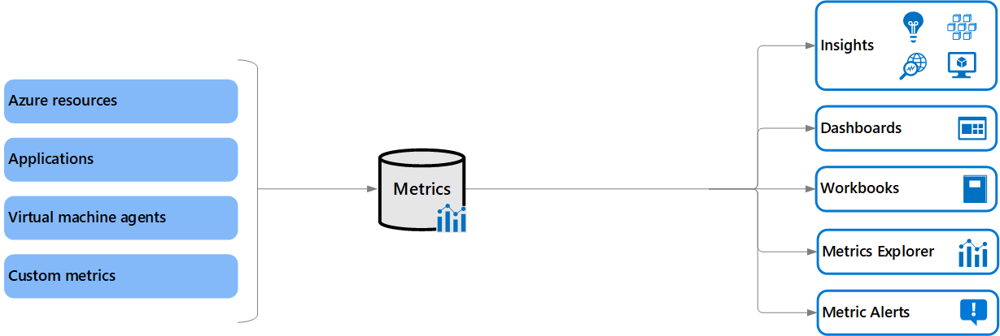

### Azure Monitor metrics sources

There are three fundamental sources of metrics collected by Azure Monitor. Once these metrics are collected in the Azure Monitor metric database, they can be evaluated together regardless of their source.

- **Azure resources** - Platform metrics are created by Azure resources and give you visibility into their health and performance. Each type of resource creates a distinct set of metrics without any configuration required. Platform metrics are collected from Azure resources at one-minute frequency unless specified otherwise in the metric's definition.

- **Applications** - Metrics are created by Application Insights for your monitored applications and help you detect performance issues and track trends in how your application is being used. This includes such values as Server response time and Browser exceptions.

- **Virtual machine agents** - Metrics are collected from the guest operating system of a virtual machine. Enable guest OS metrics for Windows virtual machines with Windows Diagnostic Extension (WAD) and for Linux virtual machines with InfluxData Telegraf Agent.

- **Custom metrics** - You can define metrics in addition to the standard metrics that are automatically available. You can define custom metrics in your application that is monitored by Application Insights or create custom metrics for an Azure service using the custom metrics API.

## Metrics Explorer

For several of your resources in Azure, you will see the data collected by Azure Monitor illustrated directly in the Azure portal on the **Monitoring** tab of a resource's **Overview** page.

In the screenshot below for example, you can see the Monitoring tab from the Overview page of a virtual machine.

> [!div class="mx-imgBorder"]
> [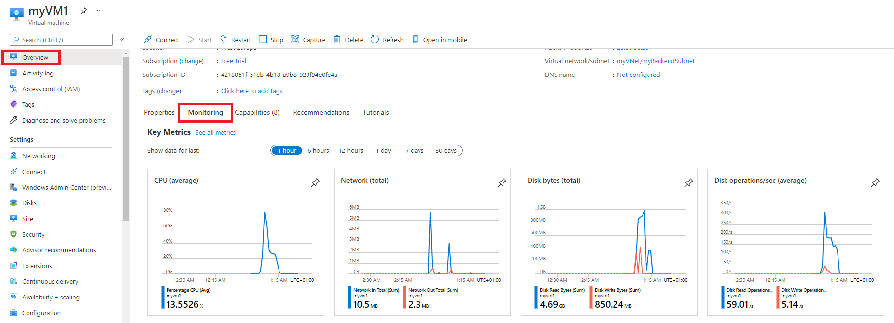](../media/monitoring-tab-vm-1.png#lightbox)

Note the various charts displaying several key performance metrics for system components such as **CPU**, **Network**, and **Disk**. 

You can click on these graphs to open the data in **Metrics Explorer** in the Azure portal, which allows you to interactively analyze the data in your metric database and chart the values of multiple metrics over time. You can also pin the charts to a dashboard to view them with other visualizations later. You can also retrieve metrics by using the Azure monitoring REST API.

> [!div class="mx-imgBorder"]
> [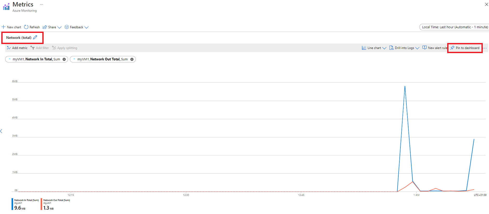](../media/monitoring-tab-vm-2.png#lightbox)

The data collected by Azure Monitor Metrics is stored in a time-series database which is optimized for analyzing time-stamped data. Each set of metric values is a time series with the following properties:

- The time the value was collected

- The resource the value is associated with

- A namespace that acts like a category for the metric

- A metric name

- The value itself

**Some metrics may have multiple dimensions, and custom metrics can have up to 10 dimensions**.

### Access Metrics in the Azure portal

You can access metrics from the **Metrics** option in the Azure Monitor menu.

> [!div class="mx-imgBorder"]
> [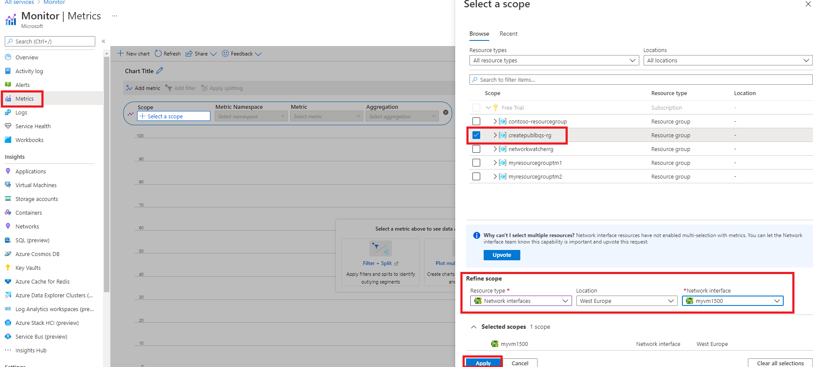](../media/azure-monitor-metrics-1.png#lightbox)

You can also access metrics from the **Metrics** menu of most other services and resources in the Azure portal. The screenshot below for example, displays the **Metrics** page for a virtual network resource.

> [!div class="mx-imgBorder"]
> [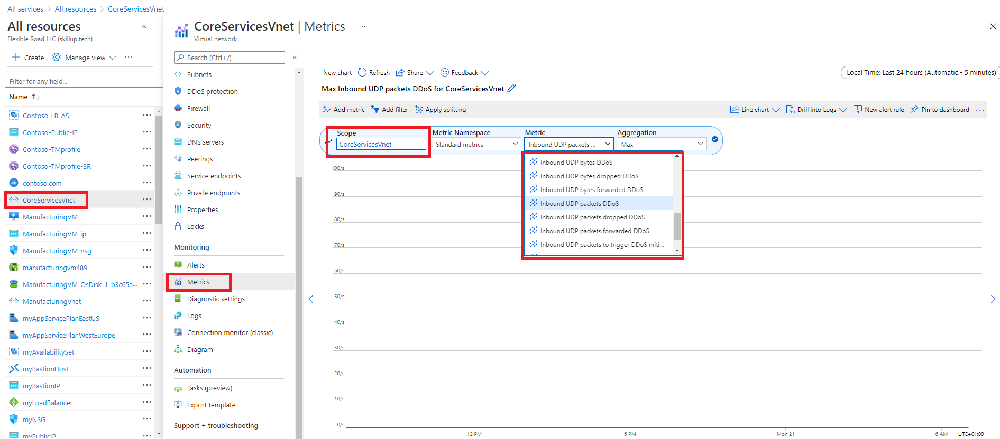](../media/azure-monitor-metrics-2.png#lightbox)

### Create metric charts with metrics explorer

Azure Monitor **Metrics Explorer** is a component of the Microsoft Azure portal that allows plotting charts, visually correlating trends, and investigating spikes and dips in metrics' values. Use the metrics explorer to investigate the health and utilization of your resources. 

Start in the following order:

1. Pick a resource and a metric and you see a basic chart. Then select a time range that is relevant for your investigation.

2. Try applying dimension filters and splitting. The filters and splitting allow you to analyze which segments of the metric contribute to the overall metric value and identify possible outliers.

3. Use advanced settings to customize the chart before pinning to dashboards. Configure alerts to receive notifications when the metric value exceeds or drops below a threshold.

4. To create a metric chart, from your resource, resource group, subscription, or Azure Monitor view, open the **Metrics** tab and follow these steps:

5. Click on the "Select a scope" button to open the resource scope picker. This will allow you to select the resource(s) you want to see metrics for. If you opened metrics explorer from the resource's menu, the resource should already be populated.

> [!div class="mx-imgBorder"]
> [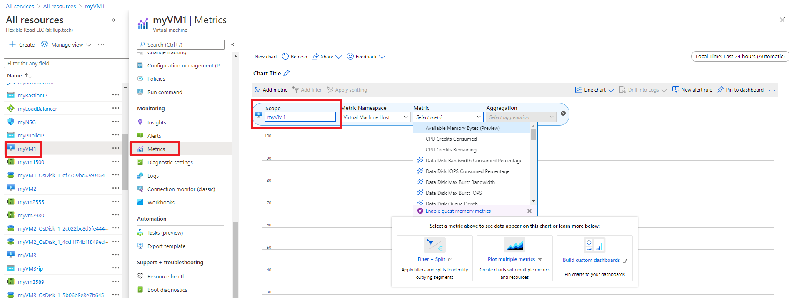](../media/metrics-explorer-1.png#lightbox)

6. For some resources, you must pick a namespace. The namespace is just a way to organize metrics so that you can easily find them. For example, storage accounts have separate namespaces for storing Files, Tables, Blobs, and Queues metrics. Many resource types only have one namespace.

> [!div class="mx-imgBorder"]
> [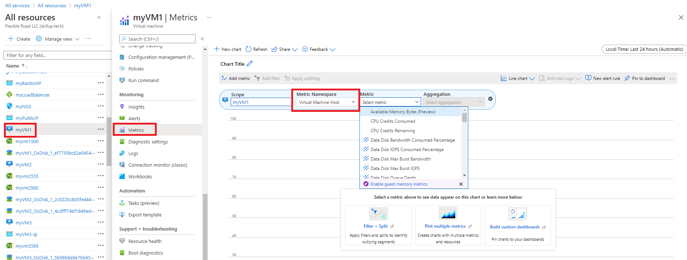](../media/metrics-explorer-2.png#lightbox)

7. Select a metric from the list of available metrics. This list will vary depending on what resource and scope you select.

> [!div class="mx-imgBorder"]
> [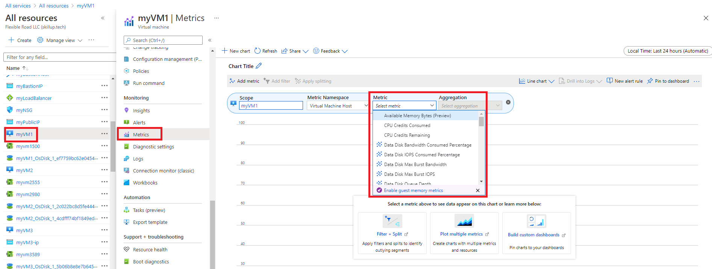](../media/metrics-explorer-3.png#lightbox)

8. Optionally, you can change the metric aggregation. For example, you might want your chart to show minimum, maximum, or average values of the metric.

> [!div class="mx-imgBorder"]
> [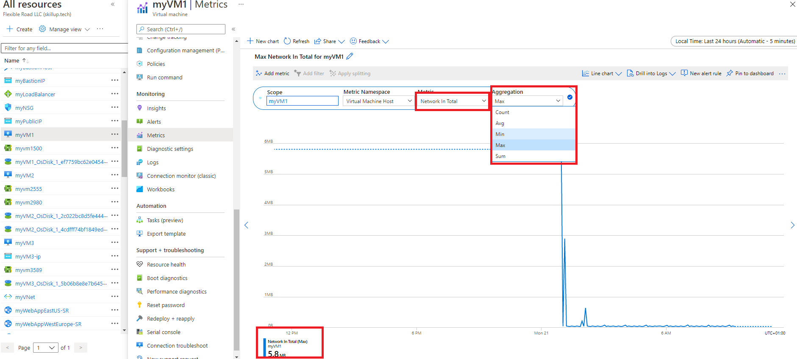](../media/metrics-explorer-4.png#lightbox)

 

## Monitor network resources with Azure Monitor Network Insights

You can use the **Insights&gt;Networks** section in **Azure Monitor** to obtain a broad view of health and metrics for all your deployed network resources, without requiring any configuration. It also provides access to network monitoring features such as Connection Monitor, flow logging for network security groups (NSG) flow logs, and Traffic Analytics, and it provides other network diagnostic features.

Azure Monitor Network Insights is structured around these key components of monitoring:

- Network health and metrics

- Connectivity

- Traffic

- Diagnostic Toolkit

  > [!div class="mx-imgBorder"]
  > [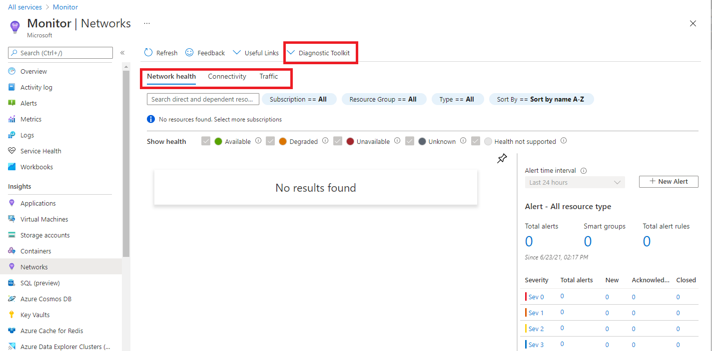](../media/network-insights-overview-1.png#lightbox)

### Network health and metrics

The **Network health** tab of Azure Monitor Network Insights offers a simple method for visualizing an inventory of your networking resources, together with resource health and alerts. It is divided into four key functionality areas: search and filtering, resource health and metrics, alerts, and dependency view.

**Search and filtering**

You can customize the resource health and alerts view by using filters such as **Subscription**, **Resource Group**, and **Type**.

You can use the search box to search for network resources and their associated resources. For example, a public IP is associated with an application gateway, so a search for the public IP's DNS name would return both the public IP and the associated application gateway.

> [!div class="mx-imgBorder"]
> [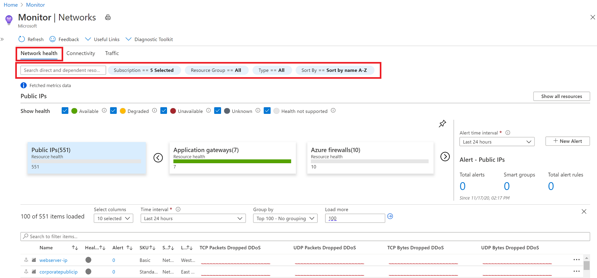](../media/network-insights-search.png#lightbox)

**Network resource health and metrics**

You can use the health and metrics information to get an overview of the health status of your various network resources.

In the example screenshot below, each tile represents a particular type of network resource. The tile displays the number of instances of that resource type that are deployed across all your selected subscriptions. It also displays the health status of the resource. Here you can see that there are 19 **Load balancers** deployed, 17 of which are healthy, 1 is degraded, and 1 is unavailable. 

If you select one of the tiles, you get a view of the metrics for that network resource. In the example screenshot below, you can see the metrics for the **ER and VPN connections** resource. 

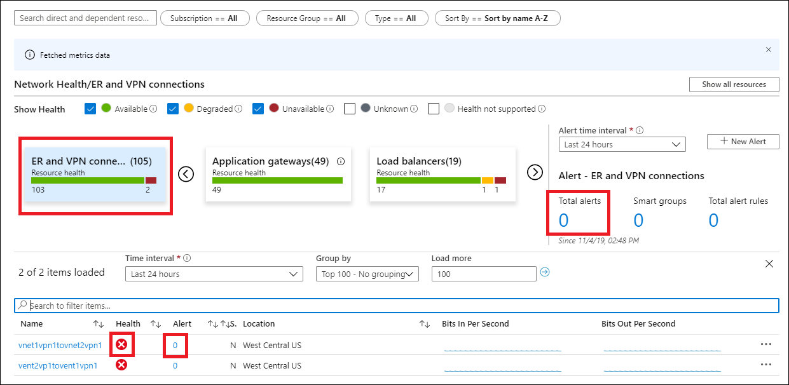

You can select any item in this grid view. For example, you could select the icon in the **Health** column to get resource health for that connection, or select the value in the **Alert** column to go to the alerts and metrics page for the connection.

**Alerts**

The **Alert** box on the right side of the page provides a view of all alerts generated for the selected resources across all your subscriptions. If there is a value for the alerts on an item, simply select the alert count for that item to go to a detailed alerts page for it.

**Dependency view**

Dependency view helps you visualize how a resource is configured. Dependency view is currently available for **Azure Application Gateway**, **Azure Virtual WAN**, and **Azure Load Balancer**. For example, for Application Gateway, you can access dependency view by selecting the Application Gateway resource name in the metrics grid view. You can do the same thing for Virtual WAN and Load Balancer.

 

### Connectivity

The **Connectivity** tab of Azure Monitor Network Insights provides an easy way to visualize all tests configured via Connection Monitor and Connection Monitor (classic) for the selected set of subscriptions.

Tests are grouped by **Sources** and **Destinations** tiles and display the reachability status for each test. Reachable settings provide easy access to configurations for your reachability criteria, based on **Checks failed(%)** and **RTT(ms)**. 

> [!div class="mx-imgBorder"]
> 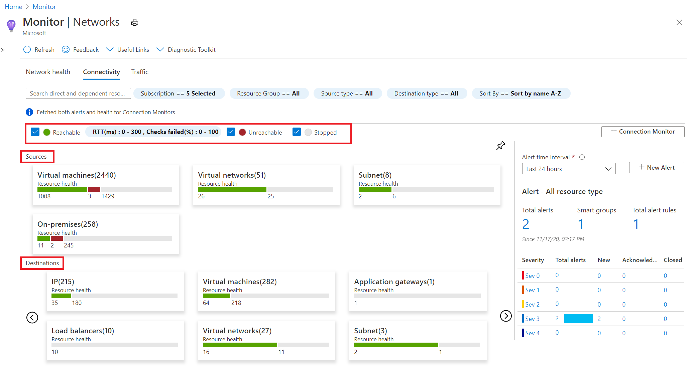

After you set the values, the status for each test updates based on the selection criteria.

> [!div class="mx-imgBorder"]
> 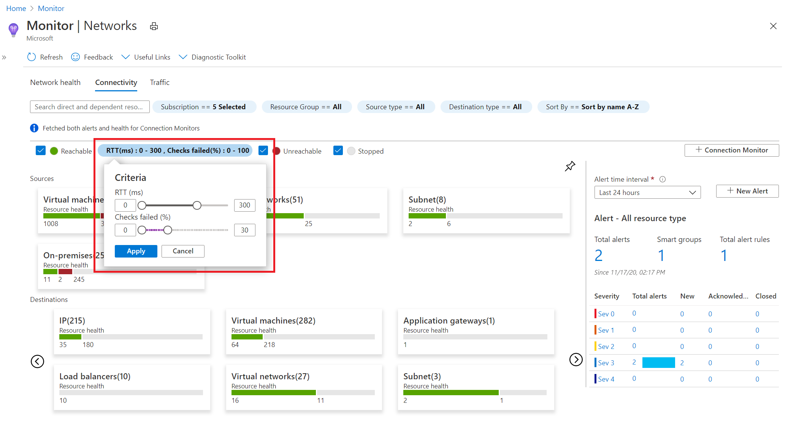

From here, you can then select any source or destination tile to open it up in metric view. In the example screenshot below, the metrics for the **Destinations&gt;Virtual machines** tile are being displayed.

> [!div class="mx-imgBorder"]
> 

 

### Traffic

The **Traffic** tab of Azure Monitor Network Insights provides access to all NSGs configured for **NSG flow logs** and **Traffic Analytics** for the selected set of subscriptions, grouped by location. The search functionality provided on this tab enables you to identify the NSGs configured for the searched IP address. You can search for any IP address in your environment. The tiled regional view will display all NSGs along with the NSG flow logs and Traffic Analytics configuration status.

> [!div class="mx-imgBorder"]
> 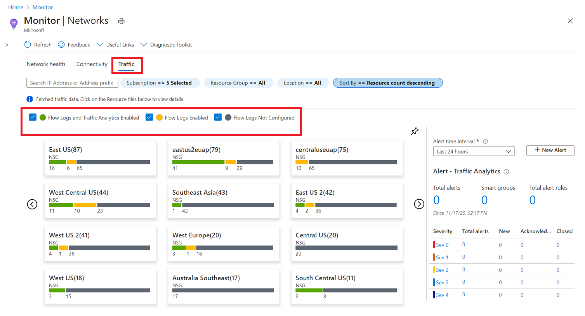

If you select any region tile, a grid view will appear which shows NSG flow logs and Traffic Analytics in a view that is simple to interpret and configure.

> [!div class="mx-imgBorder"]
> 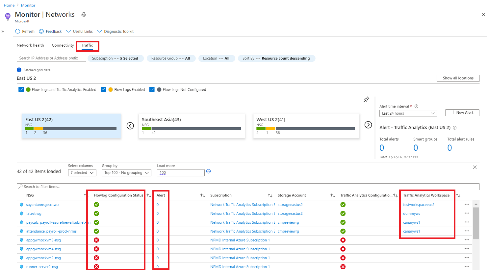

In this grid view you can select an icon in the **Flow log Configuration Status** column to edit the NSG flow log and Traffic Analytics configuration. Or you can select a value in the **Alert** column to go to the traffic alerts configured for that NSG, and you can navigate to the Traffic Analytics view by selecting the **Traffic Analytics Workspace**.

### Diagnostic Toolkit

The Diagnostic Toolkit feature in Azure Monitor Network Insights provides access to all the diagnostic features available for troubleshooting your networks and their components. 

The **Diagnostic Toolkit** drop-down list provides to access to the following network monitoring features:

- Capture packets on virtual machines - opens the **Network Watcher packet capture** network diagnostic tool to enable you create capture sessions to track traffic to and from a virtual machine. Filters are provided for the capture session to ensure you capture only the traffic you want. Packet capture helps to diagnose network anomalies, both reactively, and proactively. Packet capture is a virtual machine extension that is remotely started through Network Watcher. 

- Troubleshoot VPN - opens the **Network Watcher VPN Troubleshoot** tool to diagnose the health of a virtual network gateway or connection.

- Troubleshoot connectivity - opens the **Network Watcher Connection Troubleshoot** tool to check a direct TCP connection from a virtual machine (VM) to a VM, fully qualified domain name (FQDN), URI, or IPv4 address.

- Identify next hops - opens the **Network Watcher Next hop** network diagnostic tool to obtain the next hop type and IP address of a packet from a specific VM and NIC. Knowing the next hop can help you establish if traffic is being directed to the expected destination, or whether the traffic is being sent nowhere.

- Diagnose traffic filtering issues - opens the **Network Watcher IP flow verify** network diagnostic tool to verify if a packet is allowed or denied, to or from a virtual machine, based on 5-tuple information. The security group decision and the name of the rule that denied the packet is returned.

  > [!div class="mx-imgBorder"]
  > 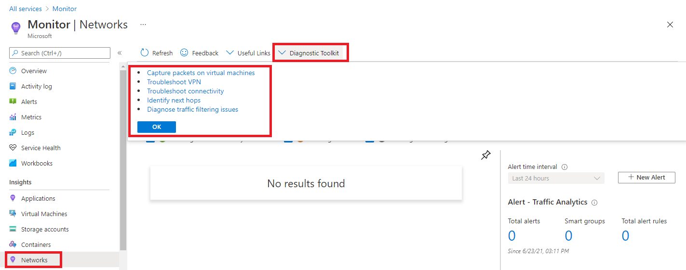