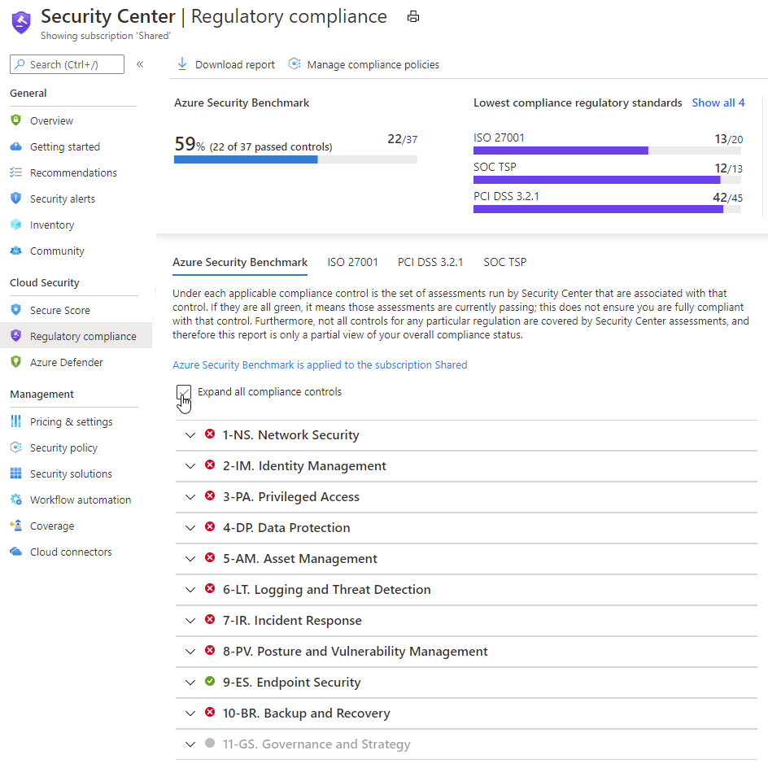
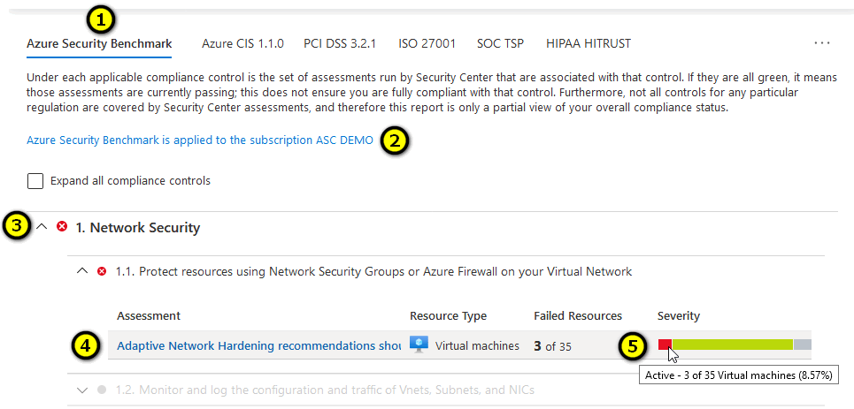
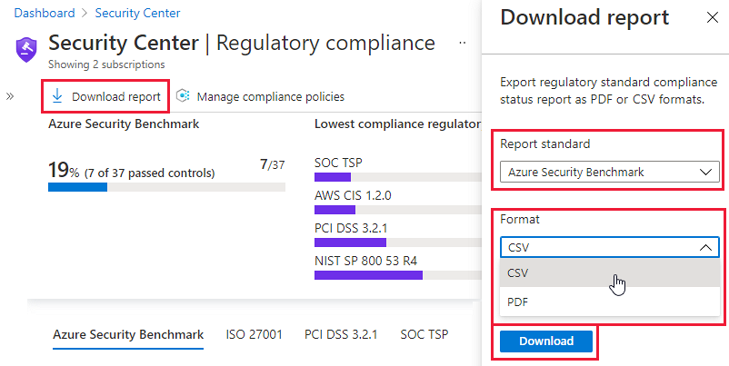
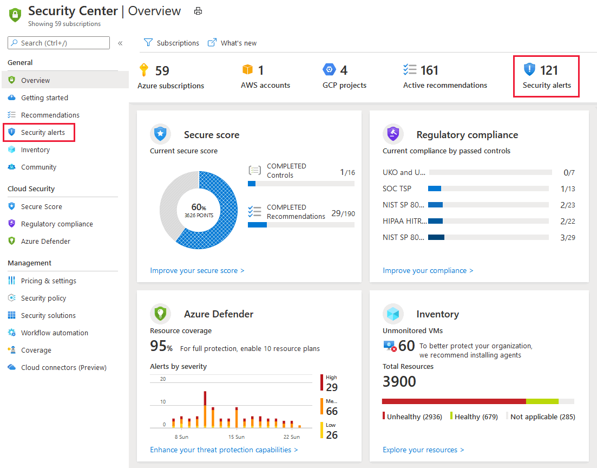
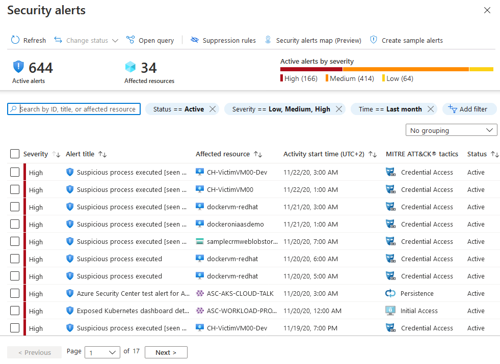
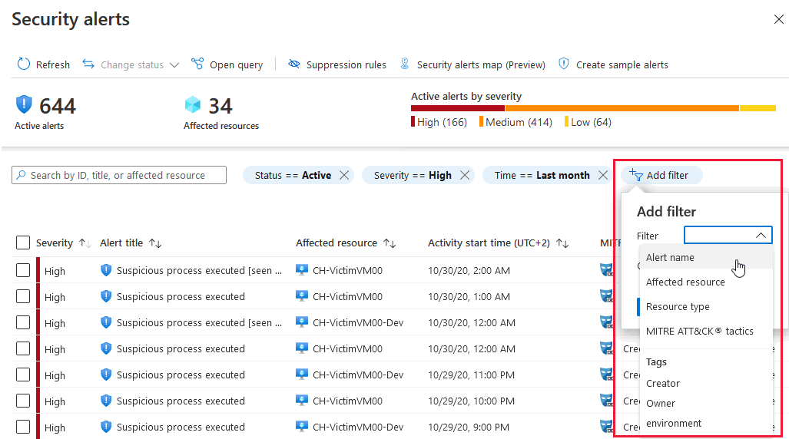
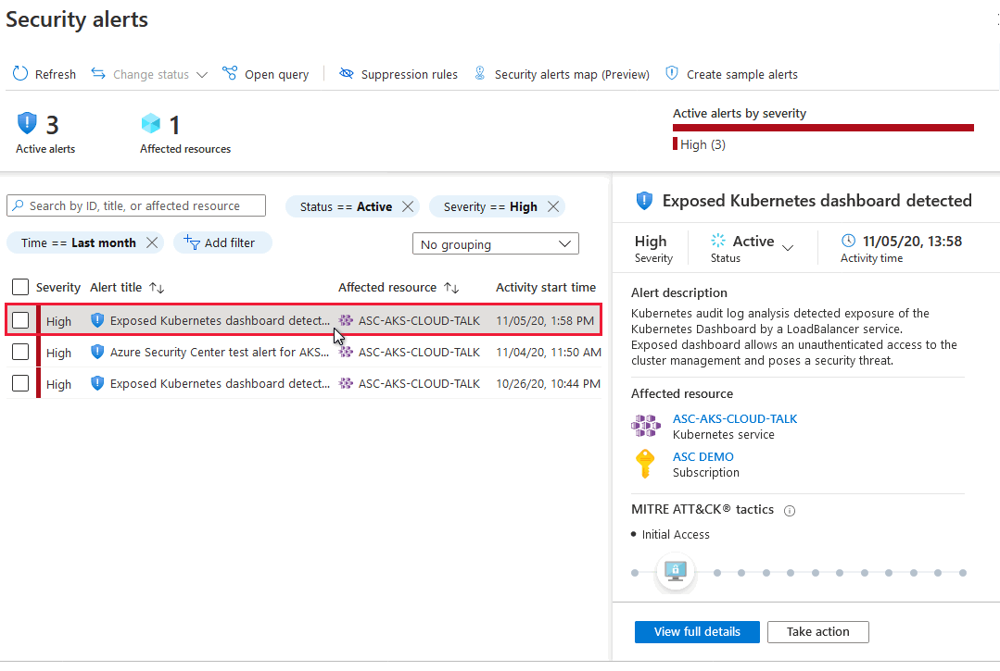
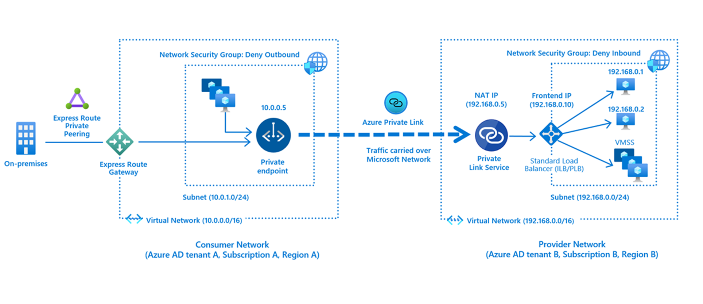
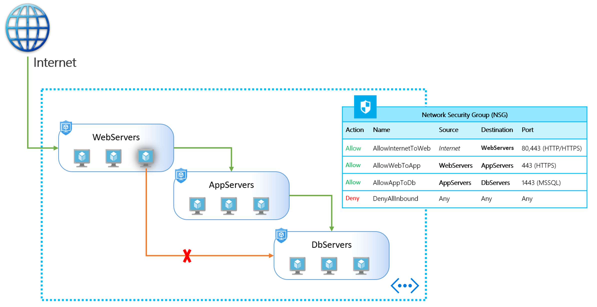

Network security covers a multitude of technologies, devices, and processes. It provides a set of rules and configurations designed to protect the integrity, confidentiality and accessibility of computer networks and data. Every organization, regardless of size, industry, or infrastructure, requires a degree of network security solutions in place to protect it from the ever-growing risks of attacks.

For Microsoft Azure, securing or providing the ability to secure resources like microservices, VMs, data, and others is paramount. Microsoft Azure ensures it through a distributed virtual firewall.

A virtual network in Microsoft Azure is isolated from other networks, while communicating through private IP addresses.

## Azure Security Benchmark

The Azure Security Benchmark (ASB) provides prescriptive best practices and recommendations to help improve the security of workloads, data, and services on Azure.

The Azure Security Benchmark includes a collection of high-impact security recommendations you can use to help secure the services you use in Azure:

- **Security controls:** These recommendations are generally applicable across your Azure tenant and Azure services. Each recommendation identifies a list of stakeholders that are typically involved in planning, approval, or implementation of the benchmark.

- **Service baselines:** These apply the controls to individual Azure services to provide recommendations on that service’s security configuration.

### Implement the Azure Security Benchmark

- Plan your Azure Security Benchmark implementation by reviewing the documentation for the enterprise controls and service-specific baselines to plan your control framework and how it maps to guidance like CIS (Controls v7.1) and NIST (SP 800-53) framework.

- Monitor your compliance with Azure Security Benchmark status (and other control sets) using the Azure Security Center regulatory compliance dashboard.

- Establish guardrails to automate secure configurations and enforce compliance with Azure Security Benchmark (and other requirements in your organization) with Azure Blueprints and Azure Policy.

Azure Security Benchmark v2 is aligned with Microsoft Security Best Practices so that Azure Security Benchmark provides a single consolidated view of Microsoft’s Azure security recommendations.

### Common Use Cases

Azure Security Benchmark is frequently used to address these common challenges for customers or service partners who are:

- New to Azure and are looking for security best practices to ensure a secure deployment.

- Improving security posture of existing Azure deployments to prioritize top risks and mitigations.

- Approving Azure services for use by technology and business use to meet specific security guidelines.

- Meeting regulatory requirements for customers who are from government or highly regulated industries like finance and healthcare (or service vendors who need to build systems for these customers). These customers need to ensure their configuration of Azure meets the security capabilities specified in an industry framework such as CIS, NIST, or PCI. Azure Security Benchmark provides an efficient approach with the controls already pre-mapped to these industry benchmarks.

### Terminology

The terms "control", "benchmark", and "baseline" are used often in the Azure Security Benchmark documentation, and it is important to understand how Azure uses those terms.

| **Term**  | **Description**                                              | **Example**                                                  |
|  |  |  |
| Control   | A control is a high-level description of a feature or activity that needs to be addressed and is not specific to a technology or implementation. | Data Protection is one of the security controls. This control contains specific actions that must be addressed to help ensure data is protected. |
| Benchmark | A benchmark contains security recommendations for a specific technology, such as Azure. The recommendations are categorized by the control to which they belong. | The Azure Security Benchmark comprises the security recommendations specific to the Azure platform. |
| Baseline  | A baseline is the implementation of the benchmark on the individual Azure service. Each organization decides benchmark recommendation and corresponding configurations are needed in the Azure implementation scope. | The Contoso company looks to enabling Azure SQL security features by following the configuration recommended in Azure SQL security baseline. |

## Using Azure Security Center for regulatory compliance

Azure Security Center helps streamline the process for meeting regulatory compliance requirements, using the regulatory compliance dashboard. 

The regulatory compliance dashboard shows the status of all the assessments within your environment for your chosen standards and regulations. As you act on the recommendations and reduce risk factors in your environment, your compliance posture improves.

### Security Center regulatory compliance dashboard 

The dashboard shows an overview of your compliance status with the set of supported compliance regulations. You will see your overall compliance score, and the number of passing vs. failing assessments associated with each standard.

### Compliance controls

 

1. Tab for each compliance standard that is relevant to you. 

2. Subscriptions the standard is applied on. 

3. List of all controls for that standard. 

4. View the details of passing and failing assessments associated with that control. 

5. Number of affected resources. 

Some controls are grayed out. These controls do not have any Security Center assessments associated with them. Check their requirements and assess them in your environment. Some of these might be process-related and not technical.

### Exploring the details of compliance with a specific standard

To generate a PDF report with a summary of your current compliance status for a particular standard, select Download report.

The report provides a high-level summary of your compliance status for the selected standard based on Security Center assessments data. The report is organized according to the controls of that standard. The report can be shared with relevant stakeholders and might provide evidence to internal and external auditors.

## Alerts in Security Center

Security Center automatically collects, analyzes, and integrates log data from your Azure resources, the network, and connected partner solutions - like firewall and endpoint protection solutions - to detect real threats and reduce false positives. A list of prioritized security alerts is shown in Security Center along with the information you need to quickly investigate the problem and steps to take to remediate an attack.

### Manage your security alerts

The Security Center overview page shows the Security alerts tile at the top of the page, and as a link from the sidebar.

The security alerts page shows the active alerts. You can sort the list by Severity, Alert title, Affected resource, Activity start time. MITRE ATTACK tactics, and status.

To filter the alerts list, select any of the relevant filters. You can add further filters with the Add filter option.

The list updates according to the filtering options you have selected. Filtering can be very helpful. For example, you might want to address security alerts that occurred in the last 24 hours because you are investigating a potential breach in the system.

### Respond to security alerts

From the Security alerts list, select an alert. A side pane opens and shows a description of the alert and all the affected resources.

View full details displays further information, as shown in the following image:

The left pane of the security alert page shows high-level information regarding the security alert: title, severity, status, activity time, description of the suspicious activity, and the affected resource. Alongside the affected resource are the Azure tags relevant to the resource. Use these to infer the organizational context of the resource when investigating the alert.

The right pane includes the Alert details tab containing further details of the alert to help you investigate the issue: IP addresses, files, processes, and more.

Also in the right pane is the Take action tab. Use this tab to take further actions regarding the security alert. Actions such as:

- **Mitigate the threat:** Provides manual remediation steps for this security alert

- **Prevent future attacks:** Provides security recommendations to help reduce the attack surface, increase security posture, and thus prevent future attacks

- **Trigger automated response:** Provides the option to trigger a logic app as a response to this security alert

- **Suppress similar alerts:** Provides the option to suppress future alerts with similar characteristics if the alert isn’t relevant for your organization

## Network Security

Network Security covers controls to secure and protect Azure networks, including securing virtual networks, establishing private connections, preventing and mitigating external attacks, and securing DNS. Full description of the controls can be found at [Security Control V2: Network Security on Microsoft Docs](/security/benchmark/azure/security-controls-v2-network-security).

### NS-1: Implement security for internal traffic

Segmentation and isolation of virtual networks should be applied based on business risks. Generally, "deny by default, permit by exception" approach should be followed.

Azure Security Center is a unified infrastructure security management system that strengthens the security posture of your data centers and provides advanced threat protection across your hybrid workloads in the cloud as well as on premises. Use Azure Security Center to:

- **Strengthen security posture:** Security Center assesses your environment and enables you to understand the status of your resources, and whether they are secure.

- **Protect against threats:** Security Center assesses your workloads and raises threat prevention recommendations and security alerts.

- **Get secure faster:** In Security Center, everything is done in cloud speed. Because it is natively integrated, deployment of Security Center is easy, providing you with auto-provisioning and protection with Azure services.

[Azure Security Center Adaptive Network Hardening](/azure/security-center/security-center-adaptive-network-hardening) is an agentless feature of Azure Security Center - nothing needs to be installed on your machines to benefit from this network hardening tool. [Azure Security Center Adaptive Network Hardening](/azure/security-center/security-center-adaptive-network-hardening) provides guidance about recommended network security group configurations like limiting ports and source IPs with reference to external network traffic rules. For more information on adaptive network hardening, see [Adaptive network hardening in Azure Security Center](/azure/security-center/security-center-adaptive-network-hardening).

### NS-2: Connect private networks together

Use Azure ExpressRoute or Azure virtual private network (VPN) to create private connections between Azure datacenters and on-premises infrastructure in a colocation environment. ExpressRoute connections do not go over the public internet, and they offer more reliability, faster speeds, and lower latencies than typical internet connections.

### NS-3: Establish private network access to Azure services

Azure Private Link enables you to access Azure PaaS Services (for example, Azure Storage and SQL Database) and Azure hosted customer-owned/partner services over a private endpoint in your virtual network.

### NS-4: Protect applications and services from external network attacks

Microsoft Azure provides native capabilities for protecting applications, services and APIs against potentially malicious traffic using Azure Firewall and Web Application Firewall in Application Gateway, Front Door, CDN (Content Delivery Network)

### NS-5: Deploy intrusion detection/intrusion prevention systems (IDS/IPS)

Use Azure Firewall threat intelligence-based filtering to alert on and/or block traffic to and from known malicious IP addresses and domains. The IP addresses and domains are sourced from the Microsoft Threat Intelligence feed.

### NS-6: Simplify network security rules

Use application security groups as a natural extension to your security policies instead of defining explicit security policies per application.

### NS-7: Secure Domain Name Service (DNS)

Follow the best practices for DNS security to mitigate against common attacks like dangling DNS, DNS amplifications attacks, DNS poisoning and spoofing, etc.