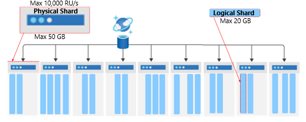
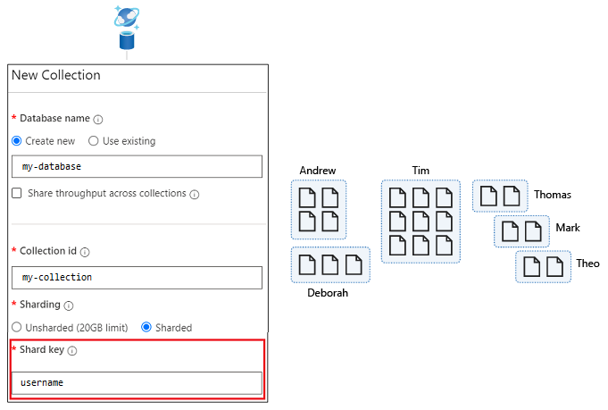
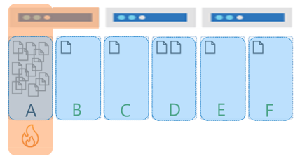

Azure Cosmos DB is Microsoft's fully managed NoSQL database on Azure. As a NoSQL database, Azure Cosmos DB is both horizontally scalable and nonrelational.

Horizontal scalability allows Azure Cosmos DB support data sizes well beyond what was possible in the past on other database systems. Horizontal scalability also means that the database provides predictable performance.

To achieve this level of scalability, users need to understand the concepts, techniques unique to NoSQL databases for modeling and sharding data.

> [!NOTE] 
> Shards are also referred as partitions in Azure Cosmos DB.

## Identify access patterns for your app

When you're designing a data model for a NoSQL database, the objective is to ensure that operations on data are done in the fewest requests. To do this, you need to understand the relationships between the data and how data will be accessed by the application. These access patterns are important because they, along with the relationships, will determine how the properties of the various entities are grouped together and stored in documents within collections in Azure Cosmos DB API for MongoDB databases.

You need to understand when and how your documents will be created, updated or retrieved. Let's consider an entity that defines a book author and separate the three entities that define that author. This can be divided into the Author's general information, the books the author published, and any awards that the author won.

```json
{
    "authorId": 100
    , "Name": "John Smith"
    , "Birthday": "1/1/1980"
}
```

```json
{
    "bookId": 100101
    , "authorId": 100
    , "Name": "The Flight of the NoSQL butterfly"
    , "Type": "Non-Fiction"
    , "Published_Year": "2015"
}
```

```json
{
    "awardId": "10001"
    , "Name": "I.T. Academic Awards"
    , "Category": "Best Author of the Year"
    , "YearWon": "2016"
}

```

So, shall we just embed all this data into one single author document? Not so fast.

## When to embed or reference data

Should we embed all that data into one document? Embedding all that data into one document reduces the number of requests, which improves performance and reduces cost. However, you can't always embed data. There are rules for when you should embed data in a document instead of referencing it in a different row.

### When should you embed data?

Embed data in a document when the following criteria apply to your data:

- **Read or updated together**: Data that's read or updated together is nearly always modeled as a single document. This is especially true because our objective for our NoSQL model is to reduce the number of requests to our database. Will all the data for our author be read together?

- **1:1 relationship**: For example, Book and Author have a 1:1 relationship.

- **1:Few relationship**: In a NoSQL database, it's necessary to distinguish 1:Many relationships as bounded or unbounded. Customer and Awards have a bounded 1:Many relationship because while award to author is a 1:1 relationship an author could have a few awards. When the relationship is bounded, this is a 1:Few relationship.

### When should you reference data?

Reference data as separate documents when the following criteria apply to your data:

- **Read or updated independently**: This is especially true where combining entities that would result in large documents. Updates in Azure Cosmos DB require the entire document to be replaced. If a document has a few properties that are frequently updated alongside a large number of mostly static properties, it's much more efficient to split the document into two. One document then contains the smaller set of properties that are updated frequently. The other document contains the static, unchanging values.

- **1:Many relationship**: This is especially true if the relationship is unbounded. Azure Cosmos DB has a maximum document size of 2 MB. So in situations where the 1:Many relationship is unbounded or can grow extremely large, data should be referenced, not embedded.

- **Many:Many relationship**: So far in our example the relationships between the different properties are either 1:1, 1:Few, but lets add a *book stores* section into the mix. Each book store would be selling at many stores (or sites) and each store/site will be selling many books. How would we efficiently design these documents if we would also like to return all the authors that write books that a particular book store sells?

Separating these properties reduces throughput consumption for more efficiency. It also reduces latency for better performance.

## Choose a Shard key

In Azure Cosmos DB databases, JSON documents are stored within collections that are in turn distributed across physical shards and where the data is routed to the appropriate physical shard based on the value of a shard key.

[](../media/2-physical-shards.png#lightbox)

The shard key is a required document property that ensures documents with the same shard key value are routed to and stored within a specific physical shard. A physical shard supports a fixed maximum amount of storage and throughput (RU/s). When the capacity of a logical shard, which we will introduce below, gets close to the maximum storage, Azure Cosmos DB adds another physical shard to the collection. Azure Cosmos DB automatically distributes the logical shards across the available physical shards, again using the shard key value to so in a predictable way.

In this unit, you'll learn more about logical shards and how to avoid hot shards. This information will help us choose the appropriate shard keys.

In Azure Cosmos DB, you increase storage and throughput by adding more physical shards to access and store data. The maximum storage size of a physical shard is 50 GB, and the maximum throughput is 10,000 RU/s.

### Logical shards in Azure Cosmos DB

The shard key ensures documents with the same shard key value are considered to belong to the same logical shard and are routed to and stored within a specific physical shard. The concept of a logical shard allows for the grouping together of documents with same shard key value. Multiple logical shards can be stored within a single physical shard and the collection can have an unlimited number of logical shards. Individual logical shards are moved to new physical shard as a unit as the collection grows. Moving logical shards as a unit ensures that all documents within it reside on the same physical shard. The maximum size for a logical shard is 20 GB. Using a shard key with high cardinality to allows you to avoid this 20-GB limit by spreading your data across a larger number of logical shards.

[](../media/2-relationship-between-physical-and-logical-shards.png#lightbox)

A shard key provides a way to route data for a logical shard. It's a property that exists within every document in your collection that routes your data. A collection is another abstraction and is for all data stored with the same shard key. The shard key is defined when you create a collection.

In the following example, the collection has a shard key of *username*.

[](../media/2-collection-shard-key.png#lightbox)

### Avoid hot shards

When you're modeling data for Azure Cosmos DB, it's critically important that the shard key that you choose results in an even distribution of data and requests across physical shards in your collection. This is especially true when collections grow larger and have an increasing number of physical shards.

If you don't test the design of your database under load during development, a poor choice for shard key might not be revealed until the application is in production and significant data has already been written.

When data isn't sharded correctly, it can result in hot shards. Hot shards prevent your application workload from scaling, and they can occur on both storage and throughput.

#### Storage hot shards

A hot shard on storage occurs when you have a shard key that results in highly asymmetric storage patterns. As an example, consider a multi-tenant application that uses TenantId as its shard key with five tenants: A to F. Tenants B,C,D and E are very small, Tenant D has a little more data. However Tenant A is massive and quickly hits the 20-GB limit for its shard. In this scenario, we need to select a different shard key that will spread the storage across more logical shards.

[](../media/2-storage-distribution-skew.png#lightbox)

#### Throughput hot shards

Throughput can suffer from hot shards when most or all of the requests go to the same logical shard.

It's important to understand the access patterns for your application to ensure that requests are spread as evenly as possible across shard key values. When throughput is provisioned for a collection in Azure Cosmos DB, it's allocated evenly across all the physical shards within a collection.

As an example, if you have a collection with 30,000 RU/s, this workload is spread across the three physical shards for the same six tenants mentioned earlier. So each physical shard gets 10,000 RU/s. If tenant D consumes all of its 10,000 RU/s, it will be rate limited because it can't consume the throughput allocated to the other shard. This results in poor performance for tenant C and D, and leaving unused compute capacity in the other physical shards and remaining tenants. Ultimately, this shard key results in a database design where the application workload can't scale.

[](../media/2-hot-shard-throughput.png#lightbox)

When data and requests are spread evenly, the database can grow in a way that fully utilizes both the storage and throughput. The result will be the best possible performance and highest efficiency. In short, the database design will scale.

[](../media/2-shards-even.png#lightbox)

#### Consider reads versus writes

When you're choosing a shard key, you also need to consider whether the data is read heavy or write heavy. You should seek to distribute write-heavy requests with a shard key that has high cardinality.

For read-heavy workloads, you should ensure that queries are processed by one or a limited number of physical shards by including an equality filter on the shard key for your *db.collection.find* or *db.collection.aggregate* function calls.

The following illustration shows a collection that's sharded by *username*. This query will hit only a single logical shard, so its performance will always be good.

[](../media/2-shard-key-in-query.png#lightbox)

A query that filters on a different property, such as *favoriteColor*, would "fan out" to all shards in the collection. This is also known as a cross-shard query. Such a query will perform as expected when the collection is small and occupies only a single shard. However, as the collection grows and there are increasing number of physical shards, this query will become slower and more expensive because it will need to check every shard to get the results whether the physical shard collection data related to the query or not.

[](../media/2-cross-shard-query.png#lightbox)

As you've seen in this unit, selecting the right model and shard key for your collections can improve performance and reduce costs.
