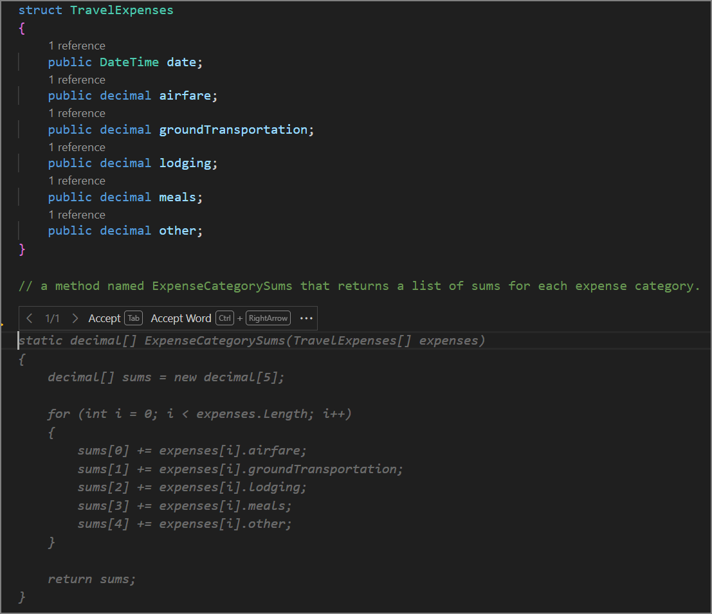
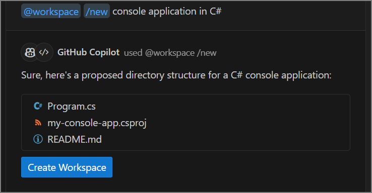
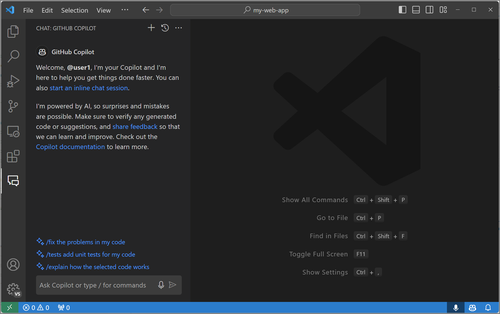
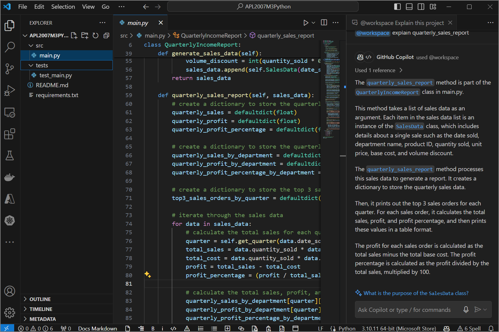
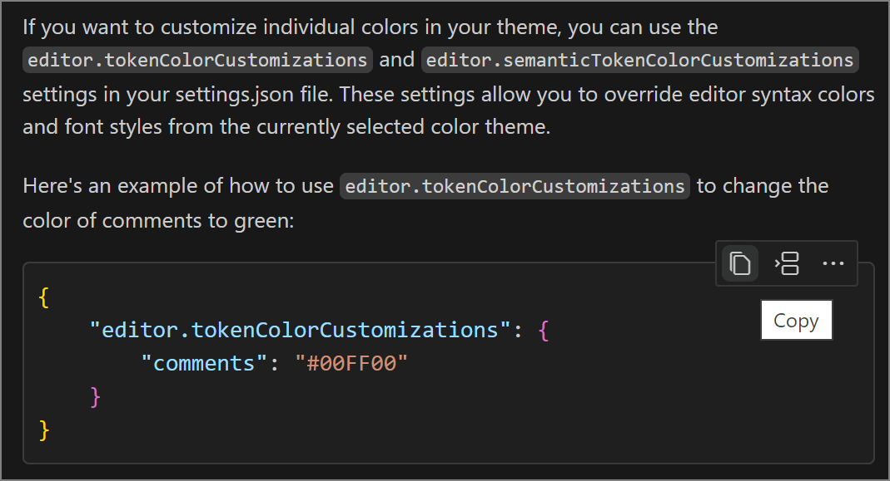

The GitHub Copilot extensions for Visual Studio Code enable developers to write code more efficiently and accurately.

GitHub Copilot and Copilot Chat can be used to accelerate code development:

- Use GitHub Copilot to generate autocompletion suggestions as you enter code.
- Use GitHub Copilot to generate autocomplete suggestions based on your code comments.
- Use GitHub Copilot Chat to generate code suggestions based on chat interactions.

> [!NOTE]
> This module focuses on using the GitHub Copilot extensions to develop code lines and code blocks. Using the GitHub Copilot extensions to create unit tests and improve existing app code are covered separately.

## Access GitHub Copilot tools in Visual Studio Code

Visual Studio Code provides easy access to the following GitHub Copilot and Copilot Chat features:

- **Code line completions**: Use code line completions to write code more efficiently.
- **Inline chat**: Start an inline chat conversation directly from the editor for help while you're coding.
- **Chat view**: Open an AI assistant on the side that can help you at any time.
- **Quick Chat**: Ask a quick question and get back into what you're doing.
- **Smart actions**: Run smart actions to complete certain tasks without even having to write a prompt.

The inline chat, chat view, and quick chat features allow you to ask questions and get help from GitHub Copilot Chat without leaving the Visual Studio Code environment. These features make it easy to get help and information from GitHub Copilot Chat while you're working on your code.

## Generate code using code line completions with GitHub Copilot

GitHub Copilot can provide code line completions as you enter code. This feature can help you write code more quickly and accurately. For example, if you start typing a function name, GitHub Copilot can provide suggestions for the rest of the function signature. The tab key can be used to accept the suggestion and you can continue typing. Code line completions can also help you write code more accurately by providing suggestions for variable names, function names, and other code elements.


You can also use code line completions to explore different ways to write code. For example, if you start typing a function call, GitHub Copilot can provide suggestions for different ways to call the function. You can cycle through the suggestion and accept option that best matches your intent. You could also reject all of the suggestions. This process can help you to quickly explore different coding styles and techniques.

GitHub Copilot can also help you create new code from code comments. For example, if you type a comment that describes a function you want to create, GitHub Copilot can provide a suggestion for the function signature and implementation.



Notice that the suggested code completion us information from your existing code and your comment that describes the function. Using code comments to generate code completions can help you to build an initial code structure quickly. You can then customize the code to meet your specific requirements.

## Generate code using GitHub Copilot Chat

GitHub Copilot Chat can help you create new code using prompts and smart actions. For example, if you enter a prompt asking GitHub Copilot Chat to create a new function, GitHub Copilot can provide a suggestion for the function signature and implementation. You can then accept or reject this suggestion, which helps you create an initial version of your code more quickly and accurately. This capability can be especially helpful when you need to write code for an application that you aren't familiar with, such as code for a new library or framework. GitHub Copilot can provide suggestions for the code you need to write, which can help you learn how to use the new library or framework. With the basics in place, you can then customize the code to meet your specific requirements.

Providing GitHub Copilot Chat with questions that include a clear scope and intent improves the generated responses. GitHub Copilot Chat uses chat participants, slash commands, and chat variables to understand the context of your question and generate relevant responses. By using these specialized descriptors, you can help GitHub Copilot Chat generate more accurate and useful responses.

- Chat participants, such as `@workspace`, help Copilot Chat understand the scope of your question.
- Slash commands, such as `/new`, help Copilot Chat understand the intent of your question.
- Chat variables, such as `#file` or `#editor`, help Copilot Chat understand the context of your question.

For example, you could scaffold a new C# console application by using the following prompt: `@workspace /new console application in C#`. This prompt includes a chat participant (`@workspace`) and a slash command (`/new`) to help GitHub Copilot Chat understand the intent of the question and generate a relevant response.



### Generate code with GitHub Copilot Chat using the Chat view

The Chat view in Visual Studio Code provides an AI assistant that can help you with your code. You can ask questions and get help from the AI assistant without leaving the Visual Studio Code environment. The Chat view can help you with code completions, code suggestions, and other coding tasks. You can also use the Chat view to ask questions about code, get help with code, and get information about code. The Chat view can help you learn new coding techniques, explore different coding styles, and improve your coding skills.

The Chat view enables you to have a chat conversation with Copilot in a separate view. You can access the Chat view via the Activity Bar or by pressing Ctrl+Alt+I.



Copilot suggests potential questions to get you started, such as "/fix the problems in my code". You can select any of these suggestions, or use the chat input field to type your own chat prompt



Copilot Chat can provide rich and interactive results that contain the following elements:

- Simple text.
- Images.
- Buttons for invoking Visual Studio Code commands.
- Reference Uniform Resource Identifiers (URIs) or editor locations.
- File trees. For example, to show a workspace preview when a chat participant proposes to create a new workspace.

The following example shows a chat prompt that's used to create an Express app. Copilot Chat returns a tree view with a suggested workspace structure and a button to create a new workspace.


As you continue asking questions, Copilot maintains the history of your conversation, and provides related follow-up questions or commands in its response too.

#### Code blocks in Chat view

Depending on your question, Copilot Chat might return source code in a code block.



Hovering over the code block presents options to Copy and Insert at Cursor (Ctrl+Enter).

The More Actions (...) button gives options to Insert Into New File and Insert into Terminal (Ctrl+Alt+Enter).


If Copilot Chat detects that a code block contains a command, you can run it directly in the integrated terminal with Insert into Terminal (Ctrl+Alt+Enter). This option creates or opens the active terminal and inserts the command text, ready for you to run.


### Generate code with GitHub Copilot Chat using inline chat

The inline chat feature allows you to harness the power of AI while staying in your existing editor workflow. When you're working in the code editor, you can open the inline chat by pressing `Ctrl` + `I` on the keyboard.

You can use inline chat in the following ways:

- To ask questions about existing code.
- To modify or replace existing code.
- To generate new code.

#### Create a new feature using inline chat

Copilot Chat can be used to generate new code features. For example, you can use Copilot Chat to generate a new user interface component, a new API endpoint, or a new data processing pipeline. To create a new feature by using Copilot Chat, you can start by describing the feature you want to create in natural language, and then use the suggestions provided by Copilot Chat to generate the code for the feature.

For example:

```output
You: I want to create a new feature that allows users to upload images to the application.
Copilot Chat: You can use the following code to create a new feature that allows users to upload images to the application:
```

```csharp
using System;
using System.IO;
using System.Threading.Tasks;
using Microsoft.AspNetCore.Http;
using Microsoft.AspNetCore.Mvc;

namespace ImageUpload.Controllers
{
    [Route("api/[controller]")]
    [ApiController]
    public class ImageUploadController : ControllerBase
    {
        [HttpPost]
        public async Task<IActionResult> UploadImage(IFormFile file)
        {
            if (file == null || file.Length == 0)
            {
                return BadRequest("No file uploaded.");
            }

            var filePath = Path.Combine("wwwroot", file.FileName);
            using (var stream = new FileStream(filePath, FileMode.Create))
            {
                await file.CopyToAsync(stream);
            }

            return Ok("File uploaded successfully.");
        }
    }
}
```

The generated C# code defines a controller in an ASP.NET Core application. This controller, `ImageUploadController`, is responsible for handling image uploads. The controller defines a single action method, `UploadImage`, which accepts an `IFormFile` parameter. This parameter represents the uploaded image file. The method checks whether the file is null or empty, and returns a `BadRequest` response if either of these conditions is true. If the file is valid, the method saves the file to the `wwwroot` directory and returns an `Ok` response.

#### Create regular expressions using inline chat

Copilot Chat can be used to generate regular expressions for validating data patterns. For example, you can use Copilot Chat to generate regular expressions for validating email addresses, phone numbers, postal codes, and other data patterns. To create regular expressions by using Copilot Chat, you can start by describing the data pattern you want to validate in natural language, and then use the suggestions provided by Copilot Chat to generate the regular expression for the pattern.

For example:

```output
You: I want to create a regular expression to validate email addresses.
Copilot Chat: You can use the following regular expression to validate email addresses:
```

```regex
^[a-zA-Z0-9._%+-]+@[a-zA-Z0-9.-]+\.[a-zA-Z]{2,}$
```

It's always important to review the generated response. Let's break down the regular expression generated by Copilot Chat to validate email addresses:

`^`: This symbol indicates the start of a line. The email address must start here.

`[a-zA-Z0-9._%+-]+`: This part matches one or more (+) of the characters inside the square brackets ([]). The characters can be lowercase (a-z), uppercase (A-Z), numeric (0-9), or special characters like period (.), underscore (_), percent (%), plus (+), or hyphen (-).

`@`: This is the at symbol (@). It's a literal character in the email address.

`[a-zA-Z0-9.-]+`: This part is similar to the first, but it's for the domain name part of the email. It can contain lowercase, uppercase, numeric, or period (.) or hyphen (-) characters.

`\.`: This is a literal period (.) character. It separates the domain name from the domain extension.

`[a-zA-Z]{2,}`: This part matches the domain extension. It can be two or more ({2,}) lowercase or uppercase letters.

`$`: This symbol indicates the end of a line. The email address must end here.

So, this regex matches any string that starts with one or more alphanumeric or special characters, followed by an @ symbol, then one or more alphanumeric or special characters, a period, and finally two or more alphabetic characters. In other words, it matches valid email addresses.

## Improve the performance of GitHub Copilot Chat

Copilot Chat can support a wide range of practical applications like code generation, code analysis, and code fixes, each with different performance metrics and mitigation strategies. To enhance performance and address some of the limitations of Copilot Chat, there are various measures that you can adopt. The following sections describe some best practices to improve the performance of Copilot Chat:

### Keep your prompts on topic

Copilot Chat is intended to address queries related to coding exclusively. Therefore, limiting the prompt to coding questions or tasks can enhance the model's output quality.

### Use Copilot Chat as a tool, not a replacement

While Copilot Chat can be a powerful tool for generating code, it is important to use it as a tool rather than a replacement for human programming. You should always review and test the code generated by Copilot Chat to ensure that it meets your requirements and is free of errors or security concerns.

### Use secure coding and code review practices

While Copilot Chat can generate syntactically correct code, it may not always be secure. To address Copilot Chat's limitations, you should always follow best practices for secure coding and code security reviews.

### Provide feedback

If you encounter any issues or limitations with Copilot Chat, we recommend that you provide feedback through the share feedback link in the Copilot Chat interface of your Integrated Development Environment (IDE). This feedback can help the developers to improve the tool and address any concerns or limitations.

### Stay up to date

Copilot Chat is a new technology and is likely to evolve over time. You should stay up to date with any updates or changes to the tool, and any new security risks or best practices that may emerge. Automated extension updates are enabled by default in Visual Studio Code, Visual Studio, and the JetBrains suite of IDEs. For GitHub Copilot Chat in GitHub.com you always have access to the latest product experience. If you have automatic updates enabled, Copilot Chat automatically updates to the latest version when you open your IDE.
