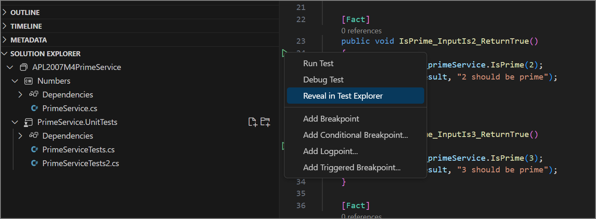

GitHub Copilot Chat can make suggestion and help you to create unit tests for specific conditions in your code. You can use GitHub Copilot Chat to generate assertions to ensure that function input parameters are valid, create unit tests for specific methods, and more.

In this exercise, you use GitHub Copilot and GitHub Copilot Chat to create unit tests for specific conditions.

### Create unit tests for specific conditions using GitHub Copilot

In the previous unit, you used GitHub Copilot Chat to generate unit tests for the `PrimeService` class. You used both the Chat view and inline chat. Both provided a range of unit tests for the `IsPrime` method. It's time to see what GitHub Copilot can do with code line completions.

1. Locate the SampleApps folder that contains the sample apps for this training.

1. Open the **APL2007M4PrimeService-UnitTests** project folder in Visual Studio Code.

1. Open the PrimeServiceTests2.cs file in the editor.

1. Delete all of the existing unit tests.

1. Save the PrimeServiceTests2.cs file, and then rebuild the solution.

1. To have GitHub Copilot generate an inline completion, create a blank line inside the `PrimeServiceTests` class.

    If you wait a second or two, GitHub Copilot suggests a completion for the `PrimeServiceTests` class.

1. Select **Accept**, and the take a minute to review the suggestions provided by GitHub Copilot.

1. Save the PrimeServiceTests2.cs file, and then rebuild the solution.

1. Open the Chat view, and then enter the following question:

    ```plaintext
    @workspace #selection are there any edge cases that should also be tested 
    ```

1. Take a minute to review the suggestions provided by GitHub Copilot.

    ```plaintext
    There are a few additional edge cases that you might consider testing:

    Large prime numbers: Testing with large prime numbers can help ensure that the IsPrime method works correctly even for large inputs. For example, you could add a test case for a known large prime number like 7919.

    Large non-prime numbers: Similarly, testing with large non-prime numbers can help ensure that the IsPrime method correctly identifies them as non-prime. For example, you could add a test case for a known large non-prime number like 7920.

    Prime numbers that are the product of two smaller prime numbers: This can help ensure that the IsPrime method correctly identifies them as non-prime. For example, you could add a test case for a number like 15, which is the product of the prime numbers 3 and 5.
    ```

    ```csharp
    [Fact]
    public void IsPrime_InputIsLargePrime_ReturnTrue()
    {
        var result = _primeService.IsPrime(7919);
        Assert.True(result, "7919 should be prime");
    }
    
    [Fact]
    public void IsPrime_InputIsLargeNonPrime_ReturnFalse()
    {
        var result = _primeService.IsPrime(7920);
        Assert.False(result, "7920 should not be prime");
    }
    
    [Fact]
    public void IsPrime_InputIsProductOfTwoPrimes_ReturnFalse()
    {
        var result = _primeService.IsPrime(15);
        Assert.False(result, "15 should not be prime");
    }
    ```

1. Create a blank line after the last test method in the `PrimeServiceTests` class.

1. In the Chat view, hover the mouse over the code snippet, and then select **Insert at Cursor**.

    ```plaintext
    generate assertions to ensure that function input parameters are valid.
    ```

1. Save the PrimeServiceTests2.cs file, and then rebuild the solution.

1. Take a minute to review the collection of unit tests that GitHub Copilot generated for the `IsPrime` method.

    As always, it's important to review the work completed by GitHub Copilot to ensure that the tests are valid and that they cover the edge cases that you want to test. Once you're satisfied with the tests, you can run them to verify that they pass.

1. Hover the mouse pointer over one of the green "test arrows".

    Notice the tooltip message telling you that you can either click to run the test, or right-click to see more options.

1. Right-click one of the green "test arrows".

    

1. Select **Reveal in Test Explorer**.

    Notice that the Test Explorer view opens. The Test Explorer view can be used to run and debug tests, and to view the results of test runs. To open the Test Explorer view manually, select **Testing** from the Activity Bar on the left side of the Visual Studio Code window. The icon for the **Testing** view is the one that looks like a lab flask.

1. At the top of the Test Explorer view, select **Run Tests**.

    After a few seconds, the Test Explorer shows the results of the test run. You should see that all of the tests pass. Green checkmarks in the Test Explorer and to the left of the unit tests in the Editor.

### Summary

In this exercise, you used GitHub Copilot and GitHub Copilot Chat to create unit tests for specific conditions in the `PrimeService` class. You used code line completions to generate assertions to ensure that function input parameters are valid, and you used the Chat view to ask GitHub Copilot to suggest additional edge cases that should be tested. You reviewed the suggestions provided by GitHub Copilot and ran the tests to verify that they pass. You also learned how to use the Test Explorer in Visual Studio Code to run and view the results of test runs.
