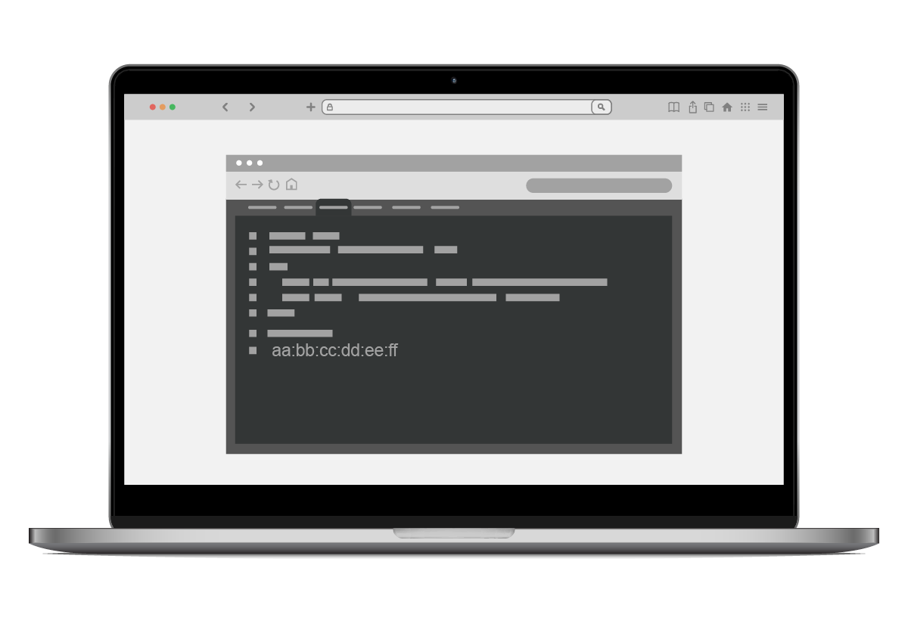
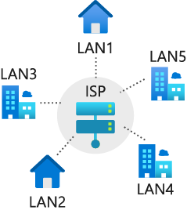

The internet changed everything. Not just for computers either. It changed just about every job on the planet. And it has done all of this in a matter of a few dozen years. You learned in the first lesson that the basic model on which computers operate is simple. But it's a long way from 1s and 0s to being able to pay bills from your phone. How do the computers you use everyday work?

## Unique like everything else

There are billions of devices on the internet. When someone sends you a message, it gets to your phone. You may have wondered how that happens. It's mind-boggling that everything on the internet gets to the right place.

All those computers need something like a name that no other computers share. That would be a good way to know which computer should get a text message. These names are called IDs. Every computer on the internet has one.

Every computer on the internet has an ID that is different than all other devices on the internet. This ID is called a *MAC address* (MAC stands for "media access control"). It's like having a name that no one else shares or could share.

Okay, so there are lots of computers with unique IDs on the internet. Let's talk about how they all talk to each other.

## Networks and Subnetworks

Networks are groups of computers. You can have a huge group like the internet. There are smaller groups like a city or corporation. You can even have smaller groups like the computers in your home. These networks can be related to each other. For example, your home network contains a small group of computers that, as a group, are part of the larger group. Your internet service provider has a group of computers that are part of it. The largest group is the internet. These smaller networks that are a part of larger ones are called *subnets*. A subnet in a corporation or your home is called **local area network**, or LAN.

The following image shows the relationship between the internet and smaller subnets.

Think of it like groupings of people. You have a family that forms a group that is a part of a larger group, say your town. Your town is a part of a larger group, say your city or region. Sometimes when something needs to be communicated, the state may send a message to your town's officials who then spread the word to your family and it finally gets to you. Networks and subnets work similarly.

On this model, each unique device ID can be exposed at any level of those networks and "invisible" to the other networks. So your unique device ID may be exposed to your home network but not necessarily exposed to the internet. The only way to get your unique device ID is to be "inside" your home network. (Some devices' MAC addresses are exposed to the internet but these are special machines that do a very particular job.)

## But wait, there's more

Let's go back to the question on how that text message sent by your friend ends up showing up on your mobile device. As you might guess by now, MAC addresses are not the only IDs involved when you send that text message to a friend. For that text message to find your friend, the systems that run the internet have to know how to find your unique machine in a secure way.
