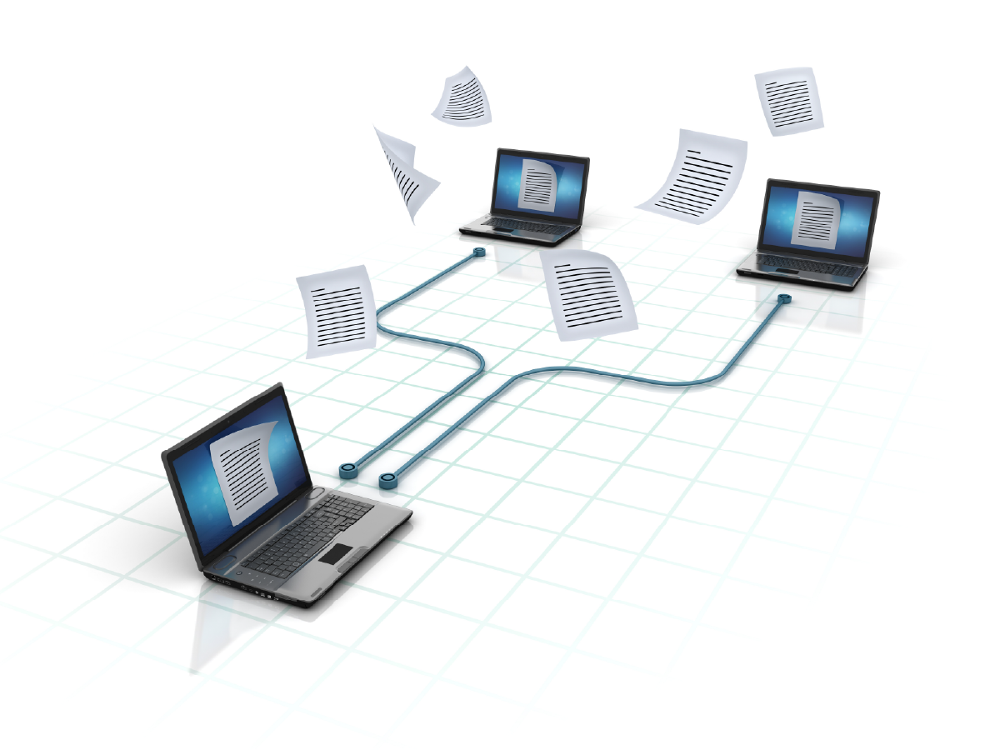

You learned in the last lesson that computers (like a mobile phone, laptop, or gaming device) that are connected to a network have a unique ID called a MAC address. This ID is very specific to that one computer and no other device shares it. You also learned that this ID is only shown to other computers in a very specific group of computers. This is a subnet.

So how does a text message, file, or photo reach *your specific computer* when someone sends it to you from the internet? With the help of internet protocol (IP) addresses on the World Wide Web.

## The Internet Protocol

The title of this section sounds like a science fiction movie, doesn't it? In some ways it is. The complex way the internet works would be science fiction to people 100 years ago. Today it's something we take for granted. It's this internet protocol that makes the internet work.

## IP Address

In addition to the MAC address, each computer that connects to a network (or a subnet) gets another unique ID *on that network*. When you connect to your home network, there's a machine, called a router, that assigns an ID to your device. This is a different ID than the MAC address. This new ID is called an internet protocol (IP) address.

You may have seen these weird IDs here and there. They're made up of four groups of numbers separated by a period. Here's an example of a common IP address: `192.168.1.1`. It's not important at this point to understand these numbers. Focus on the fact that each device on a network gets one. It's used to identify that device on that network.

## The Same but Different

Now, since devices are given this unique ID within a subnet (a small group), devices on different subnets may have the same IP address. For example, your mobile phone on your home network (a subnet) may get assigned the IP address of `192.168.1.100`. Your neighbor's home network's router may assign their mobile phone the same IP address of `192.168.1.100`. Both mobile devices have unique MAC addresses but can have the same IP address. But there's no conflict because you're on two different subnets.

When your home network needs to know how to get a text message to you, it looks for the IP address assigned to a specific MAC Address. It then finds your device and sends your phone the data which, by more magic, your phone knows what to do with.

This is all fine and good but it still doesn't answer the question of how the message finds your phone over the internet. The IP address you've been assigned on your phone is only on your subnet and the internet doesn't know anything about it. Something else must be going on. Let's explore that next.
