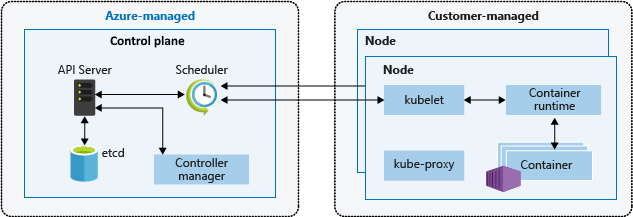

As application development moves towards a container-based approach, the need to orchestrate and manage resources is important. Kubernetes is the leading platform that provides the ability to provide reliable scheduling of fault-tolerant application workloads. Azure Kubernetes Service (AKS) is a managed Kubernetes offering that further simplifies container-based application deployment and management.

## Kubernetes is ...

Kubernetes is a rapidly evolving platform that manages container-based applications and their associated networking and storage components. The focus is on the application workloads, not the underlying infrastructure components. Kubernetes provides a declarative approach to deployments, backed by a robust set of APIs for management operations.

You can build and run modern, portable, microservices-based applications that benefit from Kubernetes orchestrating and managing the availability of those application components. Kubernetes supports both stateless and stateful applications as teams progress through the adoption of microservices-based applications.

As an open platform, Kubernetes allows you to build your applications with your preferred programming language, OS, libraries, or messaging bus. Existing continuous integration and continuous delivery (CI/CD) tools can integrate with Kubernetes to schedule and deploy releases.

Azure Kubernetes Service (AKS) provides a managed Kubernetes service that reduces the complexity for deployment and core management tasks, including coordinating upgrades. The AKS control plane is managed by the Azure platform, and you only pay for the AKS nodes that run your applications. AKS is built on top of the open-source Azure Kubernetes Service Engine (aks-engine).

## Kubernetes cluster architecture

A Kubernetes cluster is divided into two components:
* _Control plane_ nodes provide the core Kubernetes services and orchestration of application workloads.
* _Nodes_ run your application workloads.

## Features of Azure Kubernetes Service

* Fully managed​
* Public IP and FQDN (Private IP option)​
* Accessed with RBAC or Azure AD​
* Deployment of containers ​
* Dynamic scale containers ​
* Automation of rolling updates and rollbacks of containers​
* Management of storage, network traffic, and sensitive information

