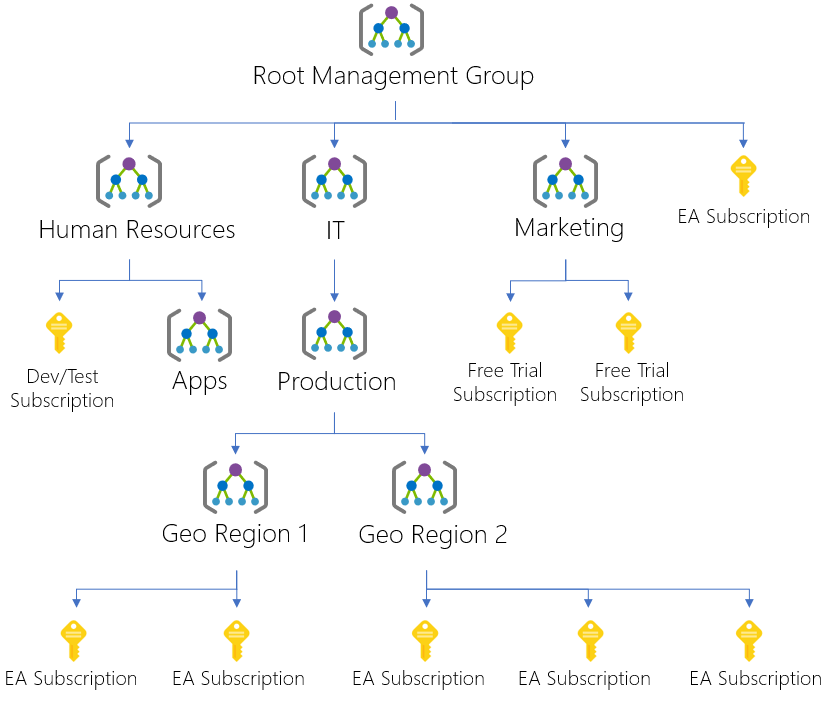

**Azure Resource Manager** (ARM) is the deployment and management service for Azure. It provides a consistent management layer that allows you to create, update, and delete resources in your Azure subscription. You can use its access control, auditing, and tagging features to help secure and organize your resources after deployment.

When you take actions through the portal, Azure PowerShell, the Azure CLI, REST APIs, or client software development kits (SDKs), the Resource Manager API handles your request. Because the same API handles all requests, you get consistent results and capabilities from all the different tools. Functionality initially released through APIs should be represented in the portal within 180 days of the initial release.

> [!div class="mx-imgBorder"]
> 

The Azure Resource Manager uses APIs and authentication to allow access to resources.

### Understand Scope

Azure provides four levels of scope: management groups, subscriptions, resource groups, and resources. The following image shows an example of these layers. Though not labeled as such, the blue cubes are resources.

> [!div class="mx-imgBorder"]
> 

You apply management settings at any of these levels of scope. The level you select determines how widely the setting is applied. Lower levels inherit settings from higher levels. For example, when you apply a policy to the subscription, the policy is applied to all resource groups and resources in your subscription. When you apply a policy on the resource group, that policy is applied to the resource group and all its resources. However, another resource group doesn't have that policy assignment.

You can deploy templates to management groups, subscriptions, or resource groups.

### Resource Groups

There are some important factors to consider when defining your resource group:

* All the resources in your group should share the same lifecycle. You deploy, update, and delete them together. If one resource, such as a database server, needs to exist on a different deployment cycle it should be in another resource group.
* Each resource can only exist in one resource group.
* You can add or remove a resource to a resource group at any time.
* You can move a resource from one resource group to another group. 
* A resource group can contain resources that are located in different regions.
* A resource group can be used to scope access control for administrative actions.
* A resource can interact with resources in other resource groups. This interaction is common when the two resources are related but don't share the same lifecycle (for example, web apps connecting to a database).

When creating a resource group, you need to provide a location for that resource group. You may be wondering, **"Why does a resource group need a location? And, if the resources can have different locations than the resource group, why does the resource group location matter at all?"** The resource group stores metadata about the resources. Therefore, when you specify a location for the resource group, you're specifying where that metadata is stored. For compliance reasons, you may need to ensure that your data is stored in a particular region.

If the resource group's region is temporarily unavailable, you can't update resources in the resource group because the metadata is unavailable. The resources in other regions will still function as expected, but you can't update them.

## Management Groups

Management groups are an Azure resource to create flexible and very maintainable hierarchies within the structure of your environment. Management groups exist above the subscription level thus allowing subscriptions to be grouped together. This grouping facilitates applying policies and RBAC permissions to those management groups. Policies and RBAC permissions are inherited to all resources in the management group.  Management groups give you enterprise-grade management at a large scale no matter what type of subscriptions you might have. All subscriptions within a single management group must trust the same Azure Active Directory tenant.

Management group hierarchies can be up to six levels deep. This provides you with the flexibility to create a hierarchy that combines several of these strategies to meet your organizational needs. For example, the diagram below shows an organizational hierarchy that combines a business unit strategy with a geographic strategy.

> [!div class="mx-imgBorder"]
> 

### The value of management groups

**Group your subscriptions**. 

* Provide user access to multiple subscriptions
* Allows for new organizational models and logically grouping of resources. 
* Allows for single assignment of controls that applies to all subscriptions.
* Provides aggregated views above the subscription level.
 
**Mirror your organization's structure**. 

* Create a flexible hierarchy that can be updated quickly.
* The hierarchy does not need to model the organization's billing hierarchy.
* The structure can easily scale up or down depending on your needs.

**Apply policies or access controls to any service**.

* Create one RBAC assignment on the management group, which will inherit that access to all the subscriptions. 
* Use Azure Resource Manager (ARM) integrations that allow integrations with other Azure services: Azure Cost Management, Privleged Identity Management, and Azure Security Center. 

>[!IMPORTANT]
>By using management groups, you can reduce your workload and reduce the risk of error by avoiding duplicate assignments. Instead of applying multiple assignments across numerous resources and subscriptions, you can apply the one assignment on the one management group that contains the target resources. This will save time in the application of assignments, creates one point for maintenance, and allows for better controls on who can control the assignment.
