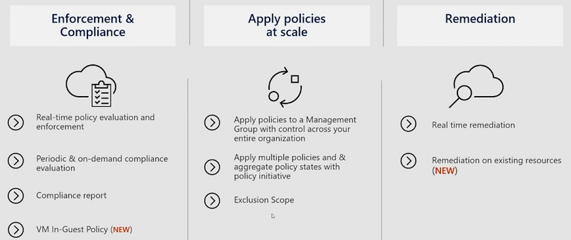

Azure Policy is a service you use to create, assign, and manage policies. These policies enforce different rules and effects over your resources so that those resources stay compliant with your corporate standards and service level agreements. Azure Policy meets this need by evaluating your resources for noncompliance with assigned policies. For example, you might have a policy that allows virtual machines of only a certain size in your environment. After this policy is implemented, new and existing resources are evaluated for compliance. With the right type of policy, existing resources can be brought into compliance.

**There are three main pillars in the functionalities of Azure policy**.

> [!div class="mx-imgBorder"]
> 

The **first pillar** is around **real-time enforcement and compliance assessment**. For example, a policy would block the creation of resources that are located outside of US regions. Each policy also provides compliance assessment on all your existing resources to bring a state of compliance for each resource. The data then powers the compliance view which aggregates results across all of the applied policies. Policies can be used to ensure that resource groups are getting tagged properly and automatically inheriting those tags from the resource group down to the resources.  

The **second pillar** of policy is **applying policies at scale** by leveraging Management Groups. By assigning policy to a management group one can impact hundreds of subscriptions and all its reach resources through a single policy assignment. There also is the concept called **policy initiative** that allows you to group policies together so that you can view the aggregated compliance result. At the initiative level there's also a concept called exclusion where one can exclude either the child management group subscription resource group or resources from the policy assignment.

The **third pillar** of your policy is **remediation by leveraging a remediation policy** that will automatically remediate the non-compliant resource so that your environment always stays compliant. For existing resources, they will be flagged as non-compliant but they won't automatically be changed because there can be impact to the environment. For these cases you can create a remediation task to bring these resources to compliance. Azure policy is a free service to use.

## Policy permissions and custom policies

Azure Policy has several permissions, known as operations, in two resource providers:

* **Microsoft.Authorization**

* **Microsoft.PolicyInsights**

Many built-in roles grant permissions to Azure Policy resources. The **Resource Policy Contributor** role includes most Azure Policy operations. The **Owner** role has full rights. Both **Contributor** and **Reader** can use all Azure Policy read operations, but Contributor can also trigger remediation.

If none of the built-in roles have the required permissions, create a custom role.
Azure has by default, security policies that work across subscriptions or on management groups. If these policies need to be augmented with your own organizational policies, new policies can be created.

Whatever the business driver for creating a custom policy, the steps are the same for defining the new custom policy.
Before creating a custom policy, check the policy samples to determine if a policy that matches your needs already exists.

The approach to creating a custom policy follows these steps:

* Identify your business requirements
* Map each requirement to an Azure resource property
* Map the property to an alias
* Determine which effect to use
* Compose the policy definition

## Composing an Azure Policy

The steps for composing and implementing a policy in Azure Policy begins with creating:
* **Policy definition** - Every policy definition has conditions under which it's enforced. And, it has a defined effect that takes place if the conditions are met.
* **Policy assignment** - A policy definition that has been assigned to take place within a specific scope. This scope could range from a management group to an individual resource. The term scope refers to all the resources, resource groups, subscriptions, or management groups that the policy definition is assigned to.
* **Policy parameters** - They help simplify your policy management by reducing the number of policy definitions you must create. You can define parameters when creating a policy definition to make it more generic. 

## Create and assign an Initiative definition

In order to easily track compliance for multiple resources, create and assign an **Initiative definition**.  With an initiative definition, you can group several policy definitions to achieve one overarching goal. An initiative evaluates resources within scope of the assignment for compliance to the included policies.

To implement these policy definitions (both built-in and custom definitions), you'll need to assign them. You can assign any of these policies through the Azure portal, PowerShell, or Azure CLI.
