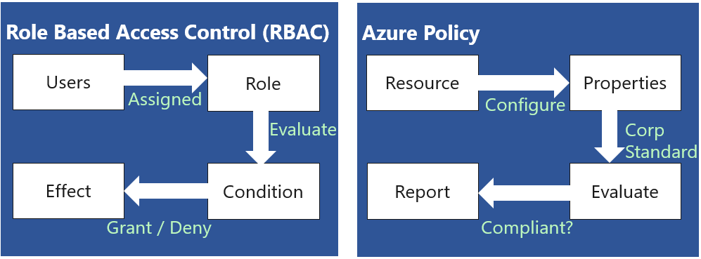

A few key differences between Azure Policy and RBAC exist. RBAC focuses on user actions at different scopes. You might be added to the contributor role for a resource group, allowing you to make changes to that resource group. Azure Policy focuses on resource properties during deployment and for already-existing resources. Azure Policy controls properties such as the types or locations of resources. Unlike RBAC, **Azure Policy is a default-allow-and-explicit-deny system**.

## RBAC

Azure Role Based Access Control and Azure Policies play an important role in governance to ensure everyone and every resource stays within the required boundaries. They are controls put in place to meet an organizations standards for resource utilization and creation.

RBAC manages who has access to Azure resources, what areas they have access to and what they can do with those resources. RBAC can be used to assign duties within a team and grant only the amount of access needed to allow the assigned user the ability to perform their job instead of giving everybody unrestricted permissions in an Azure subscription or resource.

Examples of Role Based Access Control (RBAC) include:
* Allowing a user, the ability to only manage virtual machines in a subscription and not the ability to manage virtual networks
* Allowing a user, the ability to manage all resources, such as virtual machines, websites, and subnets, within a specified resource group
* Allowing an app, to access all resources in a resource group
* Allowing a DBA group, to manage SQL databases in a subscription

RBAC achieves the ability to grant users the least amount privilege to get their work done without affecting other aspects of an instance or subscription as set by the governance plan

## Policies

Policies on the other hand play a slightly different role in governance. Azure Policies focus on resource properties during deployment and for already existing resources.  As an example, a policy can be issued to ensure users can only deploy DS series VMs within a specified resource should the user have the permission to deploy the VMs.  In an existing resource, a policy could be implemented to add or append tags to resources that do not currently have tags to make reporting on costs easier and provide a better way to assign resources to business cost centers.

> [!div class="mx-imgBorder"]
> 

>[!IMPORTANT]
>RBAC and Polices in Azure play a vital role in a governance strategy. While different, they both work together to ensure organizational business rules are followed be ensuring proper access and resource creation guidelines are met.
