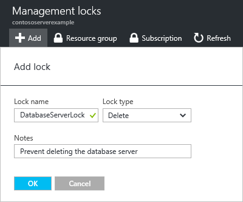

As an administrator, you may need to lock a subscription, resource group, or resource to prevent other users in your organization from accidentally deleting or modifying critical resources. You can set the lock level to **CanNotDelete or ReadOnly**. In the portal, the locks are called **Delete and Read-only** respectively.

> [!div class="mx-imgBorder"]
> 

+ **CanNotDelete** means authorized users can still read and modify a resource, but they can't delete the resource.

+ **ReadOnly** means authorized users can read a resource, but they can't delete or update the resource. Applying this lock is similar to restricting all authorized users to the permissions granted by the Reader role.

Once a resource has been locked, the resource lock must first be removed before the resource can be modified or deleted.

>[!IMPORTANT]
>Not every Azure user should have permission to create or remove locks. The role a user is a member of should have permission to set and remove locks. This requires access to one of the following RBAC 
permissions: **Microsoft.Authorization/***, **Microsoft.Authorization/locks/*** action. The Owner and User Access Administrator roles have access to those actions. However, these actions can be added to custom roles as required. 
