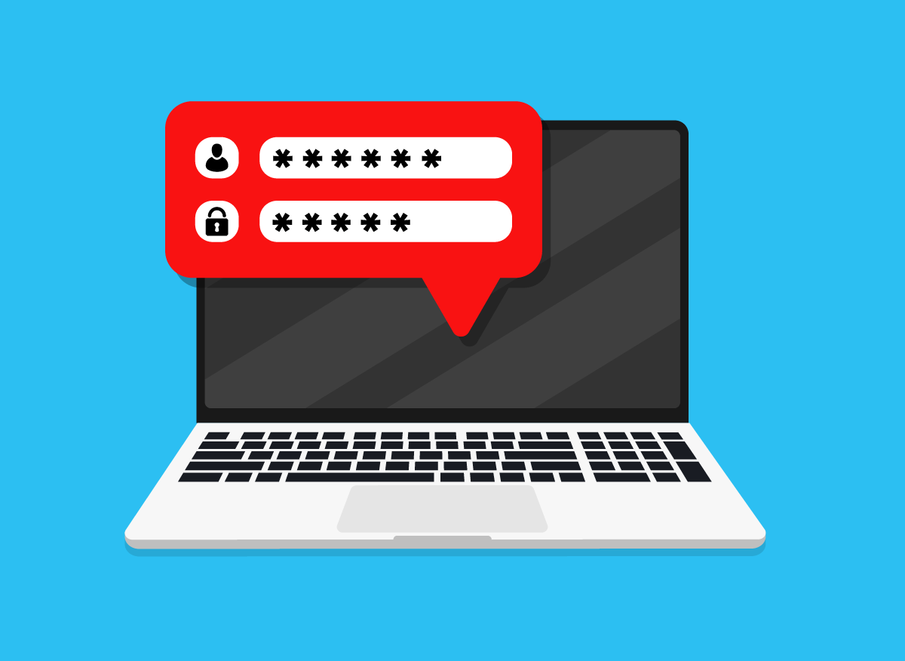

Safety and security have never been more important. Part of computer safety is knowing who should have permission to access what resources and when. First, the computer has to know who a person is. Next, it has to know whether a person can access the data on it and, if so, which data. We'll talk about each of these types of access.

## Authentication

When you want to access a computer or a private website, the first thing you may be asked to do is sign in. A sign-in is a way computer's verify users. Many of us know the username and password pair we need to access email or our phones. This is called "authentication" or "AuthN."

There has been a lot of discussion about how secure usernames and passwords actually are. They generally fit the bill for basic security. However, computer engineers have been working on building something stronger. Authentication can occur using fingerprints and being able to recognize faces. It's now possible to sign into a computer or website with just a smile.

There are different levels of authentication. Programmers may use one or more depending on what they want to secure. Here are some of the levels used in general computing.

|Type |Description |
|-|-|
|Basic |Username and password. This is used mainly to secure resources like websites that don't involve personal information or information that is likely to cause harm if it were leaked. |
|Multi-factor |Username and password plus another method for verification. Another method could be a text message with a code sent to a phone. Or it could be a code emailed to the user, which they have to enter into a form.
|Passwordless |Using a fingerprint or face to identify a person (also called biometrics). Because fingerprints and faces tend to be hard to fake, this type of authentication usually doesn't require a username and password. |
|Passkey |A variety of passwordless authentication. It's a relatively new standard being adopted by large tech companies. It uses devices (like a phone) and cryptography to authenticate a person. |

In the future, it may be possible to sign in with the unique pattern in your eyeball or other ways. These work because they're hard to fake but easy to use.

Many times, a sign-in gives someone access to the entire computer or website. This is fine in many cases. But sometimes, more fine-grained security is needed.

## Authorization

Once a person has access to a computer or website, they may be limited to what data they can access. For example, you may give a child access to a streaming service but not want them to see certain shows.

Sometimes roles are created to prevent that person from getting to certain data. For example, a person can be an "owner" and access everything. Another person may be a "user" and he or she will be prevented from doing certain things. On the cloud, administrators can let people get to some data in a database and not other data.

This type of control is called "authorization" or "AuthZ."

Authorization, then, is about access to specific resources on a computer. Compare this to authentication. Authentication is making sure a person is who they say they are. In many computer systems, a person is first authenticated and then authorized to do certain things. When you access your mobile phone, you first have to tell it that it's you. After that, you can get to the files and access email and the like. This "layering" is how AuthN and AuthZ work together.

## Working Together

On computers and in the cloud, AuthN and AuthZ can work together. This type of security can make it easier for people to get to the items they need. Working with folders and files is an area where this type of security is helpful. People use folders and files on single computers and now even in the cloud.

Let's take an example. You sign in to your work's network. Your manager has given you access to some folders and files on that network. Suppose that your workplace is partnering with another company. That company trusts your company. They agree that anyone who has access to your company's files can also access their files.

In this case, your company would use AuthN to give you access. They then use AuthZ to let you get to the folders and files. The partner company would use those permissions to apply to their files and folders. This means you don't have to sign in twice. It also means that the partner company doesn't have to manage permissions for all their files and folders. Trust is "transferred" from your company to theirs. You may hear this talked about as "Single Sign On" or SSO because you only have to provide one username and password but get access to multiple places.
