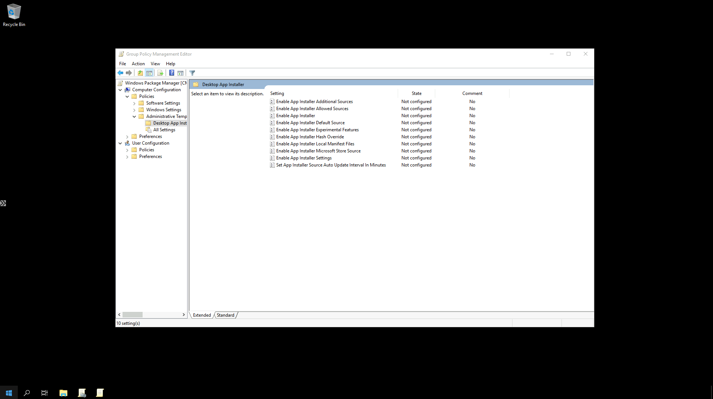
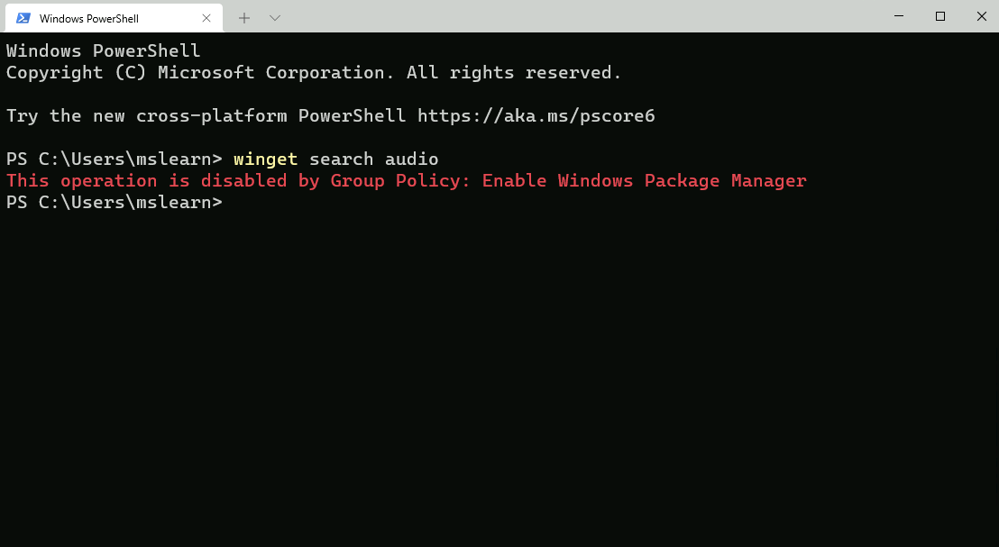

## Group Policy for Windows Package Manager

The team have released a set of Group Policy Administrative Template files (ADMX/ADML) to help make it easy for you review and configure Group Policy Objects targeting your domain-joined devices. To download these ADMX files today, visit the [Microsoft Download Center](https://www.microsoft.com/download/details.aspx?id=103034).

These policies will give you the power to enable Windows Package Manager, control certain commands and arguments and configure the sources to which your devices connect.

Below is a screenshot of the Group Policy settings available to configure within the Group Policy Management Editor

 

## Group Policy settings
Any policies that have been enabled or configured will be shown when a user executes **winget --info**. The goal is to assist users in troubleshooting unexpected behaviors they may encounter in the Windows Package Manager because of any policies that are enabled or configured. For example, a user may attempt to modify a setting controlled by policy and not be able to understand why the device does not appear to honor their setting.

### Enable App Installer
This policy controls whether Windows Package Manager can be used by users. Users will still be able to execute the **winget** command. The default help will be displayed, and users will still be able to execute **winget -?** to display the help as well. Any other command will result in the user being informed the operation is disabled by Group Policy.

If you enable or do not configure this setting, users will be able to use the Windows Package Manager.

If you disable this setting, users will not be able to use the Windows Package Manager.

 

### Enable App Installer settings
This policy controls whether users can change their settings. The settings are stored inside of a .json file on the user’s system. It may be possible for users to gain access to the file using elevated credentials. This will not override any policy settings that have been configured by this policy.

If you enable or do not configure this setting, users will be able to change settings for Windows Package Manager.

If you disable this setting, users will not be able to change settings for Windows Package Manager.

### Enable App Installer Hash Override
This policy controls whether Windows Package Manager can be configured to enable the ability to override SHA256 security validation in settings. Windows Package Manager compares the installer after it has downloaded with the hash provided in the manifest.

If you enable or do not configure this setting, users will be able to enable the ability to override SHA256 security validation in Windows Package Manager settings.

If you disable this setting, users will not be able to enable the ability to override SHA256 security validation in Windows Package Manager settings.

### Enable App Installer Experimental Features
This policy controls whether users can enable experimental features in Windows Package Manager. Experimental features are used during Windows Package Manager development cycle to provide previews for new behaviors. Some of these experimental features may be implemented prior to the Group Policy settings designed to control their behavior.

If you enable or do not configure this setting, users will be able to enable experimental features for Windows Package Manager.

If you disable this setting, users will not be able to enable experimental features for Windows Package Manager.

### Enable App Installer Local Manifest Files
This policy controls whether users can install packages with local manifest files. If a user has a manifest available via their local file system rather than a Windows Package Manager source, they may install packages using winget install -m <path to manifest>.

If you enable or do not configure this setting, users will be able to install packages with local manifests using Windows Package Manager.

If you disable this setting, users will not be able to install packages with local manifests using Windows Package Manager.

### Set App Installer Source Auto Update Interval in Minutes
This policy controls the auto-update interval for package-based sources. The default source for Windows Package Manager is configured such that an index of the packages is cached on the local machine. The index is downloaded when a user invokes a command, and the interval has passed (the index is not updated in the background). This setting has no impact on REST-based sources.

If you disable or do not configure this setting, the default interval or the value specified in settings will be used by Windows Package Manager.

If you enable this setting, the number of minutes specified will be used by Windows Package Manager.

### Enable App Installer Default Source
This policy controls the default source included with Windows Package Manager. The default source for Windows Package Manager is an open-source repository of packages located at [https://github.com/microsoft/winget-pkgs](https://github.com/microsoft/winget-pkgs).

If you enable or do not configure this setting, the default source for Windows Package Manager will be available and can be removed.

If you disable this setting, the default source for Windows Package Manager will not be available.

### Enable App Installer Microsoft Store Source
This policy controls the Microsoft Store as a source included with Windows Package Manager.

If you enable or do not configure this setting, the Microsoft Store source for Windows Package manager will be available and can be removed.

If you disable this setting, the Microsoft Store source for Windows Package Manager will not be available.

### Enable App Installer Additional Sources
This policy controls additional sources configured for Windows Package Manager.

If you do not configure this setting, no additional sources will be configured for Windows Package Manager.

If you enable this setting, additional sources will be added to Windows Package Manager and cannot be removed. The representation for each additional source can be obtained from installed sources using winget source export.

If you disable this setting, no additional sources can be configured by the user for Windows Package Manager.

### Enable Windows Package Manager Allowed Sources
This policy controls additional sources approved for users to configure using Windows Package Manager.

If you do not configure this setting, users will be able to add or remove additional sources other than those configured by policy.

If you enable this setting, only the sources specified can be added or removed from Windows Package Manager. The representation for each allowed source can be obtained from installed sources using winget source export.

If you disable this setting, no additional sources can be configured by the user for Windows Package Manager.

quiz:
  title: "Quick review"
  questions:
  - content: "If you wanted to stop users from being able to use Windows Package Manager preview features which Group Policy setting would you configure? "
    choices:
    - content: "Enable App Installer Experimental Features"
      isCorrect: true
      explanation: "That's incorrect."
    - content: "Enable Windows Package Manager Allowed Sources"
      isCorrect: false
      explanation: "That's correct."
    - content: "Enable App Installer Microsoft Store Source"
      isCorrect: false
      explanation: "That's incorrect."