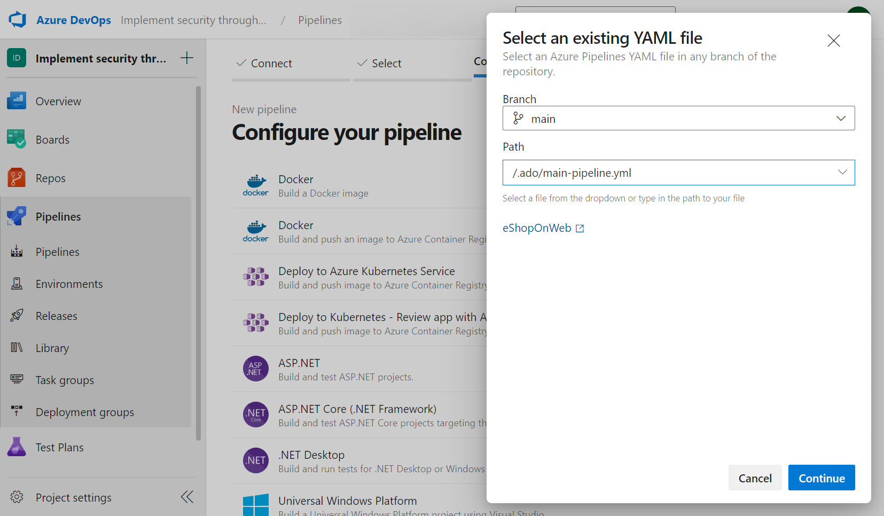
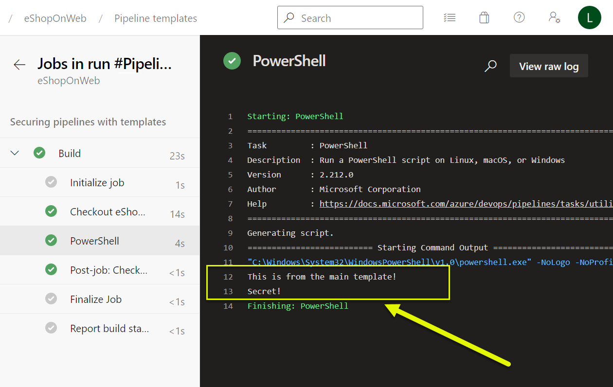

In this unit, you learn how to create a nested template using YAML pipelines in Azure DevOps. A nested template is a reusable YAML file that contains a set of tasks that can be called from another YAML file. This approach can simplify the pipeline's maintenance and management over time and reduce the amount of duplication in the pipeline configuration.

Using templates in YAML pipelines can provide several security advantages, such as:

- **Improved secret management:** Nested templates can help you abstract sensitive information such as credentials, secrets, and other configuration settings from the main deployment pipeline, making managing and securing these sensitive items easier. These can be stored in a more secure location or Azure Key Vault, reducing the exposure of sensitive information to unauthorized users and preventing unauthorized access to critical resources.
- **Reduced risk of data breaches:** By abstracting sensitive information from the main deployment pipeline, you reduce the risk of data breaches that can occur when sensitive information is exposed to unauthorized users or stored in an insecure location.
- **Easier permissions management and access:** With nested templates, you can better manage access control to the templates and configuration files, giving you granular control over who can access and modify specific pipeline components.
- **Better pipeline version control:** Separating pipeline configuration into smaller, more manageable pieces makes it easier to manage changes and version control, which can help prevent errors and conflicts that can lead to security issues.
- **Simplified pipeline maintenance:** By applying the power of nested templates, it's possible to reduce the duplication in the pipeline configuration, which can help simplify the pipeline's maintenance and management over time.

In this unit, create a nested template that can be called from the main pipeline.

## Create a YAML file for the nested template

Create a YAML file in your Git repository called `secure-template.yaml`. This file contains the pipeline's tasks that you want to reuse in other YAML files.

```YAML
parameters:
  message: ''

steps:
- task: PowerShell@2
  inputs:
    targetType: Inline
    script: |
      Write-Host "${{ parameters.message }}"
      Write-Host "$(Secure)"

```

In this example, we define one parameter `message`, and a single PowerShell task that prints the values of the parameter. We also print the value of the `Secure` variable, which is a variable that we'll define in the next step.

## Create a YAML file for the main pipeline

Create a YAML file called `main-pipeline.yaml` for the pipeline that calls the nested template. You can use the `template` property to call the nested template.

```YAML
name: 'Pipeline templates'
stages:
- stage: Build
  displayName: 'Securing pipelines with templates'
  jobs:
  - job: Build
    pool:
      vmImage: windows-latest
    variables:
    - name: Secure
      value: 'Secret!'
    steps:
    - template: '../.secure/secure-template.yaml'
      parameters:
        message: 'This is from the main template!'

```

In this example, we call the `secure-template.yaml` file from a ".secure" folder using the `template` property and pass the values of the `message` and `Secure` parameters to the nested template.

## Create a new pipeline

Navigate to your Azure DevOps project and create a new pipeline. Select the repository and branch where you committed the changes. Select the YAML file for the main pipeline (`main-pipeline.yaml` in our example) and run the pipeline.



Verify that the nested template is called and the values of the parameters are printed.



## Challenge yourself

Create a reusable template for a common task in your organization's deployment pipeline. It can be anything from creating a resource group to deploying a specific application.

1. Identify a task that is performed frequently in your organization's deployment pipeline.
2. Create a template that can be used to automate that task.
3. Test the template by using it in a simple deployment pipeline.
4. (Optional) Consider creating a new YAML pipeline that uses the template you created and configure it to use tokenization to secure sensitive information.

For more information about templates and YAML pipelines, see:

- [Security through templates](https://learn.microsoft.com/azure/devops/pipelines/security/templates)
- [Template types & usage](https://learn.microsoft.com/azure/devops/pipelines/process/templates/)
- [Securing Azure Pipelines](https://learn.microsoft.com/azure/devops/pipelines/security/overview/)
- [Recommendations to securely structure projects in your pipeline](https://learn.microsoft.com/azure/devops/pipelines/security/projects/)
